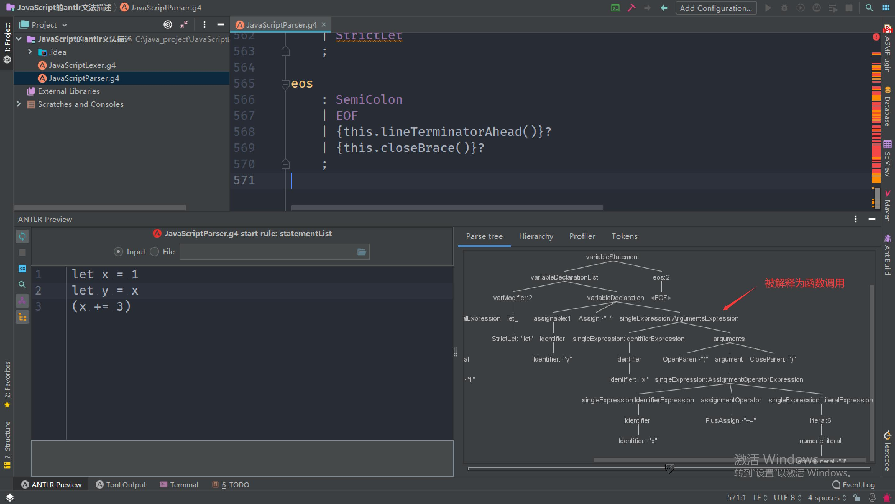
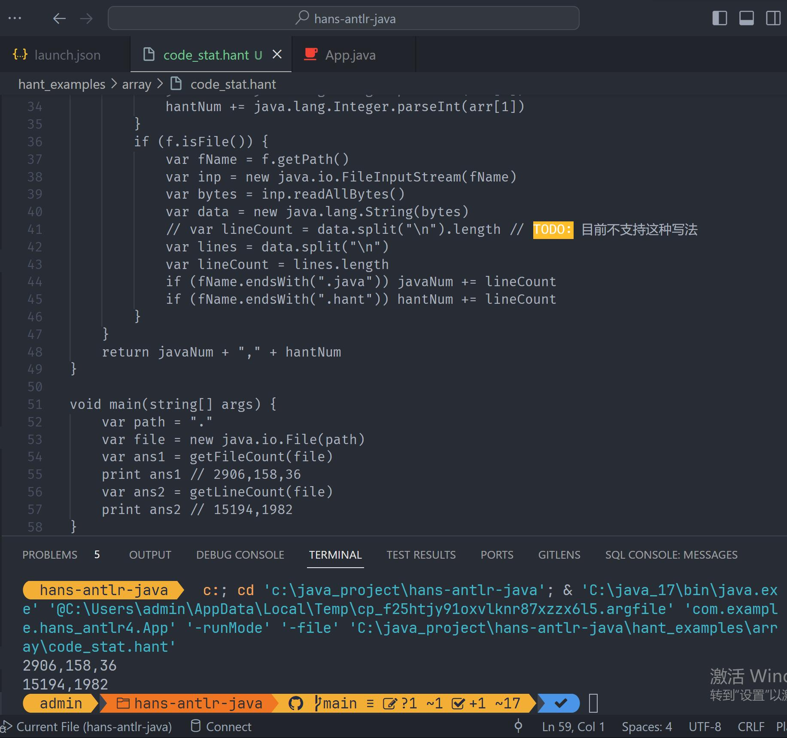

[toc]

# 基于antlr4实现一门编译到Java字节码的语言hant，参考了Enkel但高于Enkel

## 引言

近几天我看到一个项目叫[Creating JVM language](https://juejin.cn/post/6844903671679942663)，目标是开发一门编译到JVM字节码的语言。在此我打算跟着这个项目做一遍，以学习：

1. 使用antlr4生成Lexer和Parser的代码。借助IDEA ASM Bytecode Viewer插件解决开发过程中可能遇到的二义性问题。
2. 深入讨论了**隐式类型转换**等高级话题及其实现方案，并最终落地。并实现了一些语法糖，如：ranged for loop `for i: st to ed`、JS风格的模板字符串。
3. 使用`ASM`，并熟悉大量Java特性对应的JVM字节码指令。
4. 使用`JUnit + Mockito`保证项目质量。使用`system-stubs`实现黑盒测试。

为了更好地理解这个项目，我调换了各个功能的实现顺序，先实现过程式的特性，再实现函数和类。在此过程中，我会**额外实现许多`Enkel`没有的语法特性**，相信这些特性的实现过程对编程萌新们而言是很有价值的。另外，我修复了原作者项目的一些问题，在此列举：

1. 原作者给出的字符串的词法规则`STRING: '"' .* '"';`是贪婪模式，会导致`"1"\n"2"`这个例子只匹配到一个字符串。我把它改成了非贪婪模式`STRING: '"' .*? '"';`。为了支持Java的转义字符用法，我借鉴[Java9语法规则的antlr描述](https://github.com/antlr/grammars-v4/blob/master/java/java9/Java9Lexer.g4)再次升级了字符串的词法规则。
2. 加法和减法、乘法和除法的运算优先级不相同，导致`3 - 1 + 2`算出0，而非4。见本文《Part8：1-支持算数运算》一节。
3. 原作者的`if`语句后跟的statement只有为块语句时才新建了作用域，我进行了修复。
4. 原作者项目存在变量shadow问题，我进行了修复，详见《原作者项目的子作用域变量预期外地修改祖先作用域变量的问题修复》一节。
5. 原作者项目括号表达式定义的优先级有问题，我进行了修复，详见《Part10：2-支持关系运算符+原作者项目括号优先级问题修复》一节。
6. 原作者项目使用`StringBuilder`来实现字符串拼接，不仅性能差些，而且对类型支持不友好。我参考了Java9里字符串拼接的字节码实现，改用`makeConcatWithConstants`实现。

这门语言叫做`hant`。[GitHub传送门](https://github.com/Hans774882968/hans-antlr-java)。

目前支持的语言特性：

- 定义变量：`var foo = 123`。
- 输出到控制台。`print expression`可输出一行，`print \n expr`不输出换行符。
- 字符串支持Java的转义字符。比如`print "\033[31m红色字符串\033[0m"`可输出红色字符串。
- 完整的表达式支持。相比于C语言仅三目运算符、逗号表达式不支持。另外，新增了`**`和`**=`运算符，方便地进行乘方运算。与Java相同，字符串可与所有类型相加。
- `if`语句。如：`if x == 1 print x`。`if`的括号不是必须的。具体见《Part10：1-支持block语句和if语句》一节。
- ranged for loop 。语法格式：`for itVar: startExpr to endExpr bodyStatement`，变量`itVar`存在或不存在于上一层作用域均可，`startExpr`和`endExpr`可以是任意表达式。如果`startExpr < endExpr`，则继续运行的条件为`itVar <= endExpr`，否则为`itVar >= endExpr`。只要`startExpr`和`endExpr`的大小关系不改变， ranged for loop 就算是一个能提效的好语法糖。具体见《Part13-1-支持ranged for循环》一节。
- 标准`for`循环。`for`的括号不是必须的，比如`for var i = 1; i < 10; i += 1 print i`是合法的。
- 支持`int, long, float, double, boolean, string`类型。和Java一样，立即数支持类型后缀，比如`1d`表示`double`类型的立即数`1`。表达式支持**隐式类型转换**，类型提升优先级为：`int < long < float < double`。
- 支持定义方法。`hant`中，方法是语法糖，它们将被编译到隐藏的`public class`中，修饰符为`public static`。
- 支持使用多维数组。与Java相同，`new double[d1][d2]`声明了一个二维数组。也可以用数组字面量来初始化数组。比如：`var a = [1, 2, 3]`。数组字面量的元素至少为1个，且类型应相同。
- 支持JS风格的模板字符串。用法与JS的模板字符串基本相同，具体见《支持模板字符串》一节。

环境：
- Windows10
- VSCode快速创建的Maven项目

**作者：[hans774882968](https://blog.csdn.net/hans774882968)以及[hans774882968](https://juejin.cn/user/1464964842528888)以及[hans774882968](https://www.52pojie.cn/home.php?mod=space&uid=1906177)**

## 用`hant`写一些算法题吧！

我为`hant`做了不少功能，如果不用它写几道算法题就太可惜了！

### 力扣和其他OJ算法题的新过法

首先写好代码，编译出`.class`文件，接着反编译出Java代码，稍作修改后提交到OJ。

### 经典算法：八皇后

[`hant_examples/acm_and_leetcode/eight_queen.hant`](https://github.com/Hans774882968/hans-antlr-java/blob/main/hant_examples/acm_and_leetcode/eight_queen.hant)

1. 因为还不支持“全局变量”（隐藏的`public class`的静态字段），所以需要使用`var ans = new int[1]`并传入`dfs`方法的方式来模拟全局变量。

### 经典算法：棋盘覆盖问题

[`hant_examples/acm_and_leetcode/chess_fill.hant`](https://github.com/Hans774882968/hans-antlr-java/blob/main/hant_examples/acm_and_leetcode/chess_fill.hant)

1. 因为还不支持`!`运算符，所以用了这样的写法`in(xl, xr, x) == false`。

### 双周赛114C：一次遍历的贪心

显然最小值是数组的and。然后我们考虑到and是单减的，有这样一个贪心策略：前若干个区间给当前剩下了val，尝试到第一个小于等于val的位置，如果成功则当前区间有效；否则因为and单减，直接并入上一个区间即可。

[`hant_examples\acm_and_leetcode\双周赛114C.hant`](https://github.com/Hans774882968/hans-antlr-java/blob/main/hant_examples/acm_and_leetcode/%E5%8F%8C%E5%91%A8%E8%B5%9B114C.hant)

[反编译`.class`文件所得AC代码：`hant_examples\acm_and_leetcode\双周赛114C.java.txt`](https://github.com/Hans774882968/hans-antlr-java/blob/main/hant_examples/acm_and_leetcode/%E5%8F%8C%E5%91%A8%E8%B5%9B114C.java.txt)

### atcoder abc184d：3维期望dp

题意：给你`a, b, c`个3种糖果，每次从袋子抽出一个糖果，则放入2个同类型糖果进袋子（袋子里同类型糖果多了一个）。你会发现后面的抽取和前面抽到什么相关。问袋子里有某种糖果100个的期望步数是多少。保证`a~c`<=99且`a+b+c`>=1。

期望dp，设`dp[i][j][k]`表示现在袋子里有3种糖果各`i~k`个，到达目标的期望步数。则答案是`dp[a][b][c]`。分析当前抽取`dp[i][j][k]`，则有：`dp[i][j][k] = 1 + (dp[i+1][j][k]*i + dp[i][j+1][k]*j + dp[i][j][k+1]*k) / (i+j+k);`，倒序枚举即可。

[`hant_examples\acm_and_leetcode\abc184d.hant`](https://github.com/Hans774882968/hans-antlr-java/blob/main/hant_examples/acm_and_leetcode/abc184d.hant)

[反编译`.class`文件所得AC代码：`hant_examples\acm_and_leetcode\abc184d.java.txt`](https://github.com/Hans774882968/hans-antlr-java/blob/main/hant_examples/acm_and_leetcode/abc184d.java.txt)

### cf148d：3维dp，全概率公式

网上大多数题解都是2维dp，2维dp解法需要考虑公主和龙都取以后的情况，并分类讨论。我在此提出一个更易于理解的3维dp解法。定义`dp[i][j][who]`为当前还剩`i`只白鼠，`j`只黑鼠，轮到`who`取且`who`胜利的概率，`who = 0, 1`分别表示公主和龙。约定：

```java
var wp = 1.0 * i / (i + j) // 当前角色取出白鼠的概率
var bp = 1.0 * j / (i + j) // 当前角色取出黑鼠的概率
var wp0 = 1.0 * i / (i + j - 1) // 龙取出黑鼠后跳出白鼠的概率
var bp0 = 1.0 * (j - 1) / (i + j - 1) // 龙取出白鼠后跳出白鼠的概率
```

`who = 0`比较简单，说下`who = 1`的状态转移方程：`wp + bp * (wp0 * (1 - dp[i - 1][j - 1][0]) + bp0 * (1 - dp[i][j - 2][0]))`。龙取出黑鼠后，分跳出白鼠和黑鼠两种情况讨论。

[`hant_examples\acm_and_leetcode\cf148d.hant`](https://github.com/Hans774882968/hans-antlr-java/blob/main/hant_examples/acm_and_leetcode/cf148d.hant)

[反编译`.class`文件所得AC代码：`hant_examples\acm_and_leetcode\cf148d.java.txt`](https://github.com/Hans774882968/hans-antlr-java/blob/main/hant_examples/acm_and_leetcode/cf148d.java.txt)

### lc640：解方程。字符串小模拟

思路：分两次扫描，第一次获取`x`的系数，第二次获取常数项。

[`hant_examples/acm_and_leetcode/lc640.hant`](https://github.com/Hans774882968/hans-antlr-java/blob/main/hant_examples/acm_and_leetcode/lc640.hant)

[反编译`.class`文件所得AC代码：`hant_examples/acm_and_leetcode/lc640.java.txt`](https://github.com/Hans774882968/hans-antlr-java/blob/main/hant_examples/acm_and_leetcode/lc640.java.txt)

1. 因为还不支持`char`字面量，所以使用`bytes[i] != 120`这样的方法来和`'x'`比较。

### lc924：并查集

题意：给你一个无向图表示软件的病毒感染关系，再给你`initial`数组表示初始的被感染软件。和被感染软件处于同一连通块的软件都会被感染。现在允许去掉`initial`的一个元素，求最小被感染软件数。注意：被去掉的元素仍然能被同一连通块的软件感染。

思路：对于给定`initial`，答案就是所涉及的连通块的点的个数之和。因此统计所涉及的连通块各有几个点在`initial`中，若一个连通块有2个及以上点在`initial`中，则去掉它们的贡献都是0。若只有一个，则去掉这个点的贡献就是该连通块的点的个数。

注意题目中要求的“最小索引”指的是点的编号取最小。我理解成在`initial`中的下标最小，WA了好几发。

[`hant_examples/acm_and_leetcode/lc924.hant`](https://github.com/Hans774882968/hans-antlr-java/blob/main/hant_examples/acm_and_leetcode/lc924.hant)

[反编译`.class`文件所得AC代码：`hant_examples/acm_and_leetcode/lc924.java.txt`](https://github.com/Hans774882968/hans-antlr-java/blob/main/hant_examples/acm_and_leetcode/lc924.java.txt)

1. 在支持泛型后才能支持`Collections.min(Arrays.asList(a))`，目前只能用for循环来求数组最小值。
2. 不支持`&&, ||, !`运算符还是挺痛的。

### lc928：并查集，比lc924难

题意：和lc924相同，只是删除`initial`的点后会把这个点和其他点的连边也删掉。

思路：考虑`initial`以外的点构成的子图，每个`initial`中的点都和子图的某些连通块有连接。对于每个连通块，如果只有1个`initial`中的点和它有连接，那么删除这个点该连通块就能给这个点提供该连通块点的个数的贡献。所以遍历`initial`的每个点，算出所有连通块的总贡献，就得到每个点的收益，收益最大的点为所求。

[`hant_examples/acm_and_leetcode/lc928.hant`](https://github.com/Hans774882968/hans-antlr-java/blob/main/hant_examples/acm_and_leetcode/lc928.hant)

[反编译`.class`文件所得AC代码：`hant_examples/acm_and_leetcode/lc928.java.txt`](https://github.com/Hans774882968/hans-antlr-java/blob/main/hant_examples/acm_and_leetcode/lc928.java.txt)

### cf1520f2：记忆化的线段树

题意：交互题。给一个长为`n`的未知数组，有`T`个查询，每次查询要求第`k`个0。在每次查询中你可以询问若干次区间和，每次输出答案后这个点的0会修改成1。对询问总次数有限制。

看到区间和 + 单点修改，可以想到线段树。因为区间和的信息需要从询问得到，所以是记忆化的线段树。注意Java需要IO优化才能过这题。[IO优化参考](https://codeforces.com/contest/1520/submission/185762281)

[`hant_examples/acm_and_leetcode/cf1520f2.hant`](https://github.com/Hans774882968/hans-antlr-java/blob/main/hant_examples/acm_and_leetcode/cf1520f2.hant)

[反编译`.class`文件所得AC代码：`hant_examples/acm_and_leetcode/cf1520f2.java.txt`](https://github.com/Hans774882968/hans-antlr-java/blob/main/hant_examples/acm_and_leetcode/cf1520f2.java.txt)

### hdu4746：莫比乌斯反演+交换求和顺序+预处理

[我21年写的题解](https://blog.csdn.net/hans774882968/article/details/117399861)

[`hant_examples/acm_and_leetcode/hdu4746.hant`](https://github.com/Hans774882968/hans-antlr-java/blob/main/hant_examples/acm_and_leetcode/hdu4746.hant)

## 致敬原作者：如何运行[原项目](https://github.com/JakubDziworski/Enkel-JVM-language)

原项目的README已经足够清晰，我在此仅给出一些注意点。

1. mvn编译时需要跳过单测，因为单测有3个case会失败：`mvn.cmd clean package -DskipTests`。产物是`compiler\target\compiler-1.0-SNAPSHOT-jar-with-dependencies.jar`而不是`target\enkel-1.0-SNAPSHOT-jar-with-dependencies.jar`。
2. 编译`.enk`文件的命令：原作者给出的命令是`java -classpath compiler/target/compiler-1.0-SNAPSHOT-jar-with-dependencies.jar:. com.kubadziworski.compiler.Compiler EnkelExamples/DefaultParamTest.enk`，但也可以用一个更简单的命令：`java -jar <compiler-1.0-SNAPSHOT-jar-with-dependencies.jar的路径> <enk文件路径>`。编译产生的`.class`文件在根目录，在原作者项目的`.gitignore`中。

## antlr4 hello world（可以跳过）

> ANTLR（ANother Tool for Language Recognition）是用 Java 语言编写的功能强大的语法分析器自动生成工具，由旧金山大学的 Terence Parr 博士等人于 1989 年推出第一代，迭代到现在是第四代，因此一般称之为`antlr4`。该工具本身是 Java 语言的工具，但产出的语法分析器可以是包括 js 和 ts 语言在内的主流编程语言，因此基本上可以认为`antlr4`是当前使用最广泛的一款语法分析器自动生成工具。

> `antlr4`接收 g4 文法作为输入，输出为符合该文法约束的对应目标语言的解析器源代码。更准确地讲，是输出解析器的框架代码，该框架代码在运行时可以自动解析输入文本并生成我们在上一讲提到的AST，但业务项目仍然需要在该框架代码上补充完善业务需求的逻辑。

首先在[antlr官网](https://www.antlr.org/download/antlr-4.13.0-complete.jar)下载jar，并把jar所在路径加入环境变量Path。然后创建文件`src\main\java\com\example\antlr4_hello\Hello.g`：

```
grammar Hello; // 定义文法的名字

s: 'hello' ID; // 匹配关键字hello和标志符
ID: [a-z]+; // 标志符由小写字母组成
WS: [ \t\r\n]+ -> skip; // 跳过空格、制表符、回车符和换行符
```

注意，文件名必须大写，因为我们接下来要生成`.java`的lexer和parser。为了方便，编写一个叫`antlr.ps1`的power shell脚本：

```ps1
java -cp C:\java_project\softs\antlr-4.13.0-complete.jar org.antlr.v4.Tool $args
```

再把`C:\java_project\softs`加入环境变量，就能执行命令来生成`.java`的lexer和parser文件了。

```ps1
antlr src\main\java\com\example\antlr4_hello\Hello.g
```

生成了名称前缀为Hello的8个文件：`src\main\java\com\example\antlr4_hello\HelloBaseListener.java`、`src\main\java\com\example\antlr4_hello\HelloLexer.java`、`src\main\java\com\example\antlr4_hello\HelloListener.java`、`src\main\java\com\example\antlr4_hello\HelloParser.java`、`Hello.tokens`、`HelloLexer.interp`、`Hello.interp`、`HelloLexer.tokens`

现在开始准备编译由antlr4生成的Java代码。准备一个ps1脚本`antlr-compile.ps1`：

```ps1
javac -cp C:\java_project\softs\antlr-4.13.0-complete.jar $args
```

于是可以使用编译命令：

```ps1
antlr-compile src\main\java\com\example\antlr4_hello\Hello*.java
```

到此，我们已经有一个可以被执行的识别器，只缺一个主程序去触发语言识别。

antlr运行库有提供一个称之为TestRig的测试工具，可以让你不创建主程序就能测试文法。TestRig使用Java反射调用编译后的识别器，它能显示关于识别器如何匹配输入的大量信息。

输入命令：

```ps1
java -cp "C:\java_project\softs\antlr-4.13.0-complete.jar;C:\java_project\hans-antlr-java\src\main\java\com\example\antlr4_hello" org.antlr.v4.gui.TestRig Hello s -tokens
```

注意这条命令把`C:\java_project\hans-antlr-java\src\main\java\com\example\antlr4_hello`也加入了classpath，以兼容`antlr-4.13.0-complete.jar`和`Hello*.java`不同路径的情况。不出意外的话你就可以输入文本了。输入`hello world acmer`按回车，然后`Ctrl+Z`结束输入。于是你就能看到TestRig打印出的token列表了。

```
[@0,0:4='hello',<'hello'>,1:0]
[@1,6:10='world',<ID>,1:6]
[@2,12:16='acmer',<ID>,1:12]
[@3,19:18='<EOF>',<EOF>,2:0]
```

查看AST命令：

```ps1
java -cp "C:\java_project\softs\antlr-4.13.0-complete.jar;C:\java_project\hans-antlr-java\src\main\java\com\example\antlr4_hello" org.antlr.v4.gui.TestRig Hello s -gui
```

和上面一样输入`hello world`，可以看到效果：


## VSCode antlr 插件如何关闭自动生成`.antlr`文件夹的功能

antlr插件在点击`.g`文件后会自动生成lexer和parser，并生成`.antlr`文件夹。如何关闭这个功能？只需要设置：

```json
"antlr4.generation": {
    "mode": "none"
}
```

## antlr4 hello world：编程式

`pom.xml`添加依赖：

```xml
<dependency>
    <groupId>org.antlr</groupId>
    <artifactId>antlr4</artifactId>
    <version>4.13.0</version>
</dependency>
```

也可以添加本地依赖：

```xml
<dependency>
    <groupId>org.antlr</groupId>
    <artifactId>v4</artifactId>
    <version>1.0.0</version>
    <scope>system</scope>
    <systemPath>C:\java_project\softs\antlr-4.13.0-complete.jar</systemPath>
</dependency>
```

接着给上一节生成的`.java`文件添加`package com.example.antlr4_hello;`，然后就可以添加测试用例了。`src\test\java\com\example\hans_antlr4\HelloAntlr4Test.java`：

```java
package com.example.hans_antlr4;

import org.antlr.v4.runtime.CharStreams;
import org.antlr.v4.runtime.CommonTokenStream;
import org.antlr.v4.runtime.tree.ParseTree;
import org.junit.Assert;
import org.junit.Test;

import com.example.antlr4_hello.HelloLexer;
import com.example.antlr4_hello.HelloParser;

public class HelloAntlr4Test {
    @Test
    public void hello_antlr4_test() {
        HelloLexer lexer = new HelloLexer(CharStreams.fromString("hello world acmer"));
        CommonTokenStream tokens = new CommonTokenStream(lexer);
        HelloParser parser = new HelloParser(tokens);
        ParseTree tree = parser.s();
        String treeString = tree.toStringTree(parser);
        Assert.assertEquals("(s hello world)", treeString);
        System.out.println(treeString);
    }
}
```

`parser.s()`中的`s`是我们在`Hello.g`中定义的规则名。

TODO: 这样改造后就不能通过上一节的命令行来获取gui输出了。

## Part3：1-用 Listener 实现遍历 AST 过程中的自定义操作

这一节正式开始实现`hant`语言。这一节我们需要添加的特性：

- 声明`int`或者`string`类型的变量：`var str = "str"`
- 打印变量：`print str`
- 简单的类型推断
- 支持`java -jar xx.jar hello.hant`编译`hello.hant`，以及`java -jar xx.jar run hello.hant`直接运行`hello.hant`生成的字节码。
- 支持中文标识符和注释。

这一节的语法规则文件为`src\main\java\com\example\hans_antlr4\parsing\HansAntlr.g4`。

```g4
grammar HansAntlr;

@header {
package com.example.hans_antlr4.parsing;
}

// RULES
compilationUnit: (variable | print)* EOF;
// root rule - our code consist consist only of variables and prints (see definition below)
variable: VARIABLE ID EQUALS value;
// requires VAR token followed by ID token followed by EQUALS TOKEN ...
print:
	PRINT ID; // print statement must consist of 'print' keyword and ID
value:
	op = NUMBER
	| op = STRING; // must be NUMBER or STRING value (defined below)

// TOKENS
VARIABLE: 'var'; // VARIABLE TOKEN must match exactly 'var'
PRINT: 'print';
EQUALS: '='; // must be '='
NUMBER: [0-9]+; // must consist only of digits
// must be anything in quotes。注意，原作者给出的规则`STRING: '"' .* '"';`中的正则表达式是贪婪模式，我改成了非贪婪模式
STRING: '"' .*? '"';
ID: [a-zA-Z0-9]+; // must be any alphanumeric value
WS: [ \t\n\r]+ -> skip; // special TOKEN for skipping whitespaces
```

使用上一节编写的`antlr.ps1`来生成lexer、parser和listener：`antlr src\main\java\com\example\hans_antlr4\parsing\HansAntlr.g4`。

上一节提到，antlr4为我们生成了4个Java文件：

- `src\main\java\com\example\antlr4_hello\HelloBaseListener.java`
- `src\main\java\com\example\antlr4_hello\HelloLexer.java`
- `src\main\java\com\example\antlr4_hello\HelloListener.java`
- `src\main\java\com\example\antlr4_hello\HelloParser.java`

其中：
1. Lexer和Parser都不需要改动。
2. `HelloBaseListener`继承了`HelloListener`，它提供了一些函数，其中形如`enterXyz`，`exitXyz`的函数分别表示进入和离开名为`Xyz`的非终结符时的操作。因此我们只需要在`HelloBaseListener`的`exitXyz`编写自己的逻辑。

`src\main\java\com\example\hans_antlr4\parsing\HansAntlrBaseListener.java`：

```java
@Slf4j
@SuppressWarnings("CheckReturnValue")
public class HansAntlrBaseListener implements HansAntlrListener {
	private Map<String, Variable> variables = new HashMap<>();

	@Override
	public void exitVariable(HansAntlrParser.VariableContext ctx) {
		final TerminalNode varName = ctx.ID();
		final ValueContext varValue = ctx.value();
		if (varValue == null) {
			return;
		}
		final int varType = varValue.getStart().getType();
		final int varIndex = variables.size();
		final String varTextValue = varValue.getText();
		final Variable variable = new Variable(varIndex, varType, varName.getText(), varTextValue);
		variables.put(varName.getText(), variable);
		logVariableDeclarationStatementFound(varName, variable);
	}

    @Override
	public void exitPrint(HansAntlrParser.PrintContext ctx) {
		final TerminalNode varName = ctx.ID();
		if (varName == null) {
			return;
		}
		if (!variables.containsKey(varName.getText())) {
			log.error("ERROR: You are trying to print var '{}' which has not been declared!", varName.getText());
			return;
		}
		final Variable variable = variables.get(varName.getText());
		logPrintStatementFound(varName, variable);
	}

	private void logVariableDeclarationStatementFound(TerminalNode varName, Variable variable) {
		final int line = varName.getSymbol().getLine();
		log.info("OK: Define variable '{}' with type '{}' and value '{}' at line {}",
				variable.getName(), variable.getVarType(), variable.getVarTextValue(), line);
	}

	private void logPrintStatementFound(TerminalNode varName, Variable variable) {
		final int line = varName.getSymbol().getLine();
		final String format = "OK: You instructed to print variable '{}' which has type '{}' value of '{}' at line {}";
		log.info(format, variable.getVarIndex(), variable.getVarType(), variable.getVarTextValue(), line);
	}
}
```

为了方便后续的字节码生成流程，我们抽象出`Variable`表示变量信息。`src\main\java\com\example\hans_antlr4\parsing\Variable.java`：

```java
package com.example.hans_antlr4.parsing;

import lombok.AllArgsConstructor;
import lombok.Data;

@AllArgsConstructor
@Data
public class Variable {
    private int varIndex;
    private int varType;
    private String name;
    private String varTextValue;
}
```

除了BaseListener，我们还需要提供一个ErrorListener。`src\main\java\com\example\hans_antlr4\parsing\HansAntlrErrorListener.java`：

```java
package com.example.hans_antlr4.parsing;

import org.antlr.v4.runtime.BaseErrorListener;
import org.antlr.v4.runtime.RecognitionException;
import org.antlr.v4.runtime.Recognizer;

import lombok.extern.slf4j.Slf4j;

@Slf4j
public class HansAntlrErrorListener extends BaseErrorListener {
    @Override
    public void syntaxError(Recognizer<?, ?> recognizer, Object offendingSymbol, int line, int charPositionInLine,
            String msg, RecognitionException e) {
        final String errorFormat = "The program has error at line %d, char %d :(. Details:\n%s";
        final String errorMsg = String.format(errorFormat, line, charPositionInLine, msg);
        log.error(errorMsg);
    }
}
```

接下来我们需要在入口`src\main\java\com\example\hans_antlr4\App.java`显式地调用Lexer、Parser和Listener。

```java
package com.example.hans_antlr4;

import org.antlr.v4.runtime.CharStreams;
import org.antlr.v4.runtime.CommonTokenStream;
import org.antlr.v4.runtime.tree.ParseTree;

public class App {
    public static void main(String[] args) {
        HansAntlrLexer lexer = new HansAntlrLexer(CharStreams.fromString("var x1 = 114514\r\n" + //
                "print x1\r\n" +
                "var str = \"hello world\"\r\n" +
                "print str"));
        CommonTokenStream tokens = new CommonTokenStream(lexer);
        HansAntlrParser parser = new HansAntlrParser(tokens);

        HansAntlrBaseListener listener = new HansAntlrBaseListener();
        parser.addParseListener(listener);
        HansAntlrErrorListener errorListener = new HansAntlrErrorListener();
        parser.addErrorListener(errorListener);

        ParseTree tree = parser.compilationUnit();
        String treeString = tree.toStringTree(parser);
        System.out.println(treeString);
    }
}
```

运行可得输出：

```
OK: Define variable 'x1' with type '4' and value '114514' at line 1
OK: You instructed to print variable '0' which has type '4' value of '114514' at line 2
OK: Define variable 'str' with type '5' and value '"hello world"' at line 3
OK: You instructed to print variable '1' which has type '5' value of '"hello world"' at line 4
(compilationUnit (variable var x1 = (value 114514)) (print print x1) (variable var str = (value \"hello world\")) (print print str) <EOF>)
```

### VSCode快速运行本项目

点击VSCode界面左侧`Run and Debug`，即可快速生成`.vscode\launch.json`。给某个运行配置加上`args`属性（`string[]`）即可。我目前使用的配置如下：

```json
{
    "version": "0.2.0",
    "configurations": [
        {
            "type": "java",
            "name": "Current File",
            "request": "launch",
            "mainClass": "${file}"
        },
        {
            "type": "java",
            "name": "App",
            "request": "launch",
            "mainClass": "com.example.hans_antlr4.App",
            "projectName": "hans_antlr",
            "args": [
                "run",
                "<.hant文件路径>"
            ]
        }
    ]
}
```

## Part3：2-接受文件输入+打包

为了接受文件输入，我们需要改下入口`src\main\java\com\example\hans_antlr4\App.java`：

```java
@Slf4j
public class App {
    private static ARGUMENT_ERRORS getArgumentValidationError(String[] args) {
        if (args.length != 1) {
            return ARGUMENT_ERRORS.NO_FILE;
        }
        String filePath = args[0];
        if (!filePath.endsWith(".hant")) {
            return ARGUMENT_ERRORS.BAD_FILE_EXTENSION;
        }
        return ARGUMENT_ERRORS.NONE;
    }

    public static void parse(String fileAbsolutePath) throws IOException {
        // 显式调用Lexer、Parser和Listener，和上一节一样，在此省略了
    }

    public static void main(String[] args) {
        ARGUMENT_ERRORS argumentError = getArgumentValidationError(args);
        if (argumentError != ARGUMENT_ERRORS.NONE) {
            log.error(argumentError.getMessage());
            return;
        }
        File hantFile = new File(args[0]);
        String fileAbsolutePath = hantFile.getAbsolutePath();
        log.info("trying to parse hant file \"{}\" ...", fileAbsolutePath);
        try {
            parse(fileAbsolutePath);
        } catch (IOException e) {
            e.printStackTrace();
            return;
        }
    }
}
```

为了打包出一个“自带干粮”的jar，我们需要使用`maven-assembly-plugin`。`pom.xml`新增：

```xml
<plugins>
    <plugin>
    <artifactId>maven-assembly-plugin</artifactId>
    <configuration>
        <descriptorRefs>
        <descriptorRef>jar-with-dependencies</descriptorRef>
        </descriptorRefs>
        <archive>
        <manifest>
            <mainClass>com.example.hans_antlr4.App</mainClass>
        </manifest>
        </archive>
    </configuration>
    <executions>
        <execution>
        <id>make-assembly</id>
        <phase>package</phase>
        <goals>
            <goal>single</goal>
        </goals>
        </execution>
    </executions>
    </plugin>
</plugins>
```

打包完成后，运行命令

```ps1
java -jar C:\java_project\hans-antlr-java\target\hans_antlr-1.0-SNAPSHOT-jar-with-dependencies.jar C:\java_project\hans-antlr-java\hant_examples\hello.hant
```

即可看到输出。

## Part3：3-生成字节码+写入字节码到`.class`文件

为了支持字节码生成和写入，我们需要修改入口`src\main\java\com\example\hans_antlr4\App.java`：

```java
package com.example.hans_antlr4;
// 省略了一些不重要的 import
import java.io.File;
import java.io.FileOutputStream;
import java.io.IOException;
import java.io.OutputStream;
import java.util.Queue;

import org.apache.commons.lang3.StringUtils;

import com.example.hans_antlr4.bytecode_gen.BytecodeGenerator;
import com.example.hans_antlr4.bytecode_gen.instructions.Instruction;

import lombok.extern.slf4j.Slf4j;

@Slf4j
public class App {
    private static ARGUMENT_ERRORS getArgumentValidationError(String[] args) {
        if (args.length != 1) {
            return ARGUMENT_ERRORS.NO_FILE;
        }
        String filePath = args[0];
        if (!filePath.endsWith(".hant")) {
            return ARGUMENT_ERRORS.BAD_FILE_EXTENSION;
        }
        return ARGUMENT_ERRORS.NONE;
    }

    private static Queue<Instruction> parse(String fileAbsolutePath) throws IOException {
        CharStream charStream = CharStreams.fromFileName(fileAbsolutePath);
        HansAntlrLexer lexer = new HansAntlrLexer(charStream);
        // 其他语句省略了，只需要知道这里返回了 instructionsQueue
        return listener.getInstructionsQueue();
    }

    private static void saveBytecodeToClassFile(String fileAbsolutePath, byte[] byteCode) throws IOException {
        final String classFile = StringUtils.replace(fileAbsolutePath, ".hant", ".class");
        OutputStream os = new FileOutputStream(classFile);
        os.write(byteCode);
        os.close();
    }

    public static void main(String[] args) {
        // 前面的语句省略
        Queue<Instruction> instructionsQueue = null;
        try {
            instructionsQueue = parse(fileAbsolutePath);
        } catch (IOException e) {
            e.printStackTrace();
            return;
        }

        final byte[] byteCode = new BytecodeGenerator().generateBytecode(
                instructionsQueue, StringUtils.remove(fileName, ".hant"));
        try {
            saveBytecodeToClassFile(fileAbsolutePath, byteCode);
        } catch (IOException e) {
            e.printStackTrace();
        }
    }
}
```

和字节码生成相关的对象有`Instruction, instructionsQueue, BytecodeGenerator`。我们把字节码生成相关的类都放在`bytecode_gen`文件夹下：

```
SRC\MAIN\JAVA\COM\EXAMPLE\HANS_ANTLR4\BYTECODE_GEN
│  BytecodeGenerator.java
│
└─instructions
        Instruction.java
        PrintVariable.java
        VariableDeclaration.java
```

其中`interface Instruction`表示我们希望生成一条语句的字节码，`PrintVariable`和`VariableDeclaration`表示我们希望生成一条变量定义语句或print语句的字节码，所以后者都要`implements`前者。

遍历AST后，我们就能从 Listener 中拿到`Queue<Instruction> instructionsQueue`。`src\main\java\com\example\hans_antlr4\parsing\HansAntlrBaseListener.java`：

```java
@Slf4j
@SuppressWarnings("CheckReturnValue")
public class HansAntlrBaseListener implements HansAntlrListener {
	private Map<String, Variable> variables = new HashMap<>();
	private Queue<Instruction> instructionsQueue = new ArrayDeque<>();

	public Queue<Instruction> getInstructionsQueue() {
		return instructionsQueue;
	}

    @Override
	public void exitVariable(HansAntlrParser.VariableContext ctx) {
        final TerminalNode varName = ctx.ID();
		final ValueContext varValue = ctx.value();
		if (varValue == null) {
			return;
		}
		final int varType = varValue.getStart().getType();
		final int varIndex = variables.size();
		final String varTextValue = varValue.getText();
		final Variable variable = new Variable(varIndex, varType, varName.getText(), varTextValue);
		variables.put(varName.getText(), variable);
        instructionsQueue.add(new VariableDeclaration(variable));
    }

    @Override
	public void exitPrint(HansAntlrParser.PrintContext ctx) {
        final TerminalNode varName = ctx.ID();
		if (varName == null) {
			return;
		}
		if (!variables.containsKey(varName.getText())) {
			log.error("ERROR: You are trying to print var '{}' which has not been declared!", varName.getText());
			return;
		}
		final Variable variable = variables.get(varName.getText());
		instructionsQueue.add(new PrintVariable(variable));
	}
}
```

接下来我们关注`Instruction`的定义：

```java
package com.example.hans_antlr4.bytecode_gen.instructions;

import org.objectweb.asm.MethodVisitor;

public interface Instruction {
    void apply(MethodVisitor methodVisitor);
}
```

这里选用`ASM`来操作 Java 字节码。这样我们就不用关心非常底层的十六进制数字了。我们只需要知道指令的名字，`ASM`会自动帮我们处理剩下的事情。

`BytecodeGenerator.generateBytecode()`会依次遍历`instructionsQueue`里的`Instruction`，调用`apply`方法来生成字节码，输出`byte[]`。`apply`方法会调用`methodVisitor`的若干visit方法以实现输出字节码的“副作用”。`src\main\java\com\example\hans_antlr4\bytecode_gen\BytecodeGenerator.java`：

```java
package com.example.hans_antlr4.bytecode_gen;

import java.util.Queue;

import org.objectweb.asm.ClassWriter;
import org.objectweb.asm.MethodVisitor;
import org.objectweb.asm.Opcodes;

import com.example.hans_antlr4.bytecode_gen.instructions.Instruction;
import com.example.hans_antlr4.bytecode_gen.instructions.VariableDeclaration;

public class BytecodeGenerator implements Opcodes {
    public byte[] generateBytecode(Queue<Instruction> instructionsQueue, String name) {
        ClassWriter cw = new ClassWriter(0);
        MethodVisitor mv;
        // version, access, name, signature, base class, interfaces
        cw.visit(52, ACC_PUBLIC + ACC_SUPER, name, null, "java/lang/Object", null);
        {
            // declare static void main
            mv = cw.visitMethod(ACC_PUBLIC + ACC_STATIC, "main", "([Ljava/lang/String;)V", null, null);
            final long localVariablesCount = instructionsQueue.stream()
                    .filter(instruction -> instruction instanceof VariableDeclaration)
                    .count();
            final int maxStack = 100;

            // apply instructions generated from traversing parse tree!
            for (Instruction instruction : instructionsQueue) {
                instruction.apply(mv);
            }
            mv.visitInsn(RETURN); // add return instruction

            mv.visitMaxs(maxStack, (int) localVariablesCount); // set max stack and max local variables
            mv.visitEnd();
        }
        cw.visitEnd();

        return cw.toByteArray();
    }
}
```

为了简单，编译后的类直接继承自`Object`, 包含一个`main`函数。`MethodVisitor`需要提供局部变量以及栈的深度。

至此我们可以梳理出主流程：`App.java Listener 获取到 instructionsQueue -> BytecodeGenerator.generateBytecode 输入 instructionsQueue ，输出 byte[] -> PrintVariable 和 VariableDeclaration 生成字节码`。

接下来关注`PrintVariable`和`VariableDeclaration`的实现。

```java
@AllArgsConstructor
public class VariableDeclaration implements Instruction, Opcodes {
    Variable variable;

    @Override
    public void apply(MethodVisitor mv) {
        final int type = variable.getVarType();
        if (type == HansAntlrLexer.NUMBER) {
            int val = Integer.valueOf(variable.getVarTextValue());
            mv.visitIntInsn(SIPUSH, val);
            mv.visitVarInsn(ISTORE, variable.getVarIndex());
        }
        if (type == HansAntlrLexer.STRING) {
            mv.visitLdcInsn(variable.getVarTextValue());
            mv.visitVarInsn(ASTORE, variable.getVarIndex());
        }
    }
}

@AllArgsConstructor
public class PrintVariable implements Instruction, Opcodes {
    Variable variable;

    @Override
    public void apply(MethodVisitor mv) {
        int id = variable.getVarIndex();
        int type = variable.getVarType();
        mv.visitFieldInsn(GETSTATIC, "java/lang/System", "out", "Ljava/io/PrintStream;");
        if (type == HansAntlrLexer.NUMBER) {
            mv.visitVarInsn(ILOAD, id);
            mv.visitMethodInsn(INVOKEVIRTUAL, "java/io/PrintStream", "println", "(I)V", false);
        }
        if (type == HansAntlrLexer.STRING) {
            mv.visitVarInsn(ALOAD, id);
            mv.visitMethodInsn(INVOKEVIRTUAL, "java/io/PrintStream", "println", "(Ljava/lang/String;)V", false);
        }
    }
}
```

`VariableDeclaration`：

- `visitIntInsn` - 第一个参数是操作符，第二个是操作数，操作数类型为`int`。
- `ICONST_XX`，比如`ICONST_M1` - 把常量`-1`到`5`入栈。
- `BIPUSH` - 把一个`byte(integer)`入栈，同理`SIPUSH`把两个`byte(integer)`入栈。
- `ISTORE` - int 类型的值出栈，并存储到局部变量中，需要指定局部变量的索引。
- `ASTORE` - 和`ISTORE`功能类似，但是数据类型是索引。
- `visitLdcInsn` - 支持添加常量，从参数来看可以扔`Object`进去，所以`String`和`int`常量肯定都是支持的。

`PrintVariable`：

- `GETSTATIC` - 从`java.lang.System.out`获得静态属性，类型是`java.io.PrintStream`。
- `ILOAD` - 把局部变量入栈，id 是局部变量的索引。
- `visitMethodInsn` - 访问方法指令。
- `INVOKEVIRTUAL` - 触发实例方法（调用 out 的 print 方法，该方法接受一个参数为整数类型，返回为空）。
- `ALOAD` - 和`ILOAD`类似，但是数据类型是引用。

值得注意的是，`mv.visitIntInsn(SIPUSH, val);`只能处理`Short`范围的数据。为了解决这个问题，我们可以根据数值范围来决定所生成的指令。核心代码如下：

```java
public void generate(Value value) {
    Type type = value.getType();
    String stringValue = value.getValue();
    if (type == BuiltInType.INT) {
        int intValue = Integer.parseInt(stringValue);
        if (intValue == -1) {
            mv.visitInsn(ICONST_M1);
        } else if (intValue == 0) {
            mv.visitInsn(ICONST_0);
        } else if (intValue == 1) {
            mv.visitInsn(ICONST_1);
        } else if (intValue == 2) {
            mv.visitInsn(ICONST_2);
        } else if (intValue == 3) {
            mv.visitInsn(ICONST_3);
        } else if (intValue == 4) {
            mv.visitInsn(ICONST_4);
        } else if (intValue == 5) {
            mv.visitInsn(ICONST_5);
        } else if (Byte.MIN_VALUE <= intValue && intValue <= Byte.MAX_VALUE) {
            mv.visitIntInsn(BIPUSH, intValue);
        } else if (Short.MIN_VALUE <= intValue && intValue <= Short.MAX_VALUE) {
            mv.visitIntInsn(SIPUSH, intValue);
        } else {
            mv.visitLdcInsn(intValue);
        }
    }
    if (type == BuiltInType.STRING) {
        stringValue = StringUtils.removeStart(stringValue, "\"");
        stringValue = StringUtils.removeEnd(stringValue, "\"");
        mv.visitLdcInsn(stringValue);
    }
}
```

### 效果

我们准备一个`.hant`文件`hant_examples\hello.hant`：

```js
var x1 = 114514
print x1
var str = "hello world"
print str
var str2 = "hello\n支持输出中文~"
print str2
```

运行代码后，即可看到在同一文件夹下生成了`hello.class`。我们可以使用 JDK 自带的`javap`工具来验证生成的字节码的正确性。`javap -v C:\java_project\hans-antlr-java\hant_examples\hello.class`输出：

```
Classfile /C:/java_project/hans-antlr-java/hant_examples/hello.class
  Last modified 2023年8月13日; size 355 bytes
  SHA-256 checksum bae32267cc9d8cd4cd8072df85c2afc3e5f440df014b84446290f58057d40d7d
public class hello
  minor version: 0
  major version: 52
  flags: (0x0021) ACC_PUBLIC, ACC_SUPER
  this_class: #2                          // hello
  super_class: #4                         // java/lang/Object
  interfaces: 0, fields: 0, methods: 1, attributes: 0
Constant pool:
   #1 = Utf8               hello
   #2 = Class              #1             // hello
   #3 = Utf8               java/lang/Object
   #4 = Class              #3             // java/lang/Object
   #5 = Utf8               main
   #6 = Utf8               ([Ljava/lang/String;)V
   #7 = Utf8               java/lang/System
   #8 = Class              #7             // java/lang/System
   #9 = Utf8               out
  #10 = Utf8               Ljava/io/PrintStream;
  #11 = NameAndType        #9:#10         // out:Ljava/io/PrintStream;
  #12 = Fieldref           #8.#11         // java/lang/System.out:Ljava/io/PrintStream;
  #13 = Utf8               java/io/PrintStream
  #14 = Class              #13            // java/io/PrintStream
  #15 = Utf8               println
  #16 = Utf8               (I)V
  #17 = NameAndType        #15:#16        // println:(I)V
  #18 = Methodref          #14.#17        // java/io/PrintStream.println:(I)V
  #19 = Utf8               \"hello world\"
  #20 = String             #19            // \"hello world\"
  #21 = Utf8               (Ljava/lang/String;)V
  #22 = NameAndType        #15:#21        // println:(Ljava/lang/String;)V
  #23 = Methodref          #14.#22        // java/io/PrintStream.println:(Ljava/lang/String;)V
  #24 = Utf8               \"hello\\n支持输出中文~\"
  #25 = String             #24            // \"hello\\n支持输出中文~\"
  #26 = Utf8               Code
{
  public static void main(java.lang.String[]);
    descriptor: ([Ljava/lang/String;)V
    flags: (0x0009) ACC_PUBLIC, ACC_STATIC
    Code:
      stack=100, locals=3, args_size=1
         0: sipush        -16558
         3: istore_0
         4: getstatic     #12                 // Field java/lang/System.out:Ljava/io/PrintStream;
         7: iload_0
         8: invokevirtual #18                 // Method java/io/PrintStream.println:(I)V
        11: ldc           #20                 // String \"hello world\"
        13: astore_1
        14: getstatic     #12                 // Field java/lang/System.out:Ljava/io/PrintStream;
        17: aload_1
        18: invokevirtual #23                 // Method java/io/PrintStream.println:(Ljava/lang/String;)V
        21: ldc           #25                 // String \"hello\\n支持输出中文~\"
        23: astore_2
        24: getstatic     #12                 // Field java/lang/System.out:Ljava/io/PrintStream;
        27: aload_2
        28: invokevirtual #23                 // Method java/io/PrintStream.println:(Ljava/lang/String;)V
        31: return
}
```

运行class文件的命令：

```ps1
java -cp C:\java_project\hans-antlr-java\hant_examples hello
# or 在 C:\java_project\hans-antlr-java\hant_examples 下运行
java hello
```

输出：

```
-16558
"hello world"
"hello\n支持输出中文~"
```

## Part3：4-在命令行直接运行`.hant`代码

在上一节我们已经得到了类的`byte[]`，因此可以直接使用`ClassLoader`加载并运行这个类。首先，我们修改入口，同时支持`java -jar xx.jar hello.hant`和`java -jar xx.jar run hello.hant`：

```java
@Slf4j
public class App {
    private static boolean runMode = false;

    private static ARGUMENT_ERRORS getArgumentValidationError(String[] args) {
        if ((runMode && args.length != 2) || (!runMode && args.length != 1)) {
            return ARGUMENT_ERRORS.NO_FILE;
        }
        String filePath = runMode ? args[1] : args[0];
        if (!filePath.endsWith(".hant")) {
            return ARGUMENT_ERRORS.BAD_FILE_EXTENSION;
        }
        return ARGUMENT_ERRORS.NONE;
    }

    private static void runClass(byte[] byteCode) {
        CodeRunner.run(byteCode);
    }

    public static void main(String[] args) {
        runMode = args[0].equals("run");
        ARGUMENT_ERRORS argumentError = getArgumentValidationError(args);
        if (argumentError != ARGUMENT_ERRORS.NONE) {
            log.error(argumentError.getMessage());
            return;
        }

        String inputFilePath = runMode ? args[1] : args[0];
        File hantFile = new File(inputFilePath);
        // 省略无关代码
        try {
            if (runMode) {
                runClass(byteCode);
            } else {
                saveBytecodeToClassFile(fileAbsolutePath, byteCode);
            }
        } catch (IOException e) {
            e.printStackTrace();
        }
    }
}
```

新增的`src\main\java\com\example\hans_antlr4\CodeRunner.java`从`byte[]`加载类并调用其`main`函数：

```java
package com.example.hans_antlr4;

import java.lang.reflect.InvocationTargetException;
import java.lang.reflect.Method;

class MyClassLoader extends ClassLoader {
    public Class<?> myDefineClass(byte[] arg1, int arg2, int arg3) {
        return super.defineClass(null, arg1, arg2, arg3);
    }
}

public class CodeRunner {
    public static void run(byte[] byteCode) {
        MyClassLoader cl = new MyClassLoader();
        Class<?> cls = cl.myDefineClass(byteCode, 0, byteCode.length);
        try {
            Method mainMethod = cls.getDeclaredMethod("main", String[].class);
            mainMethod.invoke(null, (Object) new String[] {});
        } catch (NoSuchMethodException | SecurityException | IllegalAccessException | IllegalArgumentException
                | InvocationTargetException e) {
            e.printStackTrace();
        }
    }
}
```

## Part3：5-支持中文标识符和注释

有一个很重要的观念是，要积极从现有编程语言的antlr规则文件中取经。

为了支持中文标识符，我选择了[TS的语法规则](https://github.com/antlr/grammars-v4/blob/master/javascript/typescript/TypeScriptLexer.g4)：

```g4
Identifier: IdentifierStart IdentifierPart*;
fragment IdentifierStart:
	[\p{L}]
	| [$_]
	| '\\' UnicodeEscapeSequence;
fragment UnicodeEscapeSequence:
	'u' HexDigit HexDigit HexDigit HexDigit;
fragment HexDigit: [0-9a-fA-F];
fragment IdentifierPart:
	IdentifierStart
	| [\p{Mn}]
	| [\p{Nd}]
	| [\p{Pc}]
	| '\u200C'
	| '\u200D';
```

为了支持注释，我选择了[Java的语法规则](https://github.com/antlr/grammars-v4/blob/master/java/java9/Java9Lexer.g4)

```g4
COMMENT: '/*' .*? '*/' -> channel(HIDDEN);
LINE_COMMENT: '//' ~[\r\n]* -> channel(HIDDEN);
```

### 效果

准备一个`.hant`文件：

```js
var x = "// 这不是单行注释" // 注释
print /* 注释 */ "/* 这不是块注释 */"
```

也可以查看`src\test\java\com\example\hans_antlr4\HansAntlr4Test.java` `unicodeVarNameAndComments()`这个单测用例。

```java
@Test
public void unicodeVarNameAndComments() {
    Statement statement = TestUtils.getFirstStatementFromCode("var 変数名2です /* 这是一个注释 */ = \"// 这不是注释\"");

    VariableDeclaration variableDeclaration = new VariableDeclaration("変数名2です",
            new Value(BuiltInType.STRING, "\"// 这不是注释\""));
    Assert.assertEquals(variableDeclaration, statement);

    MethodVisitor mv = mock(MethodVisitor.class);
    Scope scope = mock(Scope.class);
    StatementGenerator statementGenerator = new StatementGenerator(mv, scope);
    statementGenerator.generate(statement);
    verify(mv, times(1)).visitVarInsn(eq(Opcodes.ASTORE), eq(0));
}
```

## Part3：6-字符串支持Java的转义字符+支持双引号

之前我们原样输出了antlr解析出的字符串，现在我们希望`hant`的字符串支持Java的转义字符。根据[参考链接6](https://stackoverflow.com/questions/4997325/java-how-to-create-unicode-from-string-u00c3-etc/4997427)，这个需求可以直接使用开源的解决方案来实现。

```xml
<dependency>
    <groupId>org.apache.commons</groupId>
    <artifactId>commons-text</artifactId>
    <version>1.10.0</version>
</dependency>
```

相关代码：

```java
import org.apache.commons.text.StringEscapeUtils;

public class TypeResolver {
    public static String getTransformedString(String value) {
        value = StringUtils.removeStart(value, "\"");
        value = StringUtils.removeEnd(value, "\"");
        value = StringEscapeUtils.unescapeJava(value);
        return value;
    }

    // 约定：getValueFromString 调用时 stringValue 已经没有 typeSuffix
    public static Object getValueFromString(String stringValue, Type type) {
        // ...
        if (type == BuiltInType.BOOLEAN) {
            return Boolean.valueOf(stringValue);
        }
        if (type == BuiltInType.STRING) {
            return getTransformedString(stringValue);
        }
        throw new AssertionError("Objects not yet implemented!");
    }
}
```

为了支持双引号，需要改造文法。直接参考[Java9语法规则的antlr描述](https://github.com/antlr/grammars-v4/blob/master/java/java9/Java9Lexer.g4)即可。

```g4
STRING: '"' StringCharacter* '"';
fragment StringCharacter: ~["\\\r\n] | EscapeSequence;
fragment EscapeSequence:
	'\\' 'u005c'? [btnfr"'\\]
	| OctalEscape
	| UnicodeEscape;
fragment OctalEscape:
	'\\' 'u005c'? OctalDigit
	| '\\' 'u005c'? OctalDigit OctalDigit
	| '\\' 'u005c'? ZeroToThree OctalDigit OctalDigit;
fragment UnicodeEscape:
	'\\' 'u'+ HexDigit HexDigit HexDigit HexDigit;
fragment HexDigit: [0-9a-fA-F];
fragment OctalDigit: [0-7];
fragment ZeroToThree: [0-3];
```

## Part3：7-引入命令行参数解析框架：JCommander

技术选型：`jcommander`。添加依赖：

```xml
<dependency>
    <groupId>com.beust</groupId>
    <artifactId>jcommander</artifactId>
    <version>1.82</version>
</dependency>
```

命令设计：
1. `-runMode`参数存在表示在命令行直接运行`.hant`代码。
2. `-file`参数必须指定。
3. `-constantFolding`参数：后续将实现`val`语句，`val x = 42`表示`x`为常量，于是只有常量的表达式可以在编译期计算好，最后只输出一条字节码指令。该参数就是常量折叠优化的开关。
4. 未指定必选参数所导致的`ParameterException`输出帮助信息，其他参数不合法情况只输出`ParameterException`。这个需求点可以依据[参考链接7](https://github.com/cbeust/jcommander/issues/337)来实现。
5. 实现依据命令行参数设置日志级别。

命令示例：

```ps1
java -jar <path of hans_antlr-1.0-SNAPSHOT-jar-with-dependencies.jar> -runMode -file C:\java_project\hans-antlr-java\hant_examples\for\print_graphics.hant
```

新增的`src\main\java\com\example\hans_antlr4\program_arguments\CompilerArguments.java`和`src\main\java\com\example\hans_antlr4\program_arguments\HantFilePathValidator.java`：

```java
@Getter
public class CompilerArguments {
    @Parameter(names = { "help", "-help", "-h" }, description = "View help information", help = true, order = 1)
    private boolean help;

    @Parameter(names = "-file", description = "File path ends with '.hant' extension", required = true, validateWith = HantFilePathValidator.class, order = 2)
    private String filePath;

    @Parameter(names = "-runMode", description = "Run the compiled class directly without writing the '.class' file to disk")
    private boolean runMode = false;

    @Parameter(names = "-constantFolding", description = "Enable constant folding optimization (Will be supported after supporting the 'val' statement)")
    private boolean constantFolding = false;

    @Parameter(names = "-debug", description = "Output debug information", hidden = true)
    private boolean debug = false;
}

public class HantFilePathValidator implements IParameterValidator {
    @Override
    public void validate(String key, String filePath) throws ParameterException {
        if (!filePath.endsWith(".hant")) {
            throw new ParameterException(ARGUMENT_ERRORS.BAD_FILE_EXTENSION.getMessage());
        }
        File file = new File(filePath);
        if (!file.exists()) {
            throw new ParameterException("'" + filePath + "' does not exist");
        }
    }
}
```

入口改造：

```java
@Slf4j
public class App {
    private static CompilerArguments compilerArguments = new CompilerArguments();

    public static void main(String[] args) {
        JCommander commander = JCommander.newBuilder()
                .programName("hant-compiler (java -jar <hant-compiler-jar-path>)")
                .addObject(compilerArguments)
                .build();
        try {
            commander.parse(args);
        } catch (ParameterException e) {
            if (e.getMessage().contains("The following option is required:")) {
                e.usage();
                System.exit(114514);
            } else {
                throw e;
            }
        }
        if (compilerArguments.isHelp()) {
            commander.usage();
            return;
        }
        // ...
    }
}
```

依据[参考链接8](https://www.baeldung.com/logback)实现运行时设置日志级别：

```java
@Slf4j
public class App {
    private static CompilerArguments compilerArguments = new CompilerArguments();

    private static void setLogLevel() {
        Logger logger = (Logger) LoggerFactory.getLogger(org.slf4j.Logger.ROOT_LOGGER_NAME);
        Level wantLevel = compilerArguments.isDebug() ? Level.DEBUG : Level.INFO;
        logger.setLevel(wantLevel);
    }

    public static void main(String[] args) {
        // ...
        setLogLevel();
    }
}
```

## Part4~6：1-改用 Visitor 模式

antlr提供了Listener和Visitor两种模式使得我们能方便地遍历AST，以提取代码文本中的信息。为什么这里我们需要把代码改造成Visitor模式呢？

- 更少的代码。
- 更少的BUG。无需把解析的结果保存到变量里。

原作者给出的对比代码：

```java
// Listener
class ClassListener extends EnkelBaseListener<ClassDeclaration> {

    private Class parsedClass;

    @Override
    public void enterClassDeclaration(@NotNull EnkelParser.ClassDeclarationContext ctx) {
        String className = ctx.className().getText();
        // do some other stuff
        parsedClass = new Class(className, methods);
    }

    public Class getParsedClass() {
        return parsedClass;
    }
}

// Visitor
public class ClassVisitor extends EnkelBaseVisitor<ClassDeclaration> {

    @Override
    public ClassDeclaration visitClassDeclaration(@NotNull EnkelParser.ClassDeclarationContext ctx) {
        String name = ctx.className().getText();
        // do some other stuff
        return new ClassDeclaration(name, methods);
    }
}
```

listener和visitor都支持拆分，只不过我目前的实现规模较小，没有进行拆分。但listener只支持副作用，而visitor允许调用者直接拿到返回值，所以Visitor模式可以稍微少写点代码。

给`antlr.jar`显式传入`-visitor`即可获取`BaseVisitor.java`：

```ps1
antlr src\main\java\com\example\hans_antlr4\parsing\HansAntlr.g4 -visitor -no-listener
```

为了方便visitor的实现，需要改下文法：

```g4
compilationUnit: statements EOF;
statements: (variable | print)*;
```

我们自己的Visitor直接import刚刚生成的`src\main\java\com\example\hans_antlr4\parsing\HansAntlrBaseVisitor.java`即可。新增visitor：

```
biz_visitor
    CompilationUnitVisitor.java
    StatementVisitor.java
```

`src\main\java\com\example\hans_antlr4\parsing\biz_visitor\CompilationUnitVisitor.java`：

```java
@EqualsAndHashCode(callSuper = false)
@Data
public class CompilationUnitVisitor extends HansAntlrBaseVisitor<CompilationUnit> {
    @Override
    public CompilationUnit visitCompilationUnit(HansAntlrParser.CompilationUnitContext ctx) {
        StatementVisitor statementVisitor = new StatementVisitor();
        ctx.statements().accept(statementVisitor);
        return new CompilationUnit(statementVisitor.getInstructionsQueue());
    }
}
```

`src\main\java\com\example\hans_antlr4\parsing\biz_visitor\StatementVisitor.java`：

```java
@EqualsAndHashCode(callSuper = false)
@Data
@Slf4j
public class StatementVisitor extends HansAntlrBaseVisitor<Instruction> {
    private Map<String, Variable> variables = new HashMap<>();
    private Queue<Instruction> instructionsQueue = new ArrayDeque<>();

    @Override
    public VariableDeclaration visitVariable(HansAntlrParser.VariableContext ctx) {
        final TerminalNode varName = ctx.ID();
        final ValueContext varValue = ctx.value();
        if (varValue == null) {
            return null;
        }
        final int varType = varValue.getStart().getType();
        final int varIndex = variables.size();
        final String varTextValue = varValue.getText();
        final Variable variable = new Variable(varIndex, varType, varName.getText(), varTextValue);
        variables.put(varName.getText(), variable);
        VariableDeclaration variableDeclaration = new VariableDeclaration(variable);
        instructionsQueue.add(variableDeclaration);
        logVariableDeclarationStatementFound(varName, variable);
        return variableDeclaration;
    }

    @Override
    public PrintVariable visitPrint(HansAntlrParser.PrintContext ctx) {
        final TerminalNode varName = ctx.ID();
        if (varName == null) {
            return null;
        }
        if (!variables.containsKey(varName.getText())) {
            log.error("ERROR: You are trying to print var '{}' which has not been declared!", varName.getText());
            return null;
        }
        final Variable variable = variables.get(varName.getText());
        PrintVariable printVariable = new PrintVariable(variable);
        instructionsQueue.add(printVariable);
        logPrintStatementFound(varName, variable);
        return printVariable;
    }

    // logVariableDeclarationStatementFound 、 logPrintStatementFound 没有变化，省略了
}
```

这里用到了本次新增的`src\main\java\com\example\hans_antlr4\bytecode_gen\CompilationUnit.java`，它是由`com.example.hans_antlr4.bytecode_gen.BytecodeGenerator`稍作修改而来。

```java
@Data
@AllArgsConstructor
public class CompilationUnit implements Opcodes {
    private Queue<Instruction> instructionsQueue;

    public byte[] generateBytecode(String name) {
        ClassWriter cw = new ClassWriter(0);
        MethodVisitor mv;
        // version, access, name, signature, base class, interfaces
        cw.visit(52, ACC_PUBLIC + ACC_SUPER, name, null, "java/lang/Object", null);
        {
            // declare static void main
            mv = cw.visitMethod(ACC_PUBLIC + ACC_STATIC, "main", "([Ljava/lang/String;)V", null, null);
            final long localVariablesCount = instructionsQueue.stream()
                    .filter(instruction -> instruction instanceof VariableDeclaration)
                    .count();
            final int maxStack = 100;

            // apply instructions generated from traversing parse tree!
            for (Instruction instruction : instructionsQueue) {
                instruction.apply(mv);
            }
            mv.visitInsn(RETURN); // add return instruction

            mv.visitMaxs(maxStack, (int) localVariablesCount); // set max stack and max local variables
            mv.visitEnd();
        }
        cw.visitEnd();

        return cw.toByteArray();
    }
}
```

最后稍微改下入口调用`Parser`的代码，把`parser.addParseListener(listener);`改为`tree.accept(compilationUnitVisitor)`即可：

```java
@Slf4j
public class App {
    // 其他函数省略
    private static CompilationUnit parse(String fileAbsolutePath) throws IOException {
        CharStream charStream = CharStreams.fromFileName(fileAbsolutePath);
        HansAntlrLexer lexer = new HansAntlrLexer(charStream);
        CommonTokenStream tokens = new CommonTokenStream(lexer);
        HansAntlrParser parser = new HansAntlrParser(tokens);

        CompilationUnitVisitor compilationUnitVisitor = new CompilationUnitVisitor();
        HansAntlrErrorListener errorListener = new HansAntlrErrorListener();
        parser.addErrorListener(errorListener);

        ParseTree tree = parser.compilationUnit();
        CompilationUnit compilationUnit = tree.accept(compilationUnitVisitor);
        String treeString = tree.toStringTree(parser);
        System.out.println(treeString);
        return compilationUnit;
    }
}
```

## Part4~7：2-语法规则新增`expression`，为实现表达式功能做准备

本节改动对应原作者的[这个commit](https://github.com/JakubDziworski/Enkel-JVM-language/commit/433179bfbf67e65b7d9dc19d74b244df546ad333)。原作者博客的有效信息十分少，只有直接阅读上述commit的代码才能明白为什么需要做这些改造。

为什么要做这些改造？我的理解如下：整个项目原本只需要一部分：在`visitor`中写完所有代码。但这样做很快项目就会失控。于是我们会拆为两部分：`visitor + utils`。这依旧不能解决visitor各个函数代码较为松散、受束缚的痛点。所以我们决定拆为三部分：`visitor + bytecode_gen + utils`。visitor部分负责提取AST中的数据，比如作用域。如果某个数据结构组织成树的形式，比如解析表达式的表达式树，那么可以认为我们提取了更为精炼的AST，有助于字节码生成阶段。`bytecode_gen`部分则专注于字节码生成。本节改动引入的`domain`文件夹就是visitor和`bytecode_gen`部分沟通的语言。总而言之，“分层”是保证项目质量的一种有效手段。

本节主要工作：

1. 给语法规则新增了`expression`的产生式，为实现表达式功能做准备。
2. 新增作用域管理类`Scope`。

本节需要引入大量的类，用于沟通visitor部分和`bytecode_gen`部分，新增的类主要集中在`domain`文件夹。因为时间紧迫、改动过大，在此我仅给出[commit传送门](https://github.com/Hans774882968/hans-antlr-java/commit/425c4eddd27fa80b3a5fc870a0ac08a892687f7e)，并简单介绍一下文件夹的结构和相关文件的作用：

```
SRC\MAIN\JAVA\COM\EXAMPLE\HANS_ANTLR4
│  App.java：项目入口
│  CodeRunner.java：负责直接在内存运行刚刚生成的类
│
├─bytecode_gen
│      CompilationUnit.java：字节码生成的入口文件
│      ExpressionGenerator.java：含若干 generate(Expression expression) 方法，负责生成表达式的字节码
│      PrintStatementGenerator.java：负责生成 print 语句的字节码
│      StatementGenerator.java：分发到具体的语句类型，如 PrintStatementGenerator
│      VariableDeclarationStatementGenerator.java：负责生成变量定义语句的字节码
│
├─domain：domain文件夹下的类，主要是用于沟通 visitors 和 bytecodeGenerators
│  ├─expression
│  │      Addition.java：记录加法信息用于表达式生成。下一小节才会用到。
│  │      ArithmeticExpression.java：Addition等具体算数运算类的基类。下一小节才会用到。
│  │      Division.java：记录除法信息用于表达式生成。下一小节才会用到。
│  │      Expression.java：所有表达式类，如 Value 、VarReference 、 ArithmeticExpression 的基类。
│  │      Multiplication.java：记录乘法信息用于表达式生成。下一小节才会用到。
│  │      Pow.java：记录乘方信息用于表达式生成。下一小节才会用到。
│  │      Subtraction.java：记录减法信息用于表达式生成。下一小节才会用到。
│  │      Value.java：记录常量信息。
│  │      VarReference.java：记录变量引用信息。
│  │
│  ├─global
│  │      MetaData.java：目前仅用于作用域类 Scope 的初始化。
│  │
│  ├─scope
│  │      LocalVariable.java：记录局部变量信息。
│  │      Scope.java：记录作用域信息。可以理解为之前的 Queue<Instruction> instructionsQueue 的封装。数据结构变更为 List<LocalVariable> localVariables 。添加局部变量的操作移动到了 StatementVisitor ，被封装为 scope.addLocalVariable(new LocalVariable(varName, 类型))。
│  │
│  ├─statement：语句相关的类
│  │      PrintStatement.java：记录 print 语句的信息。目前只记录了待 print 的 expression 。
│  │      Statement.java：用于记录语句信息。是其他语句类的基类。
│  │      VariableDeclaration.java：记录变量定义语句的信息。目前只记录了变量名和变量初始值的表达式。
│  │
│  └─type
│          BuiltInType.java
│          ClassType.java
│          Type.java：用于记录类型信息。是其他类型类的基类。
│
├─exception：自定义异常类
│      LocalVariableNotFoundException.java
│      UnsupportedArithmeticOperationException.java
│
├─parsing
│  │  HansAntlr.g4：语法规则。下面其他的文件都是由 antlr.jar 工具生成，不需要改动。主要逻辑都在 biz_visitor 文件夹下。
│  │  HansAntlr.interp
│  │  HansAntlr.tokens
│  │  HansAntlrBaseVisitor.java
│  │  HansAntlrErrorListener.java
│  │  HansAntlrLexer.interp
│  │  HansAntlrLexer.java
│  │  HansAntlrLexer.tokens
│  │  HansAntlrParser.java
│  │  HansAntlrVisitor.java
│  │
│  └─biz_visitor
│          CompilationUnitVisitor.java：visitor的入口。
│          ExpressionVisitor.java：遍历至表达式子树时记录信息。
│          StatementVisitor.java：遍历至语句子树时记录信息。如变量定义语句、 print 语句。
│
├─utils
│      TypeResolver.java：目前只有一个方法 public static Type TypeResolver.getFromValue(String value) ，仅在 ExpressionVisitor.visitValue 用到，用于提取常量的类型信息。
│
└─validation
        ARGUMENT_ERRORS.java：用于入口，解析命令行参数。
```

另外，最好在本节就将`ExpressionGenerator`和`StatementGenerator`改造成若干不同签名的`generate`方法，并分别给对应的`Expression`和`Statement`添加`accept`抽象方法来调用`generate`方法——虽然我是在后续才做了这个改动。以`StatementGenerator`为例：

```java
public class StatementGenerator {
    private MethodVisitor mv;
    private Scope scope;

    public StatementGenerator(MethodVisitor mv, Scope scope) {
        this.mv = mv;
        this.scope = scope;
    }

    public void generate(PrintStatement printStatement) {
        new PrintStatementGenerator(mv, scope).generate(printStatement);
    }

    public void generate(VariableDeclaration variableDeclaration) {
        new VariableDeclarationStatementGenerator(mv, scope).generate(variableDeclaration);
    }
}
```

相应地，遍历`instructionsQueue`的代码也应变为：

```java
StatementGenerator statementGenerator = new StatementGenerator(mv, scope);
for (Statement instruction : instructionsQueue) {
    instruction.accept(statementGenerator);
}
```

## Part8：1-支持算数运算

原作者给出的文法如下：

```g4
expression:
	varReference						# VARREFERENCE
	| value								# VALUE
	| functionCall						# FUNCALL
	| '(' expression '*' expression ')'	# MULTIPLY
	| expression '*' expression			# MULTIPLY
	| '(' expression '/' expression ')'	# DIVIDE
	| expression '/' expression			# DIVIDE
	| '(' expression '+' expression ')'	# ADD
	| expression '+' expression			# ADD
	| '(' expression '-' expression ')'	# SUBSTRACT
	| expression '-' expression			# SUBSTRACT; // “SUBSTRACT”是typo
```

tips：

1. 产生式的顺序就是优先级。比如，在这个文法里，加法的优先级大于减法。
2. 这条规则有直接左递归，不过antlr4是允许直接左递归的，所以没问题。但编写规则的时候要注意，antlr4目前不支持间接左递归。

这个文法至少存在3个问题：

1. 不支持`(x0)`，只支持`(x0 + 0)`；不支持`-x0`，只支持`0 - x0`。
2. 加法和减法、乘法和除法的运算优先级不相同，导致`3 - 1 + 2`算出0，而非4。
3. 确定的括号优先级不正确，导致`3 * 10 + 70`算出100，但`(3 * 10 + 70)`算出240。

问题1和3将在《Part10：2-支持关系运算符+原作者项目括号优先级问题修复》一节解决。

为了解决问题2，需要让`'+'`和`'-'`出现在同一条产生式。改造后的文法如下：

```g4
expression:
	variableReference								# VarReference
	| value											# ValueExpr
	| '(' expression POW expression ')'				# POW
	| expression POW expression						# POW
	| '(' expression MULTIPLICATIVE expression ')'	# MULTIPLICATIVE
	| expression MULTIPLICATIVE expression			# MULTIPLICATIVE
	| '(' expression ADDITIVE expression ')'		# ADDITIVE
	| expression ADDITIVE expression				# ADDITIVE
	| '(' expression SHIFT expression ')'			# SHIFT
	| expression SHIFT expression					# SHIFT
	| '(' expression AND expression ')'				# AND
	| expression AND expression						# AND
	| '(' expression XOR expression ')'				# XOR
	| expression XOR expression						# XOR
	| '(' expression OR expression ')'				# OR
	| expression OR expression						# OR;

POW: '**';
MULTIPLICATIVE: '*' | '/' | '%';
ADDITIVE: '+' | '-';
SHIFT: '<<' | '>>' | '>>>';
AND: '&';
XOR: '^';
OR: '|';
```

接下来在visitor判断好当前优先级实际的运算符是`'+'`还是`'-'`，返回对应类型的类用于构建表达式树。`src\main\java\com\example\hans_antlr4\parsing\biz_visitor\ExpressionVisitor.java`：

```java
@AllArgsConstructor
public class ExpressionVisitor extends HansAntlrBaseVisitor<Expression> {
    private Scope scope;

    @Override
    public Additive visitADDITIVE(HansAntlrParser.ADDITIVEContext ctx) {
        ExpressionContext leftExpressionContext = ctx.expression(0);
        ExpressionContext rightExpressionContext = ctx.expression(1);
        Expression leftExpression = leftExpressionContext.accept(this);
        Expression rightExpression = rightExpressionContext.accept(this);
        String op = ctx.ADDITIVE().getText();
        if (op.equals("+")) {
            return new Addition(leftExpression, rightExpression);
        }
        return new Subtraction(leftExpression, rightExpression);
    }
}
```

为了支持返回多种类型，需要引入一个中间父类：`src\main\java\com\example\hans_antlr4\domain\expression\Additive.java`。

```java
package com.example.hans_antlr4.domain.expression;

import com.example.hans_antlr4.domain.type.Type;

public abstract class Additive extends ArithmeticExpression {
    Additive(Type type, Expression leftExpression, Expression rightExpression) {
        super(type, leftExpression, rightExpression);
    }
}
```

如果当前运算优先级只有一个运算符，则不需要引入中间父类，比如：`&`、`^`、`|`。

在原作者的设计里，`Addition`和`Subtraction`直接继承了`ArithmeticExpression`。我改造成了`Addition -> Additive -> ArithmeticExpression`。同理，乘除法、移位分别产生了中间父类`src\main\java\com\example\hans_antlr4\domain\expression\Multiplicative.java`、`src\main\java\com\example\hans_antlr4\domain\expression\Shift.java`。

这样`src\main\java\com\example\hans_antlr4\bytecode_gen\ExpressionGenerator.java`就不必考虑当前优先级实际的运算符了，直接根据类型生成指令即可。

其他改造：

1. 给`Expression`添加`accept`抽象方法来调用`ExpressionGenerator`下的某个`generate`方法，于是`public void generate(Expression expression, Scope scope)`可以删除。
2. `ExpressionGenerator`、`PrintStatementGenerator`、`StatementGenerator`、`VariableDeclarationStatementGenerator`添加成员`private Scope scope;`，在调用构造函数时就获得`scope`，这样它们各个方法就不需要额外传入`scope`了。

### 支持乘方（`**`）运算

我们知道，Python支持乘方运算符，所以在此我也尝试支持。首先确定一下其特性：

1. 乘方运算符优先级大于乘法、除法、取模。
2. 乘方运算符也是左结合的。

接着据此修改规则：

```g4
expression:
	variableReference								# VarReference
	| value											# ValueExpr
	| '(' expression POW expression ')'				# POW
	| expression POW expression						# POW
	| '(' expression MULTIPLICATIVE expression ')'	# MULTIPLICATIVE
	| expression MULTIPLICATIVE expression			# MULTIPLICATIVE
	| '(' expression ADDITIVE expression ')'		# ADDITIVE
	| expression ADDITIVE expression				# ADDITIVE;

variableReference: Identifier;

POW: '**';
MULTIPLICATIVE: '*' | '/' | '%';
ADDITIVE: '+' | '-';
```

对`ExpressionVisitor`的改动和加减乘除一样：

```java
    @Override
    public Pow visitPOW(HansAntlrParser.POWContext ctx) {
        ExpressionContext leftExpressionContext = ctx.expression(0);
        ExpressionContext rightExpressionContext = ctx.expression(1);
        Expression leftExpression = leftExpressionContext.accept(this);
        Expression rightExpression = rightExpressionContext.accept(this);
        return new Pow(leftExpression, rightExpression);
    }
```

新增的`Pow`类也和加减乘除的一样：

```java
public class Pow extends ArithmeticExpression {
    public Pow(Expression leftExpression, Expression rightExpression) {
        super(leftExpression.getType(), leftExpression, rightExpression);
    }

    @Override
    public void accept(ExpressionGenerator generator) {
        generator.generate(this);
    }
}
```

字节码生成是支持乘方运算符的难点，我们打算先研究相关字节码再写代码。我们快速写一段Java代码：

```java
public class TestLookAtBytecode {
    public static void main(String[] args) {
        int x = 114514;
        int v = (int) Math.pow(x - 114514 + 1 * 2, x - 114514 + 1 * 3) + (x - 114512);
        System.out.println(v);
    }
}
```

并执行`javap -v xx.class`查看相关的字节码：

```
20: iload_1
21: ldc           #16                 // int 114514
23: isub
24: iconst_2
25: iadd
// 生成好 expression 的字节码后，需要生成 i2d 语句强转为 double
26: i2d
27: iload_1
28: ldc           #16                 // int 114514
30: isub
31: iconst_3
32: iadd
33: i2d
// 两个参数都准备好后即可生成 Math.pow 的调用语句
34: invokestatic  #34                 // Method java/lang/Math.pow:(DD)D       
// 因为目前 hant 语言只支持整型，所以需要强转回 int
37: d2i
38: iload_1
39: ldc           #40                 // int 114512
41: isub
42: iadd
43: istore_3
44: getstatic     #17                 // Field java/lang/System.out:Ljava/io/PrintStream;
47: iload_3
48: invokevirtual #23                 // Method java/io/PrintStream.println:(I)V
51: return
```

要点：
1. 生成好`expression`的字节码后，需要生成`i2d`语句强转为`double`。
2. 两个参数都准备好后即可生成`Math.pow`的调用语句`invokestatic`。
3. 因为目前 hant 语言只支持整型，所以需要生成`d2i`语句强转回`int`。

于是可以写出其`generate(Pow expression)`方法：

```java
    public void generate(Pow expression) {
        Expression leftExpression = expression.getLeftExpression();
        Expression rightExpression = expression.getRightExpression();
        leftExpression.accept(this);
        mv.visitInsn(I2D);
        rightExpression.accept(this);
        mv.visitInsn(I2D);
        ClassType owner = new ClassType("java.lang.Math");
        String fieldDescriptor = owner.getInternalName(); // "java/lang/Math"
        String descriptor = "(DD)D";
        mv.visitMethodInsn(INVOKESTATIC, fieldDescriptor, "pow", descriptor, false);
        mv.visitInsn(D2I);
    }
```

### 效果

`hant_examples\expression`下的`.hant`文件：

- `https://github.com/Hans774882968/hans-antlr-java/blob/main/hant_examples/expression/bitwise.hant`
- `https://github.com/Hans774882968/hans-antlr-java/blob/main/hant_examples/expression/expression_base.hant`
- `https://github.com/Hans774882968/hans-antlr-java/blob/main/hant_examples/expression/mod.hant`
- `https://github.com/Hans774882968/hans-antlr-java/blob/main/hant_examples/expression/shift.hant`

## Part8：2-编写`bytecode_gen`下代码单测的解决方案：`Mockito`

`bytecode_gen`文件夹下代码的测试用例需要通过确认函数的调用次数符合预期，来间接保证生成的字节码正确。因此我们需要一个Mock框架，经过简单搜索我选择了`Mockito`。添加`Mockito`依赖：

```xml
<dependency>
    <groupId>org.mockito</groupId>
    <artifactId>mockito-core</artifactId>
    <version>5.5.0</version>
</dependency>
```

注意，根据[参考链接13](https://www.baeldung.com/mockito-core-vs-mockito-all)，依赖应该采用`mockito-core`而不是`mockito-all`。

顺便把`junit`升级到最新，以解决GitHub指出的安全漏洞：

```xml
<dependency>
    <groupId>junit</groupId>
    <artifactId>junit</artifactId>
    <version>4.13.2</version>
    <scope>test</scope>
</dependency>
```

用法（[参考链接3](https://blog.csdn.net/shangboerds/article/details/99611079)）：

1. `MethodVisitor mv = mock(MethodVisitor.class);`：规避对象初始化过程所依赖的环境，快速获得对象。
2. `verify(mv, times(0)).visitLdcInsn(anyString());`：格式为：`verify(对象, times(方法的期望调用次数)).对象的方法(参数规则，如 anyString() 或 eq("foo"))`。值得注意的是，`verify`返回的对象不可以保存到变量里再进行多次调用，否则测试结果不符合预期。

测试用例`src\test\java\com\example\hans_antlr4\HansAntlr4Test.java`示例：

```java
public class HansAntlr4Test {
    // ...
    @Test
    public void variableDeclarationStatementGeneratorTest1() {
        MethodVisitor mv = mock(MethodVisitor.class);
        Scope scope = mock(Scope.class);
        StatementGenerator statementGenerator = new StatementGenerator(mv, scope);
        statementGenerator.generate(new VariableDeclaration("v0", new Value(BuiltInType.INT, "114514")));
        verify(mv, times(1)).visitVarInsn(eq(Opcodes.ISTORE), anyInt());
        verify(mv, times(0)).visitVarInsn(eq(Opcodes.ASTORE), anyInt());
        verify(mv, times(1)).visitIntInsn(eq(Opcodes.SIPUSH), anyInt());
        verify(mv, times(0)).visitLdcInsn(anyString());
    }
}
```

为了验证字节码的生成顺序符合预期，可以使用`Mockito`提供的`InOrder`类。示例：

```java
public class ExpressionTypeCastTest implements Opcodes {
    @Test
    public void arithmeticExpressionTypeCastTest() {
        MethodVisitor mv = TestUtils.mockGenerateBytecode(statements, scope);
        InOrder inOrder = inOrder(mv);

        inOrder.verify(mv).visitLdcInsn(eq(63L));
        inOrder.verify(mv).visitVarInsn(eq(LSTORE), eq(0));
        inOrder.verify(mv).visitLdcInsn(eq(0.3));
        inOrder.verify(mv).visitVarInsn(eq(DSTORE), eq(2));
        // ...
    }
}
```

为了实现黑盒测试，可以使用：

```xml
<dependency>
    <groupId>uk.org.webcompere</groupId>
    <artifactId>system-stubs-junit4</artifactId>
    <version>2.1.1</version>
</dependency>
```

黑盒测试代码示例：

```java
package com.example.hans_antlr4.blackbox_tests;

import org.junit.Assert;
import org.junit.Test;

import com.example.hans_antlr4.TestUtils;

import uk.org.webcompere.systemstubs.stream.SystemOut;

public class HantBlackBoxTest {
    @Test
    public void piEstimatedValueTest() throws Exception {
        SystemOut systemOut = new SystemOut();
        systemOut.execute(() -> {
            TestUtils.runBlackBox("hant_examples\\acm_and_leetcode\\pi.hant");
        });
        systemOut.getLines().findFirst().ifPresent(v -> {
            Assert.assertTrue(v.startsWith("3.138409"));
        });
    }
}
```

值得注意的是，`Mockito`依赖`cglib`实现hook，导致Java17报非法反射的错。对于VSCode的`Test Runner for Java`插件，可以通过在`.vscode\settings.json`设置`--add-opens`解决：

```json
{
    "java.test.config": {
        "vmArgs": [
            "--add-opens=java.base/java.lang=ALL-UNNAMED"
        ]
    }
}
```

但这个虚拟机参数似乎没办法传入`mvn.cmd`，设置`MAVEN_OPTS`环境变量也未生效，导致打包时无法通过单测。所以只好先在`.vscode\settings.json`设置跳过测试的虚拟机参数了：

```json
{
    "maven.executable.options": "-DskipTests"
}
```

TODO: 想办法把`--add-opens=java.base/java.lang=ALL-UNNAMED`传入`mvn.cmd`，从而可以恢复打包命令的单测。

另外，为了支持使用junit的`Assert.assertEquals()`方便地验证表达式树符合预期，我们需要补充`domain`下所有用到的类——在本项目中是所有没有子类的类的`equals`和`hashCode`方法。比如，`Unary, Additive`有子类，没被直接用到，不需要补充；`Addition`没有子类，会被直接用到，需要补充。补充过程为：先使用VSCode插件`Java Code Generators`生成`equals`和`hashCode`方法，再进行修改，把这个类具有的所有属性包含进`Objects.equals / Objects.hash`。下面举几个例子：

1. `Scope`。

```java
@Override
public boolean equals(Object o) {
    if (o == this)
        return true;
    if (!(o instanceof Scope)) {
        return false;
    }
    Scope scope = (Scope) o;
    return Objects.equals(localVariables, scope.localVariables) && Objects.equals(metaData, scope.metaData);
}

@Override
public int hashCode() {
    return Objects.hash(localVariables, metaData);
}
```

2、`Addition`。

```java
@Override
public boolean equals(Object o) {
    if (o == this)
        return true;
    if (!(o instanceof Addition)) {
        return false;
    }
    Addition addition = (Addition) o;
    return Objects.equals(getType(), addition.getType())
            && Objects.equals(getLeftExpression(), addition.getLeftExpression())
            && Objects.equals(getRightExpression(), addition.getRightExpression());
}

@Override
public int hashCode() {
    return Objects.hash(getType(), getLeftExpression(), getRightExpression());
}
```

## Part10：1-支持block语句和if语句

首先修改文法规则：

```g4
compilationUnit: statements EOF;
statements: statement*;
block: '{' statements '}';
statement: block | variable | ifStatement | print;
variable: VARIABLE Identifier EQUALS expression;
ifStatement:
	'if' ('(')? expression (')')? trueStatement = statement (
		'else' falseStatement = statement
	)?;

expression:
	// ... 
	| '(' expression RELATIONAL expression ')'		# RELATIONAL
	| expression RELATIONAL expression				# RELATIONAL
	| '(' expression EQUALITY expression ')'		# EQUALITY
	| expression EQUALITY expression				# EQUALITY
```

- `ifStatement`的`expression`是一个真值表达式。
- 真值表达式放到括号里是非必要的，问号意味着是可选的。
- 为 true 时`trueStatement`会被执行。
- if 后面可以跟随者 else。
- 当 false 时`falseStatement`会被执行。

我们不需要专门处理`if ... else if`，因为`else if`就是`falseStatement`为if语句的情况。

值得注意的是，IDEA antlr插件告诉我们，这个文法有二义性。


我尝试了[antlr4解决else悬空问题的GitHub issue](https://github.com/antlr/antlr4/issues/42)给出的写法，都不能消除IDEA antlr插件报告的二义性问题。实际上antlr4处理这个二义性问题已有默认策略，就是匹配最近的`if`，所以这个问题可以不解决。TODO: 但后续可以参考《编译原理》第2版例4.16解决，也可以参考[参考链接4](https://www.jianshu.com/p/2d55d50f8bc4)解决，两者描述的是同一个文法。

### 支持block语句

支持block的改造比较常规，保证传入`newScope`即可。

`Block`定义（`src\main\java\com\example\hans_antlr4\domain\statement\Block.java`）：

```java
@AllArgsConstructor
@Getter
public class Block implements Statement {
    private final List<Statement> statements;
    private final Scope scope;

    @Override
    public void accept(StatementGenerator generator) {
        generator.generate(this);
    }

    public List<Statement> getStatements() {
        return Collections.unmodifiableList(statements);
    }
}
```

`src\main\java\com\example\hans_antlr4\parsing\biz_visitor\StatementVisitor.java`的改造：

```java
@Override
public Block visitBlock(HansAntlrParser.BlockContext ctx) {
    Scope newScope = new Scope(scope);
    StatementsVisitor statementsVisitor = new StatementsVisitor(newScope);
    List<Statement> statements = ctx.statements().accept(statementsVisitor);
    Block block = new Block(statements, newScope);
    instructionsQueue.add(block);
    return block;
}
```

为了接收`List<Statement>`，我们不得不引入`StatementsGenerator`。`src\main\java\com\example\hans_antlr4\parsing\biz_visitor\StatementsVisitor.java`如下：

```java
public class StatementsVisitor extends HansAntlrBaseVisitor<List<Statement>> {
    private Scope scope;

    public StatementsVisitor(Scope scope) {
        super();
        this.scope = scope;
    }

    @Override
    public List<Statement> visitStatements(HansAntlrParser.StatementsContext ctx) {
        StatementVisitor statementVisitor = new StatementVisitor(scope);
        List<Statement> statements = ctx.statement().stream()
                .map(stmt -> stmt.accept(statementVisitor))
                .collect(Collectors.toList());
        return statements;
    }
}
```

`src\main\java\com\example\hans_antlr4\bytecode_gen\StatementGenerator.java`的改造：

```java
public void generate(Block block) {
    new BlockStatementGenerator(mv).generate(block);
}
```

新增的`BlockStatementGenerator`也比较常规，`src\main\java\com\example\hans_antlr4\bytecode_gen\BlockStatementGenerator.java`如下：

```java
@AllArgsConstructor
@Getter
public class BlockStatementGenerator implements Opcodes {
    private MethodVisitor mv;

    public void generate(Block blockStatement) {
        Scope newScope = blockStatement.getScope();
        StatementGenerator statementGenerator = new StatementGenerator(mv, newScope);
        blockStatement.getStatements().forEach(stmt -> stmt.accept(statementGenerator));
    }
}
```

相关测试代码：`https://github.com/Hans774882968/hans-antlr-java/blob/main/hant_examples/block.hant`。

### 支持if语句

在介绍if语句visitor的改造之前，需要先讨论作用域问题。我发现原作者项目并没有专门为`if`语句处理作用域，而是使用了`block`语句自带的作用域处理能力。我们编写以下`.enk`文件：

```enk
IfTest {
    start {
        if true var x = "x"
        else var y = "y"
        var z = "z"
        print z+"z"
    }
}
```

编译方式见上文《致敬原作者：如何运行原项目》。生成的`.class`文件如下：

```
  public void start();
    descriptor: ()V
    flags: (0x0001) ACC_PUBLIC
    Code:
      stack=3, locals=4, args_size=1
         0: ldc           #7                  // int 1
         2: ifne          11
         5: ldc           #9                  // String y
         7: astore_2
         8: goto          14
        11: ldc           #11                 // String x
        13: astore_1
        14: ldc           #13                 // String z
        16: astore_3
        17: getstatic     #19                 // Field java/lang/System.out:Ljava/io/PrintStream;
        20: new           #21                 // class java/lang/StringBuilder
        23: dup
        24: invokespecial #24                 // Method java/lang/StringBuilder."<init>":()V
        27: aload_3
        28: invokevirtual #28                 // Method java/lang/StringBuilder.append:(Ljava/lang/String;)Ljava/lang/StringBuilder;
        31: ldc           #13                 // String z
        33: invokevirtual #28                 // Method java/lang/StringBuilder.append:(Ljava/lang/String;)Ljava/lang/StringBuilder;
        36: invokevirtual #32                 // Method java/lang/StringBuilder.toString:()Ljava/lang/String;
        39: invokevirtual #38                 // Method java/io/PrintStream.println:(Ljava/lang/String;)V  
        42: return
      StackMapTable: number_of_entries = 2
        frame_type = 11 /* same */
        frame_type = 2 /* same */
```

可见变量`z`索引为3，但我们期望的索引为1。

另外，如果尝试访问if块内定义的变量，则会报运行时错误。比如对于以下`.enk`代码：

```enk
IfTest {
    start {
        if true var x = "x"
        else var y = "y"
        print x
    }
}
```

报错：

```
java.lang.VerifyError: Bad local variable type
Exception Details:
  Location:
    IfTest.start()V @17: aload_1
  Reason:
    Type top (current frame, locals[1]) is not assignable to reference type
```

为了满足期望，应该保证出block后能够销毁`if`的语句块所产生的变量。幸好`StatementGenerator`要求传入`Scope`，我们只需要保证`StatementGenerator`获取的是`newScope`即可。为此，我们引入了`StatementAfterIf`对象，如下（`src\main\java\com\example\hans_antlr4\domain\statement\StatementAfterIf.java`）：

```java
package com.example.hans_antlr4.domain.statement;

import com.example.hans_antlr4.bytecode_gen.StatementGenerator;
import com.example.hans_antlr4.domain.scope.Scope;

import lombok.AllArgsConstructor;
import lombok.Getter;

@AllArgsConstructor
@Getter
public class StatementAfterIf implements Statement {
    private final Scope newScope;
    private final Statement statement;

    @Override
    public void accept(StatementGenerator generator) {
        generator.generate(this);
    }
}
```

对应地，要给`StatementGenerator`添加一个`StatementAfterIf`的`generate`方法：

```java
public void generate(StatementAfterIf statementAfterIf) {
    StatementGenerator statementGenerator = new StatementGenerator(mv, scope);
    statementAfterIf.getStatement().accept(statementGenerator);
}
```

于是`IfStatement`可以改成持有`StatementAfterIf`对象了：

```java
@Getter
public class IfStatement implements Statement {
    private final Expression condition;
    private final StatementAfterIf trueStatement;
    private final Optional<StatementAfterIf> falseStatement;

    public IfStatement(Expression condition, StatementAfterIf trueStatement, StatementAfterIf falseStatement) {
        this.condition = condition;
        this.trueStatement = trueStatement;
        this.falseStatement = Optional.ofNullable(falseStatement);
    }

    public IfStatement(Expression condition, StatementAfterIf trueStatement) {
        this.condition = condition;
        this.trueStatement = trueStatement;
        this.falseStatement = Optional.empty();
    }

    @Override
    public void accept(StatementGenerator generator) {
        generator.generate(this);
    }

    public Optional<StatementAfterIf> getFalseStatement() {
        return falseStatement;
    }
}
```

看不惯Java啰嗦的你可能会问：直接把`newTrueScope`和`newFalseScope`挂到`IfStatement`下不就行？的确引入`StatementAfterIf`不是必要的，这里引入`StatementAfterIf`是为了可读性。

接下来改造`src\main\java\com\example\hans_antlr4\parsing\biz_visitor\StatementVisitor.java`：

```java
    @Override
public IfStatement visitIfStatement(HansAntlrParser.IfStatementContext ctx) {
    final ExpressionContext conditionalExpressionContext = ctx.expression();
    final ExpressionVisitor expressionVisitor = new ExpressionVisitor(scope);
    final Expression condition = conditionalExpressionContext.accept(expressionVisitor);
    // if 的两个语句应该各自新开作用域
    Scope newTrueScope = new Scope(scope);
    final StatementVisitor trueStatementVisitor = new StatementVisitor(newTrueScope);
    final Statement trueStatement = ctx.trueStatement.accept(trueStatementVisitor);
    final StatementAfterIf trueStatementAfterIf = new StatementAfterIf(newTrueScope, trueStatement);
    if (ctx.falseStatement == null) {
        IfStatement ifStatementResult = new IfStatement(condition, trueStatementAfterIf);
        instructionsQueue.add(ifStatementResult);
        return ifStatementResult;
    }
    Scope newFalseScope = new Scope(scope);
    final StatementVisitor falseStatementVisitor = new StatementVisitor(newFalseScope);
    final Statement falseStatement = ctx.falseStatement.accept(falseStatementVisitor);
    final StatementAfterIf falseStatementAfterIf = new StatementAfterIf(newFalseScope, falseStatement);
    IfStatement ifStatementResult = new IfStatement(condition, trueStatementAfterIf, falseStatementAfterIf);
    instructionsQueue.add(ifStatementResult);
    return ifStatementResult;
}
```

只需要注意，`if`的两个语句应该各自新开作用域。

接下来看`generator`部分。`StatementGenerator`的改造：

```java
public void generate(IfStatement ifStatement) {
    new IfStatementGenerator(mv, scope).generate(ifStatement);
}
```

新增的`src\main\java\com\example\hans_antlr4\bytecode_gen\IfStatementGenerator.java`：

```java
@AllArgsConstructor
@Getter
public class IfStatementGenerator implements Opcodes {
    private MethodVisitor mv;
    private Scope scope;

    public void generate(IfStatement ifStatement) {
        Expression condition = ifStatement.getCondition();
        condition.accept(new ExpressionGenerator(mv, scope));
        Label trueLabel = new Label();
        Label endLabel = new Label();
        mv.visitJumpInsn(IFNE, trueLabel);

        ifStatement.getFalseStatement().ifPresent(falseStatement -> {
            StatementGenerator statementGenerator = new StatementGenerator(mv, falseStatement.getNewScope());
            falseStatement.accept(statementGenerator);
        });

        mv.visitJumpInsn(GOTO, endLabel);
        mv.visitLabel(trueLabel);
        StatementAfterIf trueStatement = ifStatement.getTrueStatement();
        StatementGenerator statementGenerator = new StatementGenerator(mv, trueStatement.getNewScope());
        trueStatement.accept(statementGenerator);
        mv.visitLabel(endLabel);
    }
}
```

JVM 中有一些指令来做分支判断：

`if<eq,ne,lt,le,gt,ge>` - 操作数栈出栈，和 0 比较。
`if_icmp_<eq,ne,lt,le,gt,ge>` - 从栈上出栈两个值，比较是否相等。
`if[non]null` - 检查空值。

为了简单，本节我们只使用`IFNE`指令。如果学过汇编，上面的代码还是比较容易理解的。

```assembly
IFNE trueLabel ; 如果栈顶值不等于0，就跳到true分支代码对应的标签
; 生成false分支的代码，不跳转时就继续往下一句执行，也就是走false分支了
GOTO endLabel ; false分支走完，不能再走true分支
trueLabel:
; 生成true分支的代码
endLabel:
; 后续代码
```

同理，我们也可以写下面的代码：

```assembly
IFEQ falseLabel
; true分支代码
GOTO endLabel
falseLabel:
; false分支代码
endLabel:
; 后续代码
```

[相关单测代码](https://github.com/Hans774882968/hans-antlr-java/blob/main/src/test/java/com/example/hans_antlr4/HantIfTest.java)

相关测试代码：`hant_examples\if`下的`.hant`文件：

- `hant_examples\if\ambiguity.hant`：测试二义性。
- `hant_examples\if\if_scope_test.hant`：测试确实新建了作用域，尤其是`if`后跟单个语句的情况。
- `hant_examples\if\if.hant`：一些杂乱的测试。

这次需要加`-noverify`才能运行，否则报错：

```
java.lang.VerifyError: Expecting a stackmap frame at branch target 24
Exception Details:
  Location:
    ambiguity.main([Ljava/lang/String;)V @10: ifne
  Reason:
    Expected stackmap frame at this location.
```

### 带分支指令的字节码需要加`-noverify`才能运行的解决方案

根据[参考链接6](https://stackoverflow.com/questions/25109942/what-is-a-stack-map-frame)，给`ClassWriter`设置`ClassWriter.COMPUTE_FRAMES`即可。即`ClassWriter cw = new ClassWriter(0);`变为`ClassWriter cw = new ClassWriter(ClassWriter.COMPUTE_FRAMES);`。

当然，如果你的项目对性能有极其严苛的要求，也可以牺牲脑力，手工计算frame后调用`mv.visitFrame()`。

`StackMapTable`示例：

```
StackMapTable: number_of_entries = 5
    frame_type = 255 /* full_frame */
        offset_delta = 34
        locals = [ float, int ]
        stack = []
    frame_type = 9 /* same */
    frame_type = 10 /* same */
    frame_type = 64 /* same_locals_1_stack_item */
        stack = [ int ]
    frame_type = 5 /* same */
```

### 原作者项目的子作用域变量预期外地修改祖先作用域变量的问题修复

在我以为`if`语句已经支持完毕时，我又发现了一个和作用域有关的问题：

```hant
var x = 10
print x
{
    var x = 20
    print x
}
{
    // 一开始发现 y 输出40，不符合预期。有几个选项：
    // 1、Scope 改造成跳 parent 的逻辑。2、检测变量 shadow 并报错。3、getLocalVariable 改成 findLast。
    // 最后选择了3。
    var y = x + 20
    print y // 30
}
```

子作用域的变量预期外地修改了祖先作用域的变量。实际上原作者的项目也有这个问题。测试`.enk`代码如下（`https://github.com/JakubDziworski/Enkel-JVM-language/blob/master/EnkelExamples/ifTest3.enk`）：

```enk
IfTest3 {
    start {
        var x = 10
        print x
        if 1 {
            var x = 20
            print x
        }
        if 1 {
            var y = x + 20
            print y
        }
        print (3 * 10 + 70)
    }
}
```

我们关注`https://github.com/JakubDziworski/Enkel-JVM-language/blob/master/compiler/src/main/java/com/kubadziworski/domain/scope/Scope.java`的相关代码：

```java
public LocalVariable getLocalVariable(String varName) {
    return Optional.ofNullable(localVariables.get(varName))
            .orElseThrow(() -> new LocalVariableNotFoundException(this, varName));
}

public int getLocalVariableIndex(String varName) {
    return localVariables.indexOf(varName);
}
```

因为`indexOf`比较相等调用的是`.equals`方法，但这里应该比较的是对象地址，即使用`==`。如何解决？如上述`hant`代码注释所说，因为祖先作用域的变量都是有序添加到列表的最后的，所以我们可以把查找时的`findFirst`改造为`findLast`，并将`indexOf`修改为自己实现的查找算法。修改后的`Scope`类相关方法：

```java
public LocalVariable getLocalVariable(String varName) {
    // 越靠后的元素作用域层级越大，所以可以通过返回最后一个元素来实现变量 shadow
    return localVariables.stream()
            .filter(variable -> variable.getVarName().equals(varName))
            .reduce((result, item) -> item)
            .orElseThrow(() -> new LocalVariableNotFoundException(this, varName));
}

public int getLocalVariableIndex(String varName) {
    LocalVariable localVariable = getLocalVariable(varName);
    // 这里必须使用 == 比较对象地址，所以不能使用 indexOf
    for (int i = 0; i < localVariables.size(); i++) {
        if (localVariables.get(i) == localVariable) {
            return i;
        }
    }
    return -1;
}
```

验证问题已修复的`hant`代码（`hant_examples\if\if_scope_test.hant`）：

```hant
print "scope test about variable x"
if 1 {
    var x = 20
    print x ** 2
    if 1 {
        var x = 30
        {
            var x = 40
            print x ** 2
        }
        print x ** 2
    }
} else {
    var x = 1234
    print x ** 2
}
if 1 var x = 50
else if 1 var x = 60
print x ** 2
```

## Part10：2-支持关系运算符、一元运算符+原作者项目括号优先级问题修复

原作者项目Part10实际上包含了支持关系运算符和支持if语句两部分，为了将边界清晰地展示给大家，我把这两者拆分开来实现了。在不支持关系运算符的时候，你也已经可以直接在`if`语句上写表达式，只不过需要加`-noverify`参数才能运行。那么为什么需要支持关系运算符？我理解是为后续支持boolean类型做准备。

另外，我们已经发现原作者项目的文法规则确定的括号优先级不正确，导致`3 * 10 + 70`算出100，但`(3 * 10 + 70)`算出240。既然这一节要支持关系运算符和一元运算符，那么我们顺便把这个问题也解决了。

首先参考[参考链接5](https://blog.csdn.net/weixin_41960890/article/details/105263228)重新设计表达式的语法规则：

```g4
expression:
	variableReference								# VarReference
	| value											# ValueExpr
	| '(' expression ')'							# BRACKET
	| UNARY = ('+' | '-' | '~') expression			# UNARY
	| expression POW expression						# POW
	| expression MULTIPLICATIVE expression			# MULTIPLICATIVE
	| expression ADDITIVE = ('+' | '-') expression	# ADDITIVE
	| expression SHIFT expression					# SHIFT
	| expression RELATIONAL expression				# RELATIONAL
	| expression EQUALITY expression				# EQUALITY
	| expression AND expression						# AND
	| expression XOR expression						# XOR
	| expression OR expression						# OR;

// hant TOKENS
POW: '**';
MULTIPLICATIVE: '*' | '/' | '%';
SHIFT: '<<' | '>>' | '>>>';
RELATIONAL: '<' | '<=' | '>' | '>=';
EQUALITY: '==' | '!=';
AND: '&';
XOR: '^';
OR: '|';
```

1. 括号表达式应该处于最高优先级。`variableReference`、`value`和`'(' expression ')'`的优先级关系随意。
2. `UNARY`表达式的优先级目前仅次于括号表达式。
2. `UNARY`和之前的词法规则`ADDITIVE`在一起会产生歧义，因此我们把词法规则`ADDITIVE`删除，并改成Token，这样获取运算符的方式就由`String op = ctx.ADDITIVE().getText();`变为`String op = ctx.ADDITIVE.getText();`。

### 支持一元运算符

TODO: 为`boolean`类型引入`!`运算符。

因为目前只支持`int`和`string`，所以本次改动只新增`+ - ~`这3个一元运算符。新增`unary`文件夹和一元运算符相关的类。继承关系：`UnaryNegative, UnaryPositive, UnaryTilde -> Unary`。

```java
@Getter
public abstract class Unary extends Expression {
    private Expression expression;

    public Unary(Type type, Expression expression) {
        super(type);
        this.expression = expression;
    }
}

public class UnaryNegative extends Unary {
    public UnaryNegative(Expression expression) {
        super(expression.getType(), expression);
    }

    @Override
    public void accept(ExpressionGenerator generator) {
        generator.generate(this);
    }
}
```

`ExpressionVisitor`新增：

```java
@Override
public Unary visitUNARY(HansAntlrParser.UNARYContext ctx) {
    Expression expression = ctx.expression().accept(this);
    String op = ctx.UNARY.getText();
    if (op.equals("+")) {
        return new UnaryPositive(expression);
    }
    if (op.equals("-")) {
        return new UnaryNegative(expression);
    }
    return new UnaryTilde(expression);
}
```

随便写段Java代码：

```java
public class TestLookAtBytecode {
    public static void main(String[] args) {
        int x = 10;
        System.out.println(~-~~-+~-+x);
    }
}
```

很快就能确定一元运算符所使用的指令：`+`无额外指令，`-`生成`INEG`指令，`~`生成`ICONST_M1`和`IXOR`指令（异或-1）。

`ExpressionGenerator`新增：

```java
public void generate(UnaryPositive expression) {
    expression.getExpression().accept(this);
}

public void generate(UnaryNegative expression) {
    expression.getExpression().accept(this);
    mv.visitInsn(INEG);
}

public void generate(UnaryTilde expression) {
    expression.getExpression().accept(this);
    mv.visitInsn(ICONST_M1);
    mv.visitInsn(IXOR);
}
```

[相关`.hant`测试代码](https://github.com/Hans774882968/hans-antlr-java/blob/main/hant_examples/expression/expression_base.hant)

### 原作者项目括号优先级问题修复

相比于其他运算符比较特殊的一点是，我们不需要引入括号类，因此目前我没有引入括号类。但不引入括号类有一个缺点：拿到一棵表达式树，要生成它对应的**括号最少的**表达式字符串变得困难了（给每棵子树都添加括号是一个可行的字符串）。

因为表达式树已经包含了运算优先级信息，所以我们不需要修改字节码生成部分，只需要修改visitor部分。

```java
@Override
public Expression visitBRACKET(HansAntlrParser.BRACKETContext ctx) {
    Expression expression = ctx.expression().accept(this);
    return expression;
}
```

[表达式优先级相关单测用例](https://github.com/Hans774882968/hans-antlr-java/blob/main/src/test/java/com/example/hans_antlr4/HantOperatorPriorityTest.java)。

[表达式优先级相关`.hant`测试代码](https://github.com/Hans774882968/hans-antlr-java/blob/495ecef88aaa3b2289210290a0fbb72e23a57bef/hant_examples/expression/expression_base.hant)。

### 支持关系运算符

首先引入`ConditionalExpression`类。`src\main\java\com\example\hans_antlr4\domain\expression\ConditionalExpression.java`：

```java
@Getter
public class ConditionalExpression extends Expression {
    private final CompareSign compareSign;
    private final Expression leftExpression;
    private final Expression rightExpression;
    private final boolean isPrimitiveComparison;

    public ConditionalExpression(Expression leftExpression, Expression rightExpression, CompareSign compareSign) {
        super(BuiltInType.BOOLEAN);
        this.compareSign = compareSign;
        this.leftExpression = leftExpression;
        this.rightExpression = rightExpression;
        boolean leftExpressionIsPrimitive = leftExpression.getType().getTypeClass().isPrimitive();
        boolean rightExpressionIsPrimitive = rightExpression.getType().getTypeClass().isPrimitive();
        isPrimitiveComparison = leftExpressionIsPrimitive && rightExpressionIsPrimitive;
        boolean isObjectsComparison = !leftExpressionIsPrimitive && !rightExpressionIsPrimitive;
        boolean isMixedComparison = !isPrimitiveComparison && !isObjectsComparison;
        if (isMixedComparison) {
            throw new MixedComparisonNotAllowedException(leftExpression.getType(), rightExpression.getType()); // src\main\java\com\example\hans_antlr4\exception\MixedComparisonNotAllowedException.java
        }
    }

    @Override
    public void accept(ExpressionGenerator generator) {
        generator.generate(this);
    }
}
```

1. 引入`CompareSign`枚举不是必须的，是一种Clean Code技巧。
2. `isPrimitiveComparison`字段目前没有用到，在后续支持对象的比较时才会用到。

`ExpressionVisitor`新增：

```java
public ConditionalExpression getConditionalExpression(
        ExpressionContext leftExpressionContext,
        ExpressionContext rightExpressionContext,
        TerminalNode terminalNode) {
    Expression leftExpression = leftExpressionContext.accept(this);
    Expression rightExpression = rightExpressionContext != null
            ? rightExpressionContext.accept(this)
            : new Value(BuiltInType.INT, "0");
    CompareSign cmpSign = terminalNode != null
            ? CompareSign.fromString(terminalNode.getText())
            : CompareSign.NOT_EQUAL;
    return new ConditionalExpression(leftExpression, rightExpression, cmpSign);
}

@Override
public ConditionalExpression visitRELATIONAL(HansAntlrParser.RELATIONALContext ctx) {
    ExpressionContext leftExpressionContext = ctx.expression(0);
    ExpressionContext rightExpressionContext = ctx.expression(1);
    return getConditionalExpression(leftExpressionContext, rightExpressionContext, ctx.RELATIONAL());
}

@Override
public ConditionalExpression visitEQUALITY(HansAntlrParser.EQUALITYContext ctx) {
    ExpressionContext leftExpressionContext = ctx.expression(0);
    ExpressionContext rightExpressionContext = ctx.expression(1);
    return getConditionalExpression(leftExpressionContext, rightExpressionContext, ctx.EQUALITY());
}
```

为了不让`ExpressionGenerator`代码量膨胀得太快，这次我拆分出了`src\main\java\com\example\hans_antlr4\bytecode_gen\expression\ConditionalExpressionGenerator.java`。

```java
@AllArgsConstructor
public class ConditionalExpressionGenerator implements Opcodes {
    private ExpressionGenerator parent;
    private MethodVisitor mv;

    public void generate(ConditionalExpression conditionalExpression) {
        Expression leftExpression = conditionalExpression.getLeftExpression();
        Expression rightExpression = conditionalExpression.getRightExpression();
        CompareSign compareSign = conditionalExpression.getCompareSign();
        if (conditionalExpression.isPrimitiveComparison()) {
            generatePrimitivesComparison(leftExpression, rightExpression, compareSign);
        } else {
            throw new SupportGenerateObjectsComparisonLaterException(leftExpression, rightExpression, compareSign);
        }
        Label endLabel = new Label();
        Label trueLabel = new Label();
        mv.visitJumpInsn(compareSign.getOpcode(), trueLabel);
        mv.visitInsn(ICONST_0);
        mv.visitJumpInsn(GOTO, endLabel);
        mv.visitLabel(trueLabel);
        mv.visitInsn(ICONST_1);
        mv.visitLabel(endLabel);
    }

    private void generatePrimitivesComparison(Expression leftExpression, Expression rightExpression,
            CompareSign compareSign) {
        leftExpression.accept(parent);
        rightExpression.accept(parent);
        mv.visitInsn(ISUB);
    }
}
```

这一节的核心代码，算是对上一节学到的`IFNE`等指令的复习。如果学过汇编，这段代码就很容易理解。以

```hant
var const1 = 55
if const1 >= 44 {
    print "55 >= 44"
}
```

为例。这里`compareSign.getOpcode() = IFGE`。

```assembly
; 左侧的被减数入栈
; 右侧的减数入栈
ISUB ; 把减法结果保存到栈顶
IFGE trueLabel ; 如果栈顶的减法结果大于等于0，则跳到true分支
; 立即数0加入栈顶
GOTO endLabel
trueLabel:
; 立即数1加入栈顶
endLabel:
; 后续代码
```

[相关单测代码](https://github.com/Hans774882968/hans-antlr-java/blob/main/src/test/java/com/example/hans_antlr4/HantIfTest.java)

相关`.hant`测试代码：

1. [relational_exp.hant](https://github.com/Hans774882968/hans-antlr-java/blob/main/hant_examples/if/relational_exp.hant)
2. [equality_exp.hant](https://github.com/Hans774882968/hans-antlr-java/blob/main/hant_examples/if/equality_exp.hant)

## Part13-1-支持ranged for循环

本节我们仿照[Creating JVM language [PART 13] - For Loops](https://jakubdziworski.github.io/enkel/2016/04/24/enkel_13_for_loops.html)实现ranged for循环：`for i: L to R body`。但由我的方案所生成的字节码会和原项目有一些差异。比如：原项目生成了两份方法体的字节码，但我的方案只会生成一份方法体的字节码。

文法规则修改：

```g4
statement:
	variable
	| print
	| block
	| ifStatement
	| forStatement;

forStatement: 'for' ('(')? rangedForConditions (')')? statement;
rangedForConditions:
	iterator = variableReference ':' startExpr = expression range = 'to' endExpr = expression;
```

新增数据结构：`src\main\java\com\example\hans_antlr4\domain\statement\RangedForStatement.java`。

```java
@Getter
public class RangedForStatement implements Statement {
    private String iteratorVarName;
    private Expression startExpression;
    private Expression endExpression;
    private Statement bodyStatement;
    private Scope scope;
    private Statement iteratorVariableStatement;

    public RangedForStatement(
            Statement iteratorVariableStatement,
            String iteratorVarName,
            Expression startExpression,
            Expression endExpression,
            Statement bodyStatement,
            Scope scope) {
        this.iteratorVarName = iteratorVarName;
        this.startExpression = startExpression;
        this.endExpression = endExpression;
        this.bodyStatement = bodyStatement;
        this.scope = scope;
        this.iteratorVariableStatement = iteratorVariableStatement;
    }

    @Override
    public void accept(StatementGenerator generator) {
        generator.generate(this);
    }

    public Type getEndExpressionType() {
        return endExpression.getType();
    }
}
```

`iteratorVariableStatement`是什么？我们生成for循环的字节码时，需要先判断迭代变量是否已经定义。如果未定义，则生成变量定义语句，否则生成赋值语句。因为本节还未实现赋值，所以我们先抛出了一个异常：`src\main\java\com\example\hans_antlr4\exception\SupportAssignmentLaterException.java`。

```java
package com.example.hans_antlr4.exception;

public class SupportAssignmentLaterException extends RuntimeException {
    public SupportAssignmentLaterException() {
        super("We will support assignment expression later");
    }
}
```

`StatementVisitor`新增：

```java
    @Override
public RangedForStatement visitForStatement(HansAntlrParser.ForStatementContext ctx) {
    Scope newScope = new Scope(scope);
    final RangedForConditionsContext rangedForConditionsContext = ctx.rangedForConditions();
    final ExpressionVisitor expressionVisitor = new ExpressionVisitor(newScope);
    final String iteratorVarName = rangedForConditionsContext.variableReference().getText();
    final Expression startExpr = rangedForConditionsContext.startExpr.accept(expressionVisitor);
    final Expression endExpr = rangedForConditionsContext.endExpr.accept(expressionVisitor);
    final StatementVisitor statementVisitor = new StatementVisitor(newScope);
    // 实现赋值表达式后再修改这里
    if (newScope.localVariableExists(iteratorVarName)) {
        throw new SupportAssignmentLaterException();
    }
    newScope.addLocalVariable(new LocalVariable(iteratorVarName, startExpr.getType()));
    Statement iteratorVariableStatement = new VariableDeclaration(iteratorVarName, startExpr);
    Statement statement = ctx.statement().accept(statementVisitor);

    RangedForStatement rangedForStatement = new RangedForStatement(
            iteratorVariableStatement, iteratorVarName, startExpr, endExpr, statement, newScope);
    instructionsQueue.add(rangedForStatement);
    return rangedForStatement;
}
```

要注意，获取方法体的语句`ctx.statement().accept(statementVisitor)`要在`newScope.addLocalVariable`之后执行，否则拿不到变量定义。

`Scope`新增的`localVariableExists`方法：

```java
public boolean localVariableExists(String varName) {
    return localVariables.stream()
            .anyMatch(variable -> variable.getVarName().equals(varName));
}
```

20230827更新：支持`AssignmentExpression`后上述`visitForStatement`方法改动如下：

```java
@Override
public RangedForStatement visitForStatement(HansAntlrParser.ForStatementContext ctx) {
    // 省略 TODO 之前的内容
    Statement iteratorVariableStatement = null;
    if (newScope.localVariableExists(iteratorVarName)) {
        iteratorVariableStatement = new ExpressionStatement(
                new AssignmentExpression(iteratorVarName, AssignmentSign.ASSIGN, startExpr));
    } else {
        newScope.addLocalVariable(new LocalVariable(iteratorVarName, startExpr.getType()));
        iteratorVariableStatement = new VariableDeclaration(iteratorVarName, startExpr);
    }
    // 省略 Statement statement = ctx.statement().accept(statementVisitor); 等内容
}
```

JVM 没有为 for 循环设计特殊的指令。一种实现方式就是使用控制流指令，也就是上一节接触到的`IFNE, IFGE`等指令。这就是考验你编写汇编代码能力的时候了！原作者项目的方案和我的方案理解难度没有差别，但原作者项目的方案生成了两份方法体的字节码，性能不太好，所以下面分享一下我设计的方案。

首先，我们最好先找一个可靠的参照。简单写一段代码：

```java
public class TestLookAtBytecode {
    public static void main(String[] args) {
        int up = 10;
        for (int i = 1; i <= up; i += 3) {
            if (i % 2 == 0)
                break;
            System.out.println(i);
            if (i % 2 == 0)
                continue;
        }
    }
}
```

并使用`javap`命令生成字节码：

```
0: getstatic     #16                 // Field java/lang/System.out:Ljava/io/PrintStream;
3: ldc           #102                // String forStatement
5: invokevirtual #35                 // Method java/io/PrintStream.println:(Ljava/lang/String;)V
8: bipush        10
10: istore_0
11: iconst_1
12: istore_1
13: goto          26
16: getstatic     #16                 // Field java/lang/System.out:Ljava/io/PrintStream;
19: iload_1
20: invokevirtual #22                 // Method java/io/PrintStream.println:(I)V
23: iinc          1, 3
26: iload_1
27: iload_0
28: if_icmple     16
31: return
LineNumberTable:
line 69: 0
line 70: 8
line 71: 11
line 74: 16
line 71: 23
line 78: 31
```

简单总结一下组成部分：

- 变量定义语句
- `GOTO`语句，跳到条件判断区
- 方法体
- 循环后操作区
- 条件判断区

我们按这个框架来写代码即可。

循环后操作区和条件判断区的代码是本功能的难点，接下来讨论这一块的实现。我设计的文法允许`startExpr, endExpr`都是任意表达式，因此是加1还是减1必须在运行时决定，所以我决定生成这样的字节码：

```assembly
; 判断 startExpr < endExpr 的表达式，若满足则栈顶为1
IFEQ decOneLabel
; IINC指令，变量加1
GOTO conditionLabel

decOneLabel:
; IINC指令，变量减1

conditionLabel:
; 条件判断相关指令
```

同理，结束条件判断也需要运行时决定。如果`startExpr < endExpr`，则继续运行的条件为`itVar <= endExpr`，否则为`itVar >= endExpr`。这里就不写出汇编伪代码了，给新手读者留作练习。

`src\main\java\com\example\hans_antlr4\bytecode_gen\statement\RangedForStatementGenerator.java`完整代码：

```java
@AllArgsConstructor
@Getter
public class RangedForStatementGenerator implements Opcodes {
    private MethodVisitor mv;

    public void generate(RangedForStatement rangedForStatement) {
        final Scope newScope = rangedForStatement.getScope();
        final String iteratorVarName = rangedForStatement.getIteratorVarName();
        final int iteratorVarIndex = newScope.getLocalVariableIndex(iteratorVarName);
        final Expression startExpression = rangedForStatement.getStartExpression();
        final Expression endExpression = rangedForStatement.getEndExpression();
        final Type endExprType = rangedForStatement.getEndExpressionType();
        ExpressionGenerator expressionGenerator = new ExpressionGenerator(mv, newScope);
        StatementGenerator statementGenerator = new StatementGenerator(mv, newScope);

        // 1. 生成变量定义语句
        rangedForStatement.getIteratorVariableStatement().accept(statementGenerator);

        // 2. 生成 GOTO 结束条件判断区的 label
        Label conditionLabel = new Label();
        mv.visitJumpInsn(GOTO, conditionLabel);

        // 3. 方法体
        Label bodyLabel = new Label();
        mv.visitLabel(bodyLabel);
        rangedForStatement.getBodyStatement().accept(statementGenerator);

        // 4. 生成加1或减1的操作
        ConditionalExpression startLessThenEndExpression = new ConditionalExpression(
                startExpression, endExpression, CompareSign.LESS);
        startLessThenEndExpression.accept(expressionGenerator);
        Label decOneLabel = new Label();
        mv.visitJumpInsn(IFEQ, decOneLabel);
        mv.visitIincInsn(iteratorVarIndex, 1);
        mv.visitJumpInsn(GOTO, conditionLabel);

        mv.visitLabel(decOneLabel);
        mv.visitIincInsn(iteratorVarIndex, -1);

        // 5. 生成条件判断
        mv.visitLabel(conditionLabel);
        startLessThenEndExpression.accept(expressionGenerator);
        // start < end 固定走加1， var 大于 end 则退出；
        // 否则固定走减1， var 小于 end 则退出
        Label iteratorLessThanEndLabel = new Label();
        mv.visitJumpInsn(IFEQ, iteratorLessThanEndLabel);
        ConditionalExpression iteratorGreaterThanEndCondition = new ConditionalExpression(
                new VarReference(iteratorVarName, endExprType), endExpression, CompareSign.GREATER);
        iteratorGreaterThanEndCondition.accept(expressionGenerator);
        // 满足 var 大于 end 就退出，否则跳 body
        Label endLoopLabel = new Label();
        mv.visitJumpInsn(IFNE, endLoopLabel);
        mv.visitJumpInsn(GOTO, bodyLabel);

        // 同理
        mv.visitLabel(iteratorLessThanEndLabel);
        ConditionalExpression iteratorLessThanEndCondition = new ConditionalExpression(
                new VarReference(iteratorVarName, endExprType), endExpression, CompareSign.LESS);
        iteratorLessThanEndCondition.accept(expressionGenerator);
        mv.visitJumpInsn(IFNE, endLoopLabel);
        mv.visitJumpInsn(GOTO, bodyLabel);

        mv.visitLabel(endLoopLabel);
    }
}
```

### 效果

[相关单测代码](https://github.com/Hans774882968/hans-antlr-java/blob/main/src/test/java/com/example/hans_antlr4/HantLoopTest.java)

[相关`.hant`代码：`hant_examples/for/ranged_for.hant`](https://github.com/Hans774882968/hans-antlr-java/blob/main/hant_examples/for/ranged_for.hant)

以下代码：

```hant
var L = 12
var R = L + 7
for i: L to R {
    if i % 2 != 0 {
        print i * 2
    } else {
        print i * 3
    }
}
```

VSCode反编译效果如下：

```java
byte var65536 = 12;
int var1 = var65536 + 7;
int var2 = var65536;

while(true) {
    if (var65536 - var1 < 0) {
        if (var2 - var1 > 0) {
            break;
        }
    } else if (var2 - var1 < 0) {
        break;
    }

    if (var2 % 2 - 0 == 0) {
        System.out.println(var2 * 3);
    } else {
        System.out.println(var2 * 2);
    }

    if (var65536 - var1 < 0) {
        ++var2;
    } else {
        --var2;
    }
}
```

## Part19-支持赋值运算符

修改文法：

```g4
statement:
	variable
	| print
	| expressionStatement
	| block
	| ifStatement
	| forStatement;
expressionStatement: expression;
expression:
	variableReference								# VarReference
	| value											# ValueExpr
	| '(' expression ')'							# BRACKET
	| UNARY = ('+' | '-' | '~') expression			# UNARY
	| expression POW expression						# POW
	| expression MULTIPLICATIVE expression			# MULTIPLICATIVE
	| expression ADDITIVE = ('+' | '-') expression	# ADDITIVE
	| expression SHIFT expression					# SHIFT
	| expression RELATIONAL expression				# RELATIONAL
	| expression EQUALITY expression				# EQUALITY
	| expression AND expression						# AND
	| expression XOR expression						# XOR
	| expression OR expression						# OR
	| <assoc = right> variableReference AssignmentOperator = (
		'='
		| '**='
		| '*='
		| '/='
		| '%='
		| '+='
		| '-='
		| '<<='
		| '>>='
		| '>>>='
		| '&='
		| '^='
		| '|='
	) expression # ASSIGNMENT;
```

1. 新增`expressionStatement`。
2. `expression`新增赋值的生成式。

为了支持`expressionStatement`，需要修改`StatementVisitor`。

```java
@Override
public ExpressionStatement visitExpressionStatement(HansAntlrParser.ExpressionStatementContext ctx) {
    final ExpressionContext expressionContext = ctx.expression();
    final ExpressionVisitor expressionVisitor = new ExpressionVisitor(scope);
    Expression expression = expressionContext.accept(expressionVisitor);
    ExpressionStatement expressionStatement = new ExpressionStatement(expression);
    instructionsQueue.add(expressionStatement);
    return expressionStatement;
}
```

为了支持赋值运算符，需要修改`ExpressionVisitor`。

```java
@Override
public AssignmentExpression visitASSIGNMENT(HansAntlrParser.ASSIGNMENTContext ctx) {
    final String varName = ctx.variableReference().getText();
    final String op = ctx.AssignmentOperator.getText();
    AssignmentSign assignmentSign = AssignmentSign.fromString(op);
    Expression expression = ctx.expression().accept(this);
    return new AssignmentExpression(varName, assignmentSign, expression);
}
```

这里[`AssignmentExpression`](https://github.com/Hans774882968/hans-antlr-java/blob/main/src/main/java/com/example/hans_antlr4/domain/expression/AssignmentExpression.java)和[`AssignmentSign`](https://github.com/Hans774882968/hans-antlr-java/blob/main/src/main/java/com/example/hans_antlr4/domain/global/AssignmentSign.java)的设计仿照了`ConditionalExpression`和`CompareSign`。

`ExpressionStatementGenerator`的支持比较简单，在此省略。接下来看本节的难点：`AssignmentExpressionGenerator`。

首先我们需要观察赋值运算符对应的字节码，再考虑模仿。约定`x, y, z, w`分别占据局部变量表0到3。

（1）只有简单赋值运算符的情况：`z = x = y = 3 * (x + y + z);`。

```assembly
15: iload_0
16: iload_1
17: iadd
18: iload_2
19: iadd
20: imul
21: dup
22: istore_1
23: dup
24: istore_0
25: istore_2
```

（2）只有非简单赋值运算符：`x += y -= z *= w /= x %= 5;`。

```assembly
108: iload_0
109: iload_1
110: iload_2
111: iload_3
112: iload_0
113: iconst_5
114: irem
115: dup
116: istore_0
117: idiv
118: dup
119: istore_3
120: imul
121: dup
122: istore_2
123: isub
124: dup
125: istore_1
126: iadd
127: istore_0
```

（3）简单赋值运算符和其他赋值运算符混合：`x = y -= z += x = y += z = w;`。

```assembly
169: iload_1
170: iload_2
171: iload_1
172: iload_3
173: dup
174: istore_2
175: iadd
176: dup
177: istore_1
178: dup
179: istore_0
180: iadd
181: dup
182: istore_2
183: isub
184: dup
185: istore_1
186: istore_0
```

我们总结出以下规律：

1. 只有简单赋值运算符时开头没有额外的`iload`，直接开始从右边修改到左边。其他赋值运算符因为都是二元运算符，所以开头需要有额外的`iload`，预先把操作数放到栈里。比如（2）中额外的`iload`是`iload_0, iload_1, iload_2, iload_3, iload_0`，对应`x, y, z, w, x`。（3）中额外的`iload`是`iload_1, iload_2, iload_1`，对应`y, z, y`。
2. 最左侧的赋值运算符在`istore`之前没有`dup`，其他的都有。这是因为`istore`会弹出栈顶，后续的指令又需要用一次栈顶的值。因此最左侧的赋值运算符一定没有`dup`吗？不一定。我们需要判断的是最左侧的赋值运算符的后续指令是否需要本次的操作数。

综上：

1. 我们需要**将连续赋值语句作为一个整体考虑**，即需要向子树走若干层，直到遇到的节点不是`AssignmentExpression`。
2. 实验表明，总是为最左侧的赋值运算符在`istore`之前生成`dup`指令是可以正常运行的。因此规律2转变为以下问题：如何尽量减少不必要的`dup`指令？这个问题在下一节《引入中间层data processor》处理。

最后说一下特殊的赋值运算符：`**=`如何实现。参照其他非简单赋值运算符，如`+=`的字节码可知，我们只需要关注：

1. 修改局部变量表的哪个位置。
2. 栈顶。

因此我们基本上只需要把之前实现`**`运算符的核心代码搬过来。如下所示：

```java
if (sign == AssignmentSign.POW) {
    mv.visitInsn(I2D);
    ClassType owner = new ClassType("java.lang.Math");
    String fieldDescriptor = owner.getInternalName(); // "java/lang/Math"
    String descriptor = "(DD)D";
    mv.visitMethodInsn(INVOKESTATIC, fieldDescriptor, "pow", descriptor, false);
    mv.visitInsn(D2I);
}
```

`AssignmentExpressionGenerator`完整代码：

```java
@AllArgsConstructor
public class AssignmentExpressionGenerator implements Opcodes {
    private ExpressionGenerator parent;
    private MethodVisitor mv;

    public void generate(AssignmentExpression assignmentExpression) {
        Expression currentExpression = assignmentExpression;
        List<Integer> variableIndexes = new ArrayList<>();
        List<AssignmentSign> signs = new ArrayList<>();
        while (currentExpression instanceof AssignmentExpression) {
            AssignmentExpression currentAssignmentExpression = (AssignmentExpression) currentExpression;
            int index = parent.getScope().getLocalVariableIndex(currentAssignmentExpression.getVarName());
            variableIndexes.add(index);
            signs.add(currentAssignmentExpression.getSign());
            currentExpression = currentAssignmentExpression.getExpression();
        }

        for (int i = 0; i < variableIndexes.size(); i++) {
            AssignmentSign sign = signs.get(i);
            int variableIndex = variableIndexes.get(i);
            if (sign != AssignmentSign.ASSIGN) {
                mv.visitVarInsn(ILOAD, variableIndex);
                if (sign == AssignmentSign.POW) {
                    mv.visitInsn(I2D);
                }
            }
        }
        currentExpression.accept(parent);

        for (int i = variableIndexes.size() - 1; i >= 0; i--) {
            int variableIndex = variableIndexes.get(i);
            AssignmentSign sign = signs.get(i);

            if (sign == AssignmentSign.POW) {
                mv.visitInsn(I2D);
                ClassType owner = new ClassType("java.lang.Math");
                String fieldDescriptor = owner.getInternalName(); // "java/lang/Math"
                String descriptor = "(DD)D";
                mv.visitMethodInsn(INVOKESTATIC, fieldDescriptor, "pow", descriptor, false);
                mv.visitInsn(D2I);
            }
            if (sign == AssignmentSign.MUL) {
                mv.visitInsn(IMUL);
            }
            if (sign == AssignmentSign.DIV) {
                mv.visitInsn(IDIV);
            }
            if (sign == AssignmentSign.MOD) {
                mv.visitInsn(IREM);
            }
            if (sign == AssignmentSign.ADD) {
                mv.visitInsn(IADD);
            }
            if (sign == AssignmentSign.MINUS) {
                mv.visitInsn(ISUB);
            }
            if (sign == AssignmentSign.SHL) {
                mv.visitInsn(ISHL);
            }
            if (sign == AssignmentSign.SHR) {
                mv.visitInsn(ISHR);
            }
            if (sign == AssignmentSign.UNSIGNED_SHR) {
                mv.visitInsn(IUSHR);
            }
            if (sign == AssignmentSign.AND) {
                mv.visitInsn(IAND);
            }
            if (sign == AssignmentSign.XOR) {
                mv.visitInsn(IXOR);
            }
            if (sign == AssignmentSign.OR) {
                mv.visitInsn(IOR);
            }

            mv.visitInsn(DUP);
            mv.visitVarInsn(ISTORE, variableIndex);
        }
    }
}
```

[相关`.hant`测试代码](https://github.com/Hans774882968/hans-antlr-java/blob/main/hant_examples/expression/assignment.hant)。

`hant`语句`x = y -= z += x = y += z = w`生成的字节码：

```
132: iload_1
133: iload_2
134: iload_1
135: iload_3
136: dup
137: istore_2
138: iadd
139: dup
140: istore_1
141: dup
142: istore_0
143: iadd
144: dup
145: istore_2
146: isub
147: dup
148: istore_1
149: istore_0
```

## 引入中间层data processor

`bytecode_gen`文件夹下的各个类需要依据`Statement`树和`Expression`树的信息生成字节码，这些类会发现需要在这两种树上读取越来越多的附加信息。如果直接在visitor处附加信息，就会提高耦合度，代码质量很快就会失控。所以这一节我们需要引入data processor。具体来说，data processor的作用有：

1. 为赋值运算符尽量减少不必要的`dup`指令。
2. 为支持break和continue语句做准备。

新增的`data_processor`文件夹：

```
SRC\MAIN\JAVA\COM\EXAMPLE\HANS_ANTLR4\DATA_PROCESSOR
    ExpressionTreeProcessor.java
    ProcessorEntry.java
    StatementTreeProcessor.java
```

先为Statement树和Expression树的每个节点添加指向父节点的指针。将`Statement`从接口改造为抽象类：

```java
@Getter
@Setter
public abstract class Statement {
    private Statement parent;

    public abstract void accept(StatementGenerator generator);

    public abstract void processSubStatementTree(StatementTreeProcessor processor, Statement parent);
}
```

改造`Expression`类：

```java
@AllArgsConstructor
@Data
public abstract class Expression {
    private Type type;
    private Expression parent;

    public boolean isRootExpression() {
        return parent == null;
    }

    public abstract void accept(ExpressionGenerator generator);

    public abstract void processSubExpressionTree(ExpressionTreeProcessor processor, Expression parent);
}
```

这里新增的`processSubStatementTree`和`processSubExpressionTree`方法是模仿了它们上面的`accept`方法的设计，允许`Statement`和`Expression`对象调用方法，根据入参`this`去选择恰当的方法来触发副作用，避免直接在某个方法里写大量的`instanceof`。也许你会说，直接写`instanceof`的码量更少。但这种做法会在后续引入新的语句类型时引入因为漏改代码导致已有功能出错的风险；而在每种`Statement`中都重载`processSubStatementTree`方法看似工作量大，但可以起到提醒开发者去兼容已有功能的作用，降低了质量风险。

在此**强制规定**：所有需要通过`instanceof`将`Statement`对象转为子类对象的功能，都需要采用类似于`accept`方法的设计。

做以上修改后，`domain`文件夹大多数类都需要更改了，以`domain/expression/Addition.java`为例：

```java
@Override
public void processSubExpressionTree(ExpressionTreeProcessor processor, Expression parent) {
    processor.processExpressionTree(this, parent);
}
```

我们需要考虑语句树和表达式树的遍历如何启动。为了启动语句树的遍历，我们可以新增一个专门的入口`src\main\java\com\example\hans_antlr4\data_processor\ProcessorEntry.java`：

```java
public class ProcessorEntry {
    public static void process(CompilationUnit compilationUnit) {
        StatementTreeProcessor processor = new StatementTreeProcessor();
        for (Statement statement : compilationUnit.getInstructionsQueue()) {
            statement.processSubStatementTree(processor, null);
        }
    }
}
```

并在`ParseEntry`中调用`ProcessorEntry`：

```java
public class ParseEntry {
    private static CompilationUnit parse(CharStream charStream) {
        // ...
        onParseEnd(compilationUnit);
        // ...
    }

    private static void onParseEnd(CompilationUnit compilationUnit) {
        ProcessorEntry.process(compilationUnit);
    }
}
```

为了启动表达式树的遍历，我考虑在遍历语句树的过程中启动。以表达式语句为例：

```java
public void processStatementTree(ExpressionStatement expressionStatement, Statement parent) {
    if (expressionStatement == null) {
        return;
    }
    expressionStatement.setParent(parent);
    Expression expression = expressionStatement.getExpression();
    expression.processSubExpressionTree(expressionTreeProcessor, null);
}
```

因为目前只需要实现对`Statement`树和`Expression`树的副作用，所以我们仅添加了两个分别用于dfs`Statement`树和`Expression`树的类：[`data_processor/ExpressionTreeProcessor.java`](https://github.com/Hans774882968/hans-antlr-java/blob/main/src/main/java/com/example/hans_antlr4/data_processor/ExpressionTreeProcessor.java)和[data_processor/ExpressionTreeProcessor.java](https://github.com/Hans774882968/hans-antlr-java/blob/main/src/main/java/com/example/hans_antlr4/data_processor/ExpressionTreeProcessor.java)。

比如`ExpressionTreeProcessor`需要实现若干`processExpressionTree`方法，其第一个参数是`Expression`的某个子类。语句树和表达式树各举一个例子：

```java
public void processStatementTree(IfStatement ifStatement, Statement parent) {
    if (ifStatement == null) {
        return;
    }
    ifStatement.setParent(parent);
    ifStatement.getCondition().processSubExpressionTree(expressionTreeProcessor, null);
    ifStatement.getTrueStatement().processSubStatementTree(this, ifStatement);
    ifStatement.getFalseStatement().ifPresent(falseStatement -> {
        falseStatement.processSubStatementTree(this, ifStatement);
    });
}

public void processExpressionTree(ArithmeticExpression arithmeticExpression, Expression parent) {
    if (arithmeticExpression == null) {
        return;
    }
    arithmeticExpression.setParent(parent);
    // 递归
    arithmeticExpression.getLeftExpression().processSubExpressionTree(this, arithmeticExpression);
    arithmeticExpression.getRightExpression().processSubExpressionTree(this, arithmeticExpression);
}
```

### 为赋值运算符尽量减少不必要的`dup`指令

我们需要给`Expression`附加一个信息：它所属的语句。因此我们需要改造`Expression`类：

```java
@AllArgsConstructor
@Data
public abstract class Expression {
    private Type type;
    private Expression parent;
    private Statement belongStatement;

    public boolean isRootExpression() {
        return parent == null;
    }

    public abstract void accept(ExpressionGenerator generator);

    public abstract void processSubExpressionTree(
            ExpressionTreeProcessor processor,
            Expression parent,
            Statement belongStatement);
}
```

接下来修改`src\main\java\com\example\hans_antlr4\domain\expression`下的类，以及修改`src\main\java\com\example\hans_antlr4\data_processor`下遍历语句树和表达式树的逻辑的难度都不大。语句树和表达式树各举一个例子：

```java
public void processStatementTree(IfStatement ifStatement, Statement parent) {
    if (ifStatement == null) {
        return;
    }
    ifStatement.setParent(parent);
    ifStatement.getCondition().processSubExpressionTree(expressionTreeProcessor, null, ifStatement);
    ifStatement.getTrueStatement().processSubStatementTree(this, ifStatement);
    ifStatement.getFalseStatement().ifPresent(falseStatement -> {
        falseStatement.processSubStatementTree(this, ifStatement);
    });
}

public void processExpressionTree(
        ArithmeticExpression arithmeticExpression,
        Expression parent,
        Statement belongStatement) {
    if (arithmeticExpression == null) {
        return;
    }
    arithmeticExpression.setParent(parent);
    arithmeticExpression.setBelongStatement(belongStatement);
    arithmeticExpression.getLeftExpression().processSubExpressionTree(this, arithmeticExpression, belongStatement);
    arithmeticExpression.getRightExpression().processSubExpressionTree(this, arithmeticExpression, belongStatement);
}
```

最后为`AssignmentExpressionGenerator`生成`dup`指令的语句添加一个if语句：

```java
// 这里的变量`i`表示子孙 AssignmentExpression ， i = 0 表示回到了 assignmentExpression
if (i > 0 || (i == 0 && !assignmentExpression.notNecessaryToGenerateDupInstruction())) {
    mv.visitInsn(DUP);
}
```

我们把所有能够断定不需要`dup`指令的情况封装在`AssignmentExpression.notNecessaryToGenerateDupInstruction`中，其他情况都生成`dup`指令。上述方法的实现：

```java
public boolean notNecessaryToGenerateDupInstruction() {
    if (!isRootExpression()) {
        return false;
    }
    Statement statement = getBelongStatement();
    return statement instanceof ExpressionStatement;
}
```

## 支持break和continue语句

为了支持break和continue语句，需要知道它们所处的for循环。因此需要给现有的Statement树和Expression树附加信息，并且需要继续给data processor增加逻辑。

```java
@Getter
@Setter
public class Break extends Statement {
    private RangedForStatement nearestForStatement;
}

@Getter
@Setter
public class Continue extends Statement {
    private RangedForStatement nearestForStatement;
}
```

data processor新增逻辑：除了`RangedForStatement`的`processStatementTree`以外，其他函数都只需要透传`nearestForStatement`参数。修改后的`processStatementTree`如下：

```java
public void processStatementTree(
        RangedForStatement rangedForStatement,
        Statement parent,
        RangedForStatement nearestForStatement) {
    if (rangedForStatement == null) {
        return;
    }
    rangedForStatement.setParent(parent);
    rangedForStatement.getIteratorVariableStatement().processSubStatementTree(
            this, rangedForStatement, rangedForStatement);
    rangedForStatement.getStartExpression().processSubExpressionTree(
            expressionTreeProcessor, null, rangedForStatement);
    rangedForStatement.getEndExpression().processSubExpressionTree(
            expressionTreeProcessor, null, rangedForStatement);
    Statement body = rangedForStatement.getBodyStatement();
    if (body != null) {
        body.processSubStatementTree(this, rangedForStatement, rangedForStatement);
    }
}
```

接下来考虑字节码生成部分。我们先写一段Java代码获取字节码：

```java
public class TestLookAtBytecode {
    public static void main(String[] args) {
        System.out.println("forStatement");
        int up = 10;
        for (int i = 1; i <= up; i += 3) {
            if (i % 2 == 0)
                break;
            System.out.println(i);
            if (i % 2 == 0)
                continue;
        }
    }
}
```

字节码如下：

```
0: getstatic     #16                 // Field java/lang/System.out:Ljava/io/PrintStream;
3: ldc           #102                // String forStatement
5: invokevirtual #35                 // Method java/io/PrintStream.println:(Ljava/lang/String;)V
8: bipush        10
10: istore_0
11: iconst_1
12: istore_1
13: goto          51
16: iload_1
17: iconst_2
18: irem
19: ifne          25
22: goto          56
25: getstatic     #16                 // Field java/lang/System.out:Ljava/io/PrintStream;
28: iload_1
29: invokevirtual #22                 // Method java/io/PrintStream.println:(I)V
32: iload_1
33: iconst_2
34: irem
35: ifne          41
38: goto          48
41: getstatic     #16                 // Field java/lang/System.out:Ljava/io/PrintStream;
44: iload_1
45: invokevirtual #22                 // Method java/io/PrintStream.println:(I)V
48: iinc          1, 3
51: iload_1
52: iload_0
53: if_icmple     16
56: return
```

可知`break`和`continue`都只需要用`GOTO`指令实现。因此我们需要将`RangedForStatementGenerator`中定义的对应`Label`对象移动到`RangedForStatement`下。改动点如下：

```java
// 4. 生成加1或减1的操作
mv.visitLabel(rangedForStatement.getOperationLabel());
// 满足 var 大于 end 就退出，否则跳 body
mv.visitJumpInsn(IFNE, rangedForStatement.getEndLoopLabel());
// ...
mv.visitJumpInsn(IFNE, rangedForStatement.getEndLoopLabel());
// ...
mv.visitLabel(rangedForStatement.getEndLoopLabel());
```

`RangedForStatement`的改动：

```java
@Getter
@Setter
public class RangedForStatement extends Statement {
    // 其他属性省略
    private Label operationLabel;
    private Label endLoopLabel;

    public RangedForStatement() {
        // 其他属性省略
        this.operationLabel = new Label();
        this.endLoopLabel = new Label();
    }
}
```

最后新增`BreakStatementGenerator`和`ContinueStatementGenerator`即可：

```java
public void generate(Break breakStatement) {
    BreakStatementGenerator breakStatementGenerator = new BreakStatementGenerator(mv);
    breakStatementGenerator.generate(breakStatement);
}

public void generate(Continue continueStatement) {
    ContinueStatementGenerator continueStatementGenerator = new ContinueStatementGenerator(mv);
    continueStatementGenerator.generate(continueStatement);
}

@AllArgsConstructor
public class BreakStatementGenerator implements Opcodes {
    private MethodVisitor mv;

    public void generate(Break breakStatement) {
        mv.visitJumpInsn(GOTO, breakStatement.getNearestForStatement().getEndLoopLabel());
    }
}

@AllArgsConstructor
public class ContinueStatementGenerator implements Opcodes {
    private MethodVisitor mv;

    public void generate(Continue continueStatement) {
        mv.visitJumpInsn(GOTO, continueStatement.getNearestForStatement().getOperationLabel());
    }
}
```

### 效果

[相关`.hant`测试代码](https://github.com/Hans774882968/hans-antlr-java/blob/main/hant_examples/for/break_continue.hant)。

以下`.hant`代码：

```hant
for i : 1 to 10 {
    print i
    if i % 5 == 0 {
        break
        print i
    }
}
```

的字节码反编译结果：

```java
int var65535 = 1;

while(true) {
    if (1 - 10 < 0) {
        if (var65535 - 10 > 0) {
            break;
        }
    } else if (var65535 - 10 < 0) {
        break;
    }
    System.out.println(var65535);
    if (var65535 % 5 - 0 == 0) {
        break;
    }
    if (1 - 10 < 0) {
        ++var65535;
    } else {
        --var65535;
    }
}
```

以下`.hant`代码：

```hant
for t: 1 to 7 {
    if t % 2 == 0 {
        var v = t << 1
        v <<= 4 >> 1
        print v - 6 * t
        continue
    }
    print t
}
```

的字节码反编译结果：

```java
var65535 = 1;
int var1;
while(true) {
    if (1 - 7 < 0) {
        if (var65535 - 7 > 0) {
            break;
        }
    } else if (var65535 - 7 < 0) {
        break;
    }
    // 不会显式出现 continue
    if (var65535 % 2 - 0 != 0) {
        System.out.println(var65535);
    } else {
        var1 = var65535 << 1;
        var1 <<= 4 >> 1;
        System.out.println(var1 - 6 * var65535);
    }
    if (1 - 7 < 0) {
        ++var65535;
    } else {
        --var65535;
    }
}
```

### 编译期检测循环外的break和continue语句

如果只想具备检测功能，改动`BreakStatementGenerator`和`ContinueStatementGenerator`即可：

```java
@AllArgsConstructor
public class BreakStatementGenerator implements Opcodes {
    private MethodVisitor mv;

    public void generate(Break breakStatement) {
        if (breakStatement.getNearestForStatement() == null) {
            throw new BreakStatementOutsideLoopException(breakStatement.getSourceLine());
        }
        mv.visitJumpInsn(GOTO, breakStatement.getNearestForStatement().getEndLoopLabel());
    }
}

@AllArgsConstructor
public class ContinueStatementGenerator implements Opcodes {
    private MethodVisitor mv;

    public void generate(Continue continueStatement) {
        if (continueStatement.getNearestForStatement() == null) {
            throw new ContinueStatementOutsideLoopException(continueStatement.getSourceLine());
        }
        mv.visitJumpInsn(GOTO, continueStatement.getNearestForStatement().getOperationLabel());
    }
}
```

相应新增的自定义异常：

```java
package com.example.hans_antlr4.exception;

public class BreakStatementOutsideLoopException extends RuntimeException {
    public BreakStatementOutsideLoopException(int sourceLine) {
        super("Unexpected break statement outside loop at line " + sourceLine);
    }
}

package com.example.hans_antlr4.exception;

public class ContinueStatementOutsideLoopException extends RuntimeException {
    public ContinueStatementOutsideLoopException(int sourceLine) {
        super("Unexpected continue statement outside loop at line " + sourceLine);
    }
}
```

但我们还可以将这个检测过程提前到data processor层，这样bytecode generator层的检测就是可有可无的了。[新增的processor](https://github.com/Hans774882968/hans-antlr-java/blob/main/src/main/java/com/example/hans_antlr4/data_processor/CheckOutsideLoopBreakContinueProcessor.java)。

为此我们还需要给`Statement`抽象类新增方法：

```java
public abstract class Statement {
    public abstract void checkOutsideLoopBreakContinue(
            CheckOutsideLoopBreakContinueProcessor processor);
}
```

相关测试代码：

- [`hant_examples/for/outside_loop_break.hant`](https://github.com/Hans774882968/hans-antlr-java/blob/main/hant_examples/for/outside_loop_break.hant)
- [`hant_examples/for/outside_loop_continue.hant`](https://github.com/Hans774882968/hans-antlr-java/blob/main/hant_examples/for/outside_loop_continue.hant)

## Part13-2-支持标准for循环

因为我们是通过参考标准for循环的Java字节码来实现《Part13-1-支持ranged for循环》，所以这一节难度不大。

文法：

```g4
statement:
	variable
	| print
	| expressionStatement
	| block
	| ifStatement
	| rangedForStatement
	| standardForStatement
	| breakStatement
	| continueStatement;
standardForStatement:
	'for' ('(')? standardForInit? ';' expression? ';' standardForUpdate? (
		')'
	)? statement;
standardForInit: variable | print | expressionStatement;
standardForUpdate: variable | print | expressionStatement;
```

新增的`StandardForStatement`：

```java
@Getter
@Setter
public class StandardForStatement extends Loop {
    private Optional<Statement> standardForInit;
    private Optional<Expression> shouldEndLoopExpression;
    private Optional<Statement> standardForUpdate;

    public StandardForStatement(
            Statement standardForInit,
            Expression shouldEndLoopExpression,
            Statement standardForUpdate,
            Statement bodyStatement,
            Scope scope) {
        super(bodyStatement, scope);
        this.standardForInit = Optional.ofNullable(standardForInit);
        this.shouldEndLoopExpression = Optional.ofNullable(shouldEndLoopExpression);
        this.standardForUpdate = Optional.ofNullable(standardForUpdate);
    }
    // 其他方法省略
}
```

每新增一种`Statement`，就要修改对应的`StatementTreeProcessor`和`CheckOutsideLoopBreakContinueProcessor`。

`StatementTreeProcessor`新增的`processStatementTree`方法：

```java
public void processStatementTree(
        StandardForStatement standardForStatement,
        Statement parent,
        Loop nearestLoopStatement) {
    if (standardForStatement == null) {
        return;
    }
    standardForStatement.setParent(parent);
    standardForStatement.getStandardForInit().ifPresent(forInit -> {
        forInit.processSubStatementTree(this, standardForStatement, standardForStatement);
    });
    standardForStatement.getBodyStatement().processSubStatementTree(
            this, standardForStatement, standardForStatement);
    standardForStatement.getShouldEndLoopExpression().ifPresent(shouldEndLoopExpression -> {
        shouldEndLoopExpression.processSubExpressionTree(expressionTreeProcessor, null, standardForStatement);
    });
    standardForStatement.getStandardForUpdate().ifPresent(forUpdate -> {
        forUpdate.processSubStatementTree(this, standardForStatement, standardForStatement);
    });
}
```

`StandardForStatement`和`RangedForStatement`是`Loop`的子类，`nearestLoopStatement`要传自身下去，其他`Statement`都不是`Loop`的子类，直接透传即可。

Visitor的改动：

```java
@Override
public StandardForStatement visitStandardForStatement(HansAntlrParser.StandardForStatementContext ctx) {
    Scope newScope = new Scope(scope);
    final ExpressionVisitor expressionVisitor = new ExpressionVisitor(newScope);
    final StatementVisitor statementVisitor = new StatementVisitor(newScope);

    Statement forInit = ctx.standardForInit() != null
            ? ctx.standardForInit().accept(statementVisitor)
            : null;
    Expression shouldEndLoopExpression = ctx.expression() != null
            ? ctx.expression().accept(expressionVisitor)
            : null;
    Statement statement = ctx.statement().accept(statementVisitor);
    Statement forUpdate = ctx.standardForUpdate() != null
            ? ctx.standardForUpdate().accept(statementVisitor)
            : null;

    StandardForStatement standardForStatement = new StandardForStatement(
            forInit, shouldEndLoopExpression, forUpdate, statement, newScope);
    instructionsQueue.add(standardForStatement);
    return standardForStatement;
}
```

`bytecode_gen`部分实现上的注意点：

1. 观察生成的字节码可知，如果`expression`部分为空字符串，那么不应该生成`GOTO`语句。同理，条件判断区的代码也需要用`if`判断包裹。
2. 实现完毕后记得测`break`和`continue`。

```java
@AllArgsConstructor
public class StandardForStatementGenerator implements Opcodes {
    private MethodVisitor mv;

    public void generate(StandardForStatement standardForStatement) {
        final Scope newScope = standardForStatement.getScope();
        ExpressionGenerator expressionGenerator = new ExpressionGenerator(mv, newScope);
        StatementGenerator statementGenerator = new StatementGenerator(mv, newScope);
        Optional<Expression> nullableShouldEndLoopExpression = standardForStatement.getShouldEndLoopExpression();

        // 1. 生成 forInit
        standardForStatement.getStandardForInit().ifPresent(forInit -> {
            forInit.accept(statementGenerator);
        });

        // 2. 生成 GOTO 结束条件判断区的 label
        Label conditionLabel = new Label();
        if (nullableShouldEndLoopExpression.isPresent()) {
            mv.visitJumpInsn(GOTO, conditionLabel);
        }

        // 3. 方法体
        Label bodyLabel = new Label();
        mv.visitLabel(bodyLabel);
        standardForStatement.getBodyStatement().accept(statementGenerator);

        // 4. 生成 forUpdate
        mv.visitLabel(standardForStatement.getOperationLabel());
        standardForStatement.getStandardForUpdate().ifPresent(forUpdate -> {
            forUpdate.accept(statementGenerator);
        });

        // 5. 生成条件判断
        if (nullableShouldEndLoopExpression.isPresent()) {
            mv.visitLabel(conditionLabel);
            standardForStatement.getShouldEndLoopExpression().ifPresent(shouldEndLoopExpression -> {
                shouldEndLoopExpression.accept(expressionGenerator);
            });
            mv.visitJumpInsn(IFEQ, standardForStatement.getEndLoopLabel());
        }

        mv.visitJumpInsn(GOTO, bodyLabel);

        mv.visitLabel(standardForStatement.getEndLoopLabel());
    }
}
```

### 效果：来实现一些简单的算法吧！

[相关`.hant`测试代码：`hant_examples\for\for.hant`](https://github.com/Hans774882968/hans-antlr-java/blob/main/hant_examples/for/for.hant)。

```hant
for var i = 0; i < 10; i += 1 {
    if i % 2 == 0 continue
    print i
}
```

的反编译结果：

```java
int var65535;
for(var65535 = 0; var65535 - 10 < 0; ++var65535) {
    if (var65535 % 2 - 0 != 0) {
        System.out.println(var65535);
    }
}
```

#### 求广义水仙花数

至此，`hant`语言可以实现求广义水仙花数的脚本了：

```hant
var ans = 0
for i: 10 to 100000 {
    var dNum = 0
    for var x = i;; x /= 10 {
        if x == 0 break
        dNum += 1
    }
    var tmpSum = 0
    for var v = 1; v <= i; v *= 10 tmpSum += (i / v % 10) ** dNum
    if tmpSum == i {ans += 1 print i} // 153 370 371 407 1634 8208 9474 54748 92727 93084
}
print ans // 10
```

#### 整除分块

```hant
var ans = 0
var mx = 0
var n = 50000
var mod = 998244353
for var L = 1; L <= n; {
    var R = n / (n / L)
    ans = (ans + (R - L + 1) * L % mod) % mod
    if mx < (R - L + 1) * L mx = (R - L + 1) * L
    L = R + 1
}
print mx // 625025000 = 25000 * 25001
print ans // 887711275
```

## Part15：1-支持long、float、double、boolean

到目前为止`hant`仅支持`int`类型和字符串类型。是时候支持其他的原始类型了！这是本项目最难实现的一部分了，建议萌新查看以下版本对比链接进行学习：

1. https://github.com/Hans774882968/hans-antlr-java/compare/8df8d734b2ba5cf49cb722684948c4b845a476ce...3661533ca0a4b103aed76de92a5e7f625eee1c6d
2. https://github.com/Hans774882968/hans-antlr-java/commit/bf01ab45689edd824d77591eee8b889f97a97662

`hant`是强类型语言，这意味着每个表达式的类型都可以在编译时推断出。为了支持类型推断，我们的改动点主要有：

1. 从源代码中读取立即数的类型信息。
2. 在各种`Expression`中实现类型推断。
3. 在generator中，根据`Expression`的类型推断结果来选择生成对应的指令。如果需要类型转换，还需要生成`I2L`等类型转换指令。

为了推断出立即数的类型，我们需要像Java一样，支持在源代码层面给立即数添加类型信息。在此约定：`0x3f`、`0x3fL`、`1.2f`、`1.0`、`1.0d`的类型分别为`int, long, float, double, double`。另外，我们不妨顺便支持2进制、8进制和16进制，前缀分别为`0b, 0o, 0x`，其中8进制的前缀和Java的不一样，这是因为之前定义的10进制数的文法为`NUMBER: [0-9]+;`，为了改动方便，我们约定8进制的前缀不是数字0。所以在`hant`中，`0123`是10进制数。

参考[Java9语法规则的antlr描述](https://github.com/antlr/grammars-v4/blob/master/java/java9/Java9Lexer.g4)修改文法：

```g4
NUMBER:
	IntegerOrDecimalLiteral
	| HexIntegerLiteral
	| OctalIntegerLiteral
	| BinaryIntegerLiteral;
IntegerOrDecimalLiteral: [0-9.]+ [lLfFdD]?;
HexIntegerLiteral: '0' [xX] HexDigit+ [lL]?;
OctalIntegerLiteral: '0' [oO] [0-7]+ [lL]?;
BinaryIntegerLiteral: '0' [bB] [01]+ [lL]?;
```

接下来需要在visitor中提取立即数的类型信息。因为我们没有改造`Value`类，所以传入`Value`类的字符串必须没有类型后缀，所以我们需要一些工具方法，来完成立即数的类型判断、提取出无类型后缀的立即数字符串等工作。

```java
public Expression visitValue(HansAntlrParser.ValueContext ctx) {
    String value = ctx.getText();
    Type type = TypeResolver.getFromValue(value);
    // 约定：getValueFromString 调用时已经没有 typeSuffix
    String pureNumber = HantNumber.getStringWithoutTypeSuffix(value);
    return new Value(type, pureNumber);
}
```

[上述新增的工具类`src\main\java\com\example\hans_antlr4\utils\HantNumber.java`](https://github.com/Hans774882968/hans-antlr-java/blob/main/src/main/java/com/example/hans_antlr4/utils/HantNumber.java)，代码较长就不贴出啦。

generator的改动点主要是，根据推断好的类型信息来决定要生成的指令。对于最简单的`if-else`判断，可以参考[原项目](https://juejin.cn/post/6844903671692541960)，定义一个枚举`TypeSpecificOpcodes`，里面列举了尽量多的可能有多种类型的指令，来避免写大量`if-else`。但对于其他更复杂的情况（比如后文要实现的连续赋值语句的隐式类型转换特性），还是得老实写`if-else`。

```java
@AllArgsConstructor
@Getter
public enum TypeSpecificOpcodes {
    INT(ILOAD, ISTORE, IRETURN, DUP, I2D, D2I, NOP, INEG, IMUL, IDIV, IREM, IADD, ISUB, ISHL, ISHR, IUSHR, IAND, IXOR,
            IOR), LONG(LLOAD, LSTORE, LRETURN, DUP2, L2D, D2L, L2I, LNEG, LMUL, LDIV, LREM, LADD, LSUB, LSHL, LSHR,
                    LUSHR, LAND, LXOR, LOR), FLOAT(FLOAD, FSTORE, FRETURN, DUP, F2D, D2F, F2I, FNEG, FMUL, FDIV, FREM,
                            FADD, FSUB, -1, -1, -1, -1, -1, -1), DOUBLE(DLOAD, DSTORE, DRETURN, DUP2, NOP, NOP, D2I,
                                    DNEG, DMUL, DDIV, DREM, DADD, DSUB, -1, -1, -1, -1, -1, -1), VOID(ALOAD, ASTORE,
                                            RETURN, DUP, -1, -1, -1, -1, -1, -1, -1, -1, -1, -1, -1, -1, -1, -1,
                                            -1), OBJECT(ALOAD, ASTORE, ARETURN, DUP, -1, -1, -1, -1, -1, -1, -1, -1, -1,
                                                    -1, -1, -1, -1, -1, -1);

    private final int load;
    private final int store;
    private final int ret;
    private final int dup;
    private final int toDouble;
    private final int doubleToThisType;
    private final int toInt;
    private final int unaryNegative;
    private final int mul;
    private final int div;
    private final int rem;
    private final int add;
    private final int sub;
    private final int shl;
    private final int shr;
    private final int unsignedShr;
    private final int and;
    private final int xor;
    private final int or;
}
```

和原项目不同，我对于大部分未定义的指令都给了魔数`-1`。因为`ASM`发现输入的指令号为`-1`时一定会抛出异常，这样我就能发现我的代码存在漏洞，所以我认为原项目全部给0（即`NOP`）会掩盖问题，并不是最好的选择。

在项目最早期，为了支持`int`和`string`类型，我们就引入了`BuiltInType`。代码大致如下：

```java
@AllArgsConstructor
@Getter
public enum BuiltInType implements Type {
    BOOLEAN("boolean", boolean.class, "Z"),
    INT("int", int.class, "I"),
    STRING("string", String.class, "Ljava/lang/String;"),
    VOID("void", void.class, "V");

    private String name;
    private Class<?> typeClass;
    private String descriptor;
}
```

其中的`name`属性很重要，`hant`代码中的类型字符串（比如函数签名`int bc(int v)`）需要通过`name`找到对应的`BuiltInType`枚举值。接下来改造`BuiltInType`，添加类型相关的方法：

```java
@AllArgsConstructor
@Getter
public enum BuiltInType implements Type {
    private final TypeSpecificOpcodes opcodes;
    // 其他方法，比如 getMultiplyOpcode ，就省略了
    @Override
    public int getLoadVariableOpcode() {
        return opcodes.getLoad();
    }

    @Override
    public int getStoreVariableOpcode() {
        return opcodes.getStore();
    }

    @Override
    public int getReturnOpcode() {
        return opcodes.getRet();
    }

    @Override
    public int getDupOpcode() {
        return opcodes.getDup();
    }
}
```

`BuiltInType`枚举的`opcodes`基本上都和其类型对应，只有`BuiltInType.BOOLEAN`是例外。`BuiltInType.BOOLEAN`的`opcodes`是`TypeSpecificOpcodes.INT`。

```java
BOOLEAN("boolean", boolean.class, "Z", TypeSpecificOpcodes.INT),
INT("int", int.class, "I", TypeSpecificOpcodes.INT),
STRING("string", String.class, "Ljava/lang/String;", TypeSpecificOpcodes.OBJECT),
// 其他的省略
```

于是generator可以这么使用：`mv.visitInsn(expression.getType().getAndOpcode());`。

另外还需要对`Scope`做一些改造。

> 在局部变量表里，32位以内的类型只占用一个slot（包括`returnAddress`类型），64位的类型(long和double)占用两个slot。

为了支持`long`和`double`类型，我们需要改造一下`Scope.getLocalVariableIndex`，在遍历过程中对使用的slot总数进行累加。

```java
public int getLocalVariableIndex(String varName) {
    LocalVariable localVariable = getLocalVariable(varName);
    // 这里必须使用 == 比较对象地址，所以不能使用 indexOf
    for (int i = 0, currentLocalVarIndex = 0; i < localVariables.size(); i++) {
        if (localVariables.get(i) == localVariable) {
            return currentLocalVarIndex;
        }
        currentLocalVarIndex += localVariables.get(i).getType().slotUsage();
    }
    return -1;
}
```

相应新增的`BuiltInType.slotUsage`：

```java
@Override
public int slotUsage() {
    if (this == BuiltInType.LONG || this == BuiltInType.DOUBLE) {
        return 2;
    }
    return 1;
}
```

[相关测试用例：`src\test\java\com\example\hans_antlr4\type\TypeResolverTest.java`](https://github.com/Hans774882968/hans-antlr-java/blob/main/src/test/java/com/example/hans_antlr4/type/TypeResolverTest.java)

[相关`.hant`测试代码：`hant_examples\type\type.hant`](https://github.com/Hans774882968/hans-antlr-java/blob/main/hant_examples/type/type.hant)。

```hant
{
    var x = true
    print x
}

{
    var x = 2.1
    var y = 0.6
    print x + y // float 2.6999998 double 2.7
}
```

反编译结果：

```java
public class type {
    public static void main(String[] var0) {
        int var12 = 1;
        System.out.println((boolean)var12);
        double var13 = 2.1;
        double var2 = 0.6;
        System.out.println(var13 + var2);
    }
}
```

## Part15：2-支持表达式的类型提升

为了实现方便，编译器的类型系统需要给出许多约定和约束。上文已经介绍了一条约束，就是所有表达式的类型都可以推断。这一节就是要实现表达式的类型推断。我们已经知道，Java数值类型的隐式类型转换有优先级：`int < long < float < double`，这是类型优先级升高的路径。而类型优先级降低的路径需要由强制类型转换来实现。为了实现方便，本项目只实现前半部分，即只提供类型优先级升高的路径，不实现强制类型转换。

所以我们需要给`BuiltInType`提供数值类型的优先级：

```java
@AllArgsConstructor
@Getter
public enum BuiltInType implements Type {
    private Double priority;
}
```

`byte 10, short 20, int 30, long 40, float 50, double 60, string 70`，其他为`NaN`。

接下来改造`ArithmeticExpression`。类型推断工作在构造函数中完成。

```java
@Getter
public abstract class ArithmeticExpression extends Expression {
    private Expression leftExpression;
    private Expression rightExpression;
    private ArithmeticSign sign;

    public ArithmeticExpression(
            Expression leftExpression,
            Expression rightExpression,
            ArithmeticSign sign) {
        super(getCommonType(leftExpression, rightExpression), null, null);
        this.leftExpression = leftExpression;
        this.rightExpression = rightExpression;
        this.sign = sign;
    }

    public ArithmeticExpression(
            Type type,
            Expression leftExpression,
            Expression rightExpression,
            ArithmeticSign sign) {
        super(type, null, null);
        this.leftExpression = leftExpression;
        this.rightExpression = rightExpression;
        this.sign = sign;
    }

    private static Type getCommonType(Expression leftExpression, Expression rightExpression) {
        Type leftType = leftExpression.getType();
        Type rightType = rightExpression.getType();
        if (leftType == BuiltInType.STRING || rightType == BuiltInType.STRING) {
            return BuiltInType.STRING;
        }
        if (leftType.getPriority().compareTo(rightType.getPriority()) >= 0) {
            return leftType;
        }
        return rightType;
    }
}
```

接下来写一段代码来探究存在隐式类型转换的场景下生成的字节码。

```java
public class Main {
    public static void main(String[] args) {
        int tmpI = 0x3f;
        double tmpD = 2.7;
        System.out.println(tmpI * tmpD);
    }
}
```

```
L9
    LINENUMBER 17 L9
    GETSTATIC java/lang/System.out : Ljava/io/PrintStream;
    ILOAD 5
    I2D
    DLOAD 6
    DMUL
    INVOKEVIRTUAL java/io/PrintStream.println (D)V
```

结论：低优先级的类型需要先转换为高优先级的类型，再生成高优先级的类型的运算指令。

所以我们需要给`BuiltInType`新增`getToHigherPriorityNumericTypeOpcode()`。

```java
public enum BuiltInType implements Type {
    private static final HashMap<Type, HashMap<Type, Integer>> toHigherPriorityNumericTypeConvertMap = new HashMap<Type, HashMap<Type, Integer>>() {
        {
            put(INT, new HashMap<Type, Integer>() {
                {
                    put(INT, Opcodes.NOP);
                    put(LONG, Opcodes.I2L);
                    put(FLOAT, Opcodes.I2F);
                    put(DOUBLE, Opcodes.I2D);
                }
            });
            put(LONG, new HashMap<Type, Integer>() {
                {
                    put(INT, Opcodes.NOP);
                    put(LONG, Opcodes.NOP);
                    put(FLOAT, Opcodes.L2F);
                    put(DOUBLE, Opcodes.L2D);
                }
            });
            put(FLOAT, new HashMap<Type, Integer>() {
                {
                    put(INT, Opcodes.NOP);
                    put(LONG, Opcodes.NOP);
                    put(FLOAT, Opcodes.NOP);
                    put(DOUBLE, Opcodes.F2D);
                }
            });
            put(DOUBLE, new HashMap<Type, Integer>() {
                {
                    put(INT, Opcodes.NOP);
                    put(LONG, Opcodes.NOP);
                    put(FLOAT, Opcodes.NOP);
                    put(DOUBLE, Opcodes.NOP);
                }
            });
        }
    };

    @Override
    public int getToHigherPriorityNumericTypeOpcode(Type targetType) {
        if (!isNumericTypes() || !TypeChecker.isNumericTypes(targetType)) {
            return Const.INVALID_OPCODE;
        }
        if (!toHigherPriorityNumericTypeConvertMap.containsKey(this)) {
            return Const.INVALID_OPCODE;
        }
        HashMap<Type, Integer> mp = toHigherPriorityNumericTypeConvertMap.get(this);
        return mp.getOrDefault(targetType, Const.INVALID_OPCODE);
    }
}
```

于是generator可以这么使用：`leftType.getToHigherPriorityNumericTypeOpcode(rightType)`。这个改动会带来不少多余的`NOP`指令，暂时不优化。

其他`Arithmetic`表达式和`Shift`表达式的改动分别如下：

```java
public class ExpressionGenerator implements Opcodes {
    private void evaluateArithmeticComponents(ArithmeticExpression expression) {
        Expression leftExpression = expression.getLeftExpression();
        Expression rightExpression = expression.getRightExpression();
        Type leftType = leftExpression.getType();
        Type rightType = rightExpression.getType();
        leftExpression.accept(this);
        mv.visitInsn(leftType.getToHigherPriorityNumericTypeOpcode(rightType));
        rightExpression.accept(this);
        mv.visitInsn(rightType.getToHigherPriorityNumericTypeOpcode(leftType));
    }

    private void evaluateShiftComponents(Shift shift) {
        shiftExpressionGenerator.evaluateShiftComponents(shift);
    }
}

@AllArgsConstructor
public class ShiftExpressionGenerator implements Opcodes {
    private ExpressionGenerator parent;
    private MethodVisitor mv;

    public void evaluateShiftComponents(Shift shift) {
        Expression leftExpression = shift.getLeftExpression();
        Expression rightExpression = shift.getRightExpression();
        leftExpression.accept(parent);
        rightExpression.accept(parent);
        Type rightType = rightExpression.getType();
        mv.visitInsn(rightType.getToIntOpcode());
    }
}
```

其他`Arithmetic`表达式和`Shift`表达式对类型的要求是不一样的，为了实现方便，在此我们约定：不在generator处校验类型，generator之前的环节已经保证各种`Expression`的类型是合法的。类型校验逻辑将在下文《支持类型检查》讲解。

`Pow`运算符是用`Math.pow`实现的，其类型转换规则需要特殊约定：

1. 和其他二元运算符一样，返回值类型取两边优先级最大者。
2. 先转`double`再传入`Math.pow`。

`Pow`运算符实现改动如下：

```java
public void generate(Pow expression) {
    Expression leftExpression = expression.getLeftExpression();
    Expression rightExpression = expression.getRightExpression();
    leftExpression.accept(this);
    mv.visitInsn(leftExpression.getType().getToDoubleOpcode());
    rightExpression.accept(this);
    mv.visitInsn(rightExpression.getType().getToDoubleOpcode());
    ClassType owner = new ClassType("java.lang.Math");
    String fieldDescriptor = owner.getInternalName(); // "java/lang/Math"
    String descriptor = "(DD)D";
    mv.visitMethodInsn(INVOKESTATIC, fieldDescriptor, "pow", descriptor, false);
    // 把运算结果的 double 强转为左右侧的最高优先级类型
    mv.visitInsn(expression.getType().getDoubleToThisTypeOpcode());
}
```

相关测试用例：

1. 直接测试生成的字节码：https://github.com/Hans774882968/hans-antlr-java/blob/main/src/test/java/com/example/hans_antlr4/type/ExpressionTypeCastTest.java
2. 测试`Expression`对象的类型推断结果：https://github.com/Hans774882968/hans-antlr-java/blob/main/src/test/java/com/example/hans_antlr4/type/TypeInferTest.java

[相关`.hant`测试代码：`hant_examples\type\type_cast.hant`](https://github.com/Hans774882968/hans-antlr-java/blob/main/hant_examples/type/type_cast.hant)。

### 支持字符串拼接

在原本的实现之前加一个分支，如果推断出的类型为`string`，就导流到本次新增的`StringAppendGenerator`：

```java
public void generate(Addition expression) {
    if (expression.getType() == BuiltInType.STRING) {
        stringAppendGenerator.generate(expression);
        return;
    }
    evaluateArithmeticComponents(expression);
    mv.visitInsn(expression.getType().getAddOpcode());
}
```

我们选择用`StringBuilder`来实现字符串拼接，具体来说只需要实现以下效果：

```java
StringBuilder sb = new StringBuilder();
// 生成 leftExpression 的字节码
sb.append(leftExpression);
// 生成 rightExpression 的字节码
sb.append(rightExpression);
sb.toString(); // toString 的结果入栈即可
```

用`javap`查看以上代码对应的字节码，即可轻松写出实现代码。

```java
public void generate(Addition addition) {
    mv.visitTypeInsn(NEW, "java/lang/StringBuilder");
    mv.visitInsn(DUP);
    mv.visitMethodInsn(INVOKESPECIAL, "java/lang/StringBuilder", "<init>", "()V", false);

    Expression leftExpression = addition.getLeftExpression();
    leftExpression.accept(parent);
    String leftExprDescriptor = leftExpression.getType().getDescriptor();
    String descriptor = "(" + leftExprDescriptor + ")Ljava/lang/StringBuilder;";
    mv.visitMethodInsn(INVOKEVIRTUAL, "java/lang/StringBuilder", "append", descriptor, false);

    Expression rightExpression = addition.getRightExpression();
    rightExpression.accept(parent);
    String rightExprDescriptor = rightExpression.getType().getDescriptor();
    descriptor = "(" + rightExprDescriptor + ")Ljava/lang/StringBuilder;";
    mv.visitMethodInsn(INVOKEVIRTUAL, "java/lang/StringBuilder", "append", descriptor, false);

    mv.visitMethodInsn(INVOKEVIRTUAL, "java/lang/StringBuilder", "toString", "()Ljava/lang/String;", false);
}
```

### 支持类型检查

我目前想到了两种实现方式：

1. 全部收敛到`TypeChecker`实现，检测时机为visitor遍历时。各种`Expression`的构造函数不再检查类型。
2. 在各种`Expression`的构造函数中检查，并给`Expression`增加抽象方法`typeCheck`，强制每种后续产生的`Expression`实现这个方法。这种方案要求把待抛出异常`ArithmeticExprLhsAndRhsTypeIncompatibleException`所需的参数都传入构造函数，即时这个类不需要其中某些参数。

因为目前类型检查逻辑很简单，所以我选择了方案1。

```java
public static boolean arithmeticLhsTypeAndRhsAreCompatible(
        ArithmeticExpression arithmeticExpression) {
    ArithmeticSign arithmeticSign = arithmeticExpression.getSign();
    Type lhsType = arithmeticExpression.getLeftExpression().getType();
    Type rhsType = arithmeticExpression.getRightExpression().getType();
    if (arithmeticSign == ArithmeticSign.ADD) {
        if (lhsType == BuiltInType.STRING || rhsType == BuiltInType.STRING) {
            return true;
        }
        if (isNumericTypes(lhsType)) {
            return isNumericTypes(rhsType);
        }
        if (isNumericTypes(rhsType)) {
            return isNumericTypes(lhsType);
        }
        return lhsType == rhsType;
    }
    if (arithmeticSign.isBitwiseSign()) {
        return isIntegerTypes(lhsType) && isIntegerTypes(rhsType);
    }
    return isNumericTypes(lhsType) && isNumericTypes(rhsType);
}
```

`ExpressionVisitor`使用（仅以`&`为例）：

```java
@Override
public And visitAND(HansAntlrParser.ANDContext ctx) {
    ExpressionContext leftExpressionContext = ctx.expression(0);
    ExpressionContext rightExpressionContext = ctx.expression(1);
    Expression leftExpression = leftExpressionContext.accept(this);
    Expression rightExpression = rightExpressionContext.accept(this);
    And res = new And(leftExpression, rightExpression);
    if (!TypeChecker.arithmeticLhsTypeAndRhsAreCompatible(res)) {
        int sourceLine = ctx.getStart().getLine();
        throw new ArithmeticExprLhsAndRhsTypeIncompatibleException(res, sourceLine);
    }
    return res;
}
```

## Part15：3-支持关系运算符的隐式类型转换

首先写一段代码来探究存在隐式类型转换的关系运算符对应的字节码。

```java
public class TestLookAtBytecode {
    public static void main(String[] args) {
        long xl = 3;
        float xf = 2.3f;
        float yf = 2.5f;
        double xd = 2.3;
        double yd = 2.5;
        boolean xx1 = xl == yd * xf;
        boolean xx2 = xl != yd * xf;
        boolean xx3 = xl < yd * xf;
        boolean xx4 = xl > yd * xf;
        boolean xx5 = xl <= yd * xf;
        boolean xx6 = xl >= yd * xf;
        if (xx1 || xx2 || xx3 || xx4 || xx5 || xx6) {
        }
    }
}
```

所得字节码：

`xx1~xx6`：

```
157: lload         4
159: l2d
160: dload_2
161: fload         8
163: f2d
164: dmul
165: dcmpl
166: ifne          173
169: iconst_1
170: goto          174
173: iconst_0
174: istore        10
176: lload         4
178: l2d
179: dload_2
180: fload         8
182: f2d
183: dmul
184: dcmpl
185: ifeq          192
188: iconst_1
189: goto          193
192: iconst_0
193: istore        11
195: lload         4
197: l2d
198: dload_2
199: fload         8
201: f2d
202: dmul
203: dcmpg
204: ifge          211
207: iconst_1
208: goto          212
211: iconst_0
212: istore        12
214: lload         4
216: l2d
217: dload_2
218: fload         8
220: f2d
221: dmul
222: dcmpl
223: ifle          230
226: iconst_1
227: goto          231
230: iconst_0
231: istore        13
233: lload         4
235: l2d
236: dload_2
237: fload         8
239: f2d
240: dmul
241: dcmpg
242: ifgt          249
245: iconst_1
246: goto          250
249: iconst_0
250: istore        14
252: lload         4
254: l2d
255: dload_2
256: fload         8
258: f2d
259: dmul
260: dcmpl
261: iflt          268
264: iconst_1
265: goto          269
268: iconst_0
269: istore        15
```

最后的`if`语句：

```
271: iload         10
273: ifne          296
276: iload         11
278: ifne          296
281: iload         12
283: ifne          296
286: iload         13
288: ifne          296
291: iload         14
293: ifne          296
```

结论：

1. 对于不同数值类型的表达式，会将低优先级的表达式运算结果转化为高优先级的类型，即上面的`l2d`指令。
2. 对于每种运算符，生成的都是：

```
260: dcmpxx
261: ifxx          268
264: iconst_1
265: goto          269
268: iconst_0
```

这种格式。其中`dcmpxx`对于小于和小于等于是`dcmpg`，对于其他是`dcmpl`；`ifxx`是当前运算符的相反运算符。`float`类型结论完全类似。`long`类型生成的所有`cmp`指令都是`lcmp`。

据此改造`ConditionalExpression`：

```java
@Getter
public class ConditionalExpression extends Expression {
    // ...
    public Type getMaxPriorityNumericType() {
        Type leftType = leftExpression.getType();
        Type rightType = rightExpression.getType();
        if (leftType.getPriority().compareTo(rightType.getPriority()) >= 0) {
            return leftType;
        }
        return rightType;
    }
}
```

接下来看`ConditionalExpressionGenerator`的改造。

生成两侧表达式的逻辑的改动点：

1. 左右侧表达式字节码生成完毕后，需要转为高优先级的类型。
2. 根据上述字节码给出`lcmp`、`dcmpg`等指令。

```java
private void generatePrimitivesComparison(ConditionalExpression conditionalExpression) {
    Expression leftExpression = conditionalExpression.getLeftExpression();
    Expression rightExpression = conditionalExpression.getRightExpression();
    CompareSign compareSign = conditionalExpression.getCompareSign();
    Type maxPriorityNumericType = conditionalExpression.getMaxPriorityNumericType();
    Type lhsType = leftExpression.getType();
    Type rhsType = rightExpression.getType();
    leftExpression.accept(parent);
    mv.visitInsn(lhsType.getToHigherPriorityNumericTypeOpcode(maxPriorityNumericType));
    rightExpression.accept(parent);
    mv.visitInsn(rhsType.getToHigherPriorityNumericTypeOpcode(maxPriorityNumericType));
    if (maxPriorityNumericType == BuiltInType.INT) {
        mv.visitInsn(ISUB);
    }
    if (maxPriorityNumericType == BuiltInType.LONG) {
        mv.visitInsn(LCMP);
    }
    if (maxPriorityNumericType == BuiltInType.FLOAT) {
        if (compareSign == CompareSign.LESS || compareSign == CompareSign.LESS_OR_EQUAL) {
            mv.visitInsn(FCMPG);
        } else {
            mv.visitInsn(FCMPL);
        }
    }
    if (maxPriorityNumericType == BuiltInType.DOUBLE) {
        if (compareSign == CompareSign.LESS || compareSign == CompareSign.LESS_OR_EQUAL) {
            mv.visitInsn(DCMPG);
        } else {
            mv.visitInsn(DCMPL);
        }
    }
}
```

将bool值压入栈顶的逻辑也需要调整。原本的实现是：

```java
Label endLabel = new Label();
Label trueLabel = new Label();
mv.visitJumpInsn(compareSign.getOpcode(), trueLabel);
mv.visitInsn(ICONST_0);
mv.visitJumpInsn(GOTO, endLabel);
mv.visitLabel(trueLabel);
mv.visitInsn(ICONST_1);
mv.visitLabel(endLabel);
```

为了兼容`lcmp`等指令，我们不得不把这段逻辑改写成下面这段等价的逻辑：

```java
Label endLabel = new Label();
Label falseLabel = new Label();
// getOppositeCompareSign 获取相反运算符，比如 > 的相反运算符为 <=。
mv.visitJumpInsn(compareSign.getOppositeCompareSign().getOpcode(), falseLabel);
mv.visitInsn(ICONST_1);
mv.visitJumpInsn(GOTO, endLabel);
mv.visitLabel(falseLabel);
mv.visitInsn(ICONST_0);
mv.visitLabel(endLabel);
```

[相关单测用例：`src\test\java\com\example\hans_antlr4\type\RelationalExpressionTypeCastTest.java`](https://github.com/Hans774882968/hans-antlr-java/blob/main/src/test/java/com/example/hans_antlr4/type/RelationalExpressionTypeCastTest.java)

[相关`.hant`测试代码：`hant_examples\if\relational_exp.hant`](https://github.com/Hans774882968/hans-antlr-java/blob/main/hant_examples/if/relational_exp.hant)

### 支持字符串拼接

和加法表达式支持字符串拼接的逻辑类似，我们在`AssignmentExpressionGenerator.java`的`if (sign == AssignmentSign.ADD)`处加一个分支，如果LHS类型是`string`，就导流到本次新增的`StringAppendGenerator`：

```java
if (sign == AssignmentSign.ADD) {
    if (lhsType == BuiltInType.STRING) {
        new StringAppendGenerator(parent, mv).generate(currentAssignmentExpression);
    } else {
        Type maxPriorityNumericType = currentAssignmentExpression.getMaxPriorityNumericType();
        generateCastToHigherPriorityTypeInsn(rhsType, maxPriorityNumericType);
        mv.visitInsn(maxPriorityNumericType.getAddOpcode());
        generateCastToOtherPriorityTypeInsn(maxPriorityNumericType, lhsType);
    }
}
```

字符串`+=`仍然可以用`StringBuilder`实现，但这次我们换一种方式。根据[参考链接9](https://juejin.cn/post/7182872058743750715)，从Java9开始，为了对用户透明地支持性能优化，字符串拼接的字节码实现由`StringBuilder`改为`动态生成的拼接函数(a, b, c)`。

> 在`new StringBuilder().append(a).append(b).toString()`的过程中可能会发生两次内存分配：

> - builder.append(a) 时内部空间不足，需要扩容；
> - builder.append(b) 时内部空间又不足了，需要再次扩容。

我们只要给 StringBuilder 指定一个初始容量即可克服这一点，但不够方便，把这个过程交给JVM即可实现对用户透明地支持性能优化。具体来说，Java9里字符串拼接的字节码使用了`InvokeDynamic`，指向了`makeConcatWithConstants`方法。

我们写一段代码来探究其字节码：

```java
public class Main {
    public static void main(String[] args) {
        String x0 = "x", x1 = "y";
        x0 += x1;
    }
}
```

IDEA ASM Bytecode Viewer插件查看编译结果：

```
   L0
    LINENUMBER 4 L0
    LDC "x"
    ASTORE 1
   L1
    LDC "y"
    ASTORE 2
   L3
    LINENUMBER 5 L3
    ALOAD 1
    ALOAD 2
    INVOKEDYNAMIC makeConcatWithConstants(Ljava/lang/String;Ljava/lang/String;)Ljava/lang/String; [
      // handle kind 0x6 : INVOKESTATIC
      java/lang/invoke/StringConcatFactory.makeConcatWithConstants(Ljava/lang/invoke/MethodHandles$Lookup;Ljava/lang/String;Ljava/lang/invoke/MethodType;Ljava/lang/String;[Ljava/lang/Object;)Ljava/lang/invoke/CallSite;
      // arguments:
      "\u0001\u0001"
    ]
    ASTORE 1
```

插件给出的对应的Java ASM代码：

```java
methodVisitor.visitVarInsn(ALOAD, 1);
methodVisitor.visitVarInsn(ALOAD, 2);
methodVisitor.visitInvokeDynamicInsn("makeConcatWithConstants", "(Ljava/lang/String;Ljava/lang/String;)Ljava/lang/String;", new Handle(Opcodes.H_INVOKESTATIC, "java/lang/invoke/StringConcatFactory", "makeConcatWithConstants", "(Ljava/lang/invoke/MethodHandles$Lookup;Ljava/lang/String;Ljava/lang/invoke/MethodType;Ljava/lang/String;[Ljava/lang/Object;)Ljava/lang/invoke/CallSite;", false), new Object[]{"\u0001\u0001"});
methodVisitor.visitVarInsn(ASTORE, 1);
```

很快就能总结出`mv.visitInvokeDynamicInsn`需要的几个参数：

1. `String descriptor`：`lhsType.getDescriptor()`和`rhsType.getDescriptor()`。
2. `Handle bootstrapMethodHandle`：可以直接使用上面给出的Java ASM代码，也可以在Stack Overflow或者GitHub开源代码中找到`Handle`实例化的最佳实践。具体见我下面贴出的代码。
3. `Object... bootstrapMethodArguments`：根据上面的字节码，因为我们只需要处理LHS和RHS两个字符串，所以传入`new Object[]{"\u0001\u0001"}`就行。

```java
public void generate(AssignmentExpression assignmentExpression) {
    if (assignmentExpression.getSign() != AssignmentSign.ADD) {
        throw new RuntimeException(
                "String append operation not supported for operator " + assignmentExpression.getSign());
    }
    Handle handle = new Handle(
            H_INVOKESTATIC,
            org.objectweb.asm.Type.getInternalName(java.lang.invoke.StringConcatFactory.class),
            "makeConcatWithConstants",
            MethodType.methodType(
                    CallSite.class, MethodHandles.Lookup.class, String.class, MethodType.class,
                    String.class, Object[].class).toMethodDescriptorString(),
            false);
    Type lhsType = assignmentExpression.getVariable().getType();
    Type rhsType = assignmentExpression.getRhsType();
    String descriptor = "(" + lhsType.getDescriptor() + rhsType.getDescriptor() + ")Ljava/lang/String;";
    mv.visitInvokeDynamicInsn("makeConcatWithConstants", descriptor, handle, new Object[] { "\u0001\u0001" });
}
```

### 支持类型检查

和表达式相同，在visitor做检查：

```java
public ConditionalExpression getConditionalExpression(
        ExpressionContext leftExpressionContext,
        ExpressionContext rightExpressionContext,
        TerminalNode terminalNode) {
    // ...
    Type lhsType = leftExpression.getType();
    Type rhsType = rightExpression.getType();
    if (!TypeChecker.conditionalLhsTypeAndRhsAreCompatible(lhsType, rhsType)) {
        int sourceLine = leftExpressionContext.getStart().getLine();
        throw new ConditionalExprLhsAndRhsTypeIncompatibleException(lhsType, rhsType, sourceLine);
    }
    // ...
}
```

类型相容判定：

```java
public static boolean conditionalLhsTypeAndRhsAreCompatible(Type lhsType, Type rhsType) {
    if (isNumericTypes(lhsType) && isNumericTypes(rhsType)) {
        return true;
    }
    return lhsType == rhsType;
}
```

## Part15：4-支持赋值运算符的隐式类型转换

照例写demo代码查看赋值运算符的字节码：

```java
public class TestLookAtBytecode {
    public static void main(String[] args) {
        double d1 = 2.5, d2 = 3.5;
        float f1 = 4.5f, f2 = 1.5f;
        long l1 = 5, l2 = 6;
        int i1 = 3, i2 = 4;
        // int v1 = l1 * i2; // Type mismatch: cannot convert from long to int
        double v1 = l1 * l2;
        long v2 = l1 * i2;
        // long v3 = f1 * l2; // Type mismatch: cannot convert from float to long
        float v3 = l1 * l2;
        System.out.println(v1);
        System.out.println(v2);
        System.out.println(v3);
        int v4 = 0;
        v4 += f2;
        long v5 = 0;
        v5 += d1;
        System.out.println(v4);
        System.out.println(v5);
        int v6 = 0;
        v6 += i1 * d2;
        System.out.println(v6);
        double v7 = 0;
        v7 += f1 * i2;
        System.out.println(v7);
    }
}
```

为节省篇幅，就不贴出字节码了，总结一下结论：

1. 某种类型的变量只能被小于等于它等级的类型的变量赋值。
2. 对于`=`以外的赋值运算符，right hand side（后文简称LHS和RHS）可以是任意等级类型，额外生成一条RHS类型强转LHS类型的指令即可。
3. 对于`=`赋值运算符，RHS类型优先级不能高于LHS类型。

另外，因为`hant`是强类型语言，所以我们约定：任何赋值运算符不会改变变量的类型。这对于简化实现是至关重要的。

对`AssignmentExpressionGenerator`的改造比较多，不贴代码了，总结一下关键点：

1. 设`maxPriorityNumericType`为LHS、RHS中优先级更高的数值类型。
2. `=`以外的赋值运算符（二元赋值运算符）事先把LHS入栈阶段：`**=`要生成LHS转`double`指令，非shift赋值运算符要生成LHS转`maxPriorityNumericType`指令，shift赋值运算符无动作。
3. 计算阶段：对于`**=`，要记得RHS也要转`double`，计算完毕后从`double`转为LHS类型；对于非shift赋值运算符，要生成RHS转`maxPriorityNumericType`指令，计算完毕后从`maxPriorityNumericType`转LHS；对于shift运算符，要将RHS强转为int（查看Java字节码可知shift运算符会生成to int的指令），计算完毕后因为之前没有转换入栈的LHS的类型，所以无动作。
4. 计算完毕阶段：`DUP`指令根据LHS类型，调整为`DUP or DUP2`。`STORE`指令也依据LHS类型。

相关单测用例：

1. [`src\test\java\com\example\hans_antlr4\assignment\AssignmentWithTypesTest.java`](https://github.com/Hans774882968/hans-antlr-java/blob/main/src/test/java/com/example/hans_antlr4/assignment/AssignmentWithTypesTest.java)
2. [`src\test\java\com\example\hans_antlr4\type\TypeIncompatibleExceptionTest.java`](https://github.com/Hans774882968/hans-antlr-java/blob/main/src/test/java/com/example/hans_antlr4/type/TypeIncompatibleExceptionTest.java)

相关`.hant`测试代码：

1. [`hant_examples\expression\assignment.hant`](https://github.com/Hans774882968/hans-antlr-java/blob/main/hant_examples/expression/assignment.hant)
2. [`hant_examples\for\print_graphics.hant`](https://github.com/Hans774882968/hans-antlr-java/blob/main/hant_examples/for/print_graphics.hant)

### 支持类型检查

和表达式、关系运算符相同，在visitor做检查：

```java
@Override
public AssignmentExpression visitASSIGNMENT(HansAntlrParser.ASSIGNMENTContext ctx) {
    // ...
    Type lhsType = localVariable.getType();
    Type rhsType = expression.getType();
    if (!TypeChecker.assignmentLhsTypeAndRhsAreCompatible(assignmentSign, lhsType, rhsType)) {
        int sourceLine = ctx.AssignmentOperator.getLine();
        throw new AssignmentLhsAndRhsTypeIncompatibleException(lhsType, rhsType, assignmentSign, sourceLine);
    }
    return new AssignmentExpression(localVariable, assignmentSign, expression);
}
```

类型相容判定：

1. `+=`如果LHS是`string`，则RHS可以是任意类型。
2. `=`：如果LHS是数值类型，那么LHS类型优先级>=RHS；否则要求LHS、RHS类型相同。
3. 位运算符号：要求LHS和RHS都是整数。

```java
public static boolean assignmentLhsTypeAndRhsAreCompatible(
        AssignmentSign assignmentSign,
        Type lhsType,
        Type rhsType) {
    if (assignmentSign == AssignmentSign.ADD) {
        if (isNumericTypes(lhsType)) {
            return isNumericTypes(rhsType);
        }
        if (lhsType == BuiltInType.STRING) {
            return true;
        }
        return lhsType == rhsType;
    }
    if (assignmentSign == AssignmentSign.ASSIGN) {
        if (isNumericTypes(lhsType)) {
            return isNumericTypes(rhsType) && lhsType.getPriority().compareTo(rhsType.getPriority()) >= 0;
        }
        return lhsType == rhsType;
    }
    if (assignmentSign.isBitwiseSign()) {
        return isIntegerTypes(lhsType) && isIntegerTypes(rhsType);
    }
    return isNumericTypes(lhsType) && isNumericTypes(rhsType);
}
```

## print语句支持换行与不换行

借鉴`Linux Shell`的设计，我们约定`print \n "foo"`表示不需要换行，`print "foo"`表示需要换行，与原本行为一致。为什么是“\n”呢？因为`print -n`、`print <-n`等都可以被认为是有效的表达式，都有歧义。

修改文法：

```g4
print: PRINT (printArg = '\\n')? expression;
```

修改`PrintStatement`：

```java
@Data
public class PrintStatement extends Statement {
    private Expression expression;
    private boolean shouldNotPrintLine;

    public PrintStatement(Expression expression) {
        this.expression = expression;
        this.shouldNotPrintLine = false;
    }

    public PrintStatement(Expression expression, String printArg) {
        this.expression = expression;
        this.shouldNotPrintLine = printArg.equals("\\n");
    }

    // 其他方法省略
}
```

visitor读取`printArg`：

```java
@Override
public PrintStatement visitPrint(HansAntlrParser.PrintContext ctx) {
    String printArg = ctx.printArg != null ? ctx.printArg.getText() : "";
    PrintStatement printStatement = new PrintStatement(expression, printArg);
    // ...
}
```

generator根据`shouldNotPrintLine`决定调用`System.out.println`或`System.out.print`：

```java
public void generate(PrintStatement printStatement) {
    // ...
    String printMethodName = printStatement.isShouldNotPrintLine() ? "print" : "println";
    mv.visitMethodInsn(INVOKEVIRTUAL, fieldDescriptor, printMethodName, descriptor, false);
}
```

相关`.hant`测试代码：[hant_examples\for\print_graphics.hant](https://github.com/Hans774882968/hans-antlr-java/blob/main/hant_examples/for/print_graphics.hant)

目前`hant`已经具备打印字符画的能力！以心型为例：

```hant
print "心型"
var stp = 0.15
for (var y = 1.5; y > -1.5; y -= stp) {
    var halfStp = stp / 2
    for (var x = -1.5; x < 1.5; x += halfStp) {
        var a = x ** 2 + y ** 2 - 1
        if (a ** 3 - x * x * y ** 3 <= 0) print \n "*"
        else print \n " "
    }
    print ""
}
```

## Part7-支持方法

[相关git commit](https://github.com/Hans774882968/hans-antlr-java/compare/440b692c67dd66d8b9fac46cb750121e1cc43be6...main)

### 期望的`hant`程序结构

目前`hant`还未支持方法和面向对象，程序仅由若干条语句组成。但我希望`hant`类似于`cpp`，由函数、类定义和全局变量定义这几种要素组成。并且必须提供`void main(string[] args)`。这个目标和`Enkel`差别很大，并且对于Java这门纯粹面向对象的语言来说需要一些技巧才能实现。我的想法是，`function, variable`分别作为隐藏的`public class`的静态方法和静态字段。但这样你会发现，自定义的类不能访问全局变量，我觉得这无伤大雅，因为在自定义类中访问全局变量本来就是反模式。

我对`hant`程序结构的目标可以用`antlr`描述：

```g4
compilationUnit: (functions | classDeclaration | variable) EOF;
```

因此本次程序的根规则改造如下：

```g4
compilationUnit: functions EOF;
```

### 支持函数定义和调用需要修改的语法规则

要点：

1. `funcCall`优先级必须高于`variableReference`，否则`foo(1)`会被优先解释为`foo`和表达式`(1)`。
2. 之前`hant`不支持加分号，现在将`statements`规则调整为允许加或不加分号。原因在下一节《函数调用语法规则引入的二义性问题》讲解。
3. 返回值类型可以省略。如果省略，则返回值类型为`BuiltInType.VOID`。

```g4
compilationUnit: functions EOF;

functions: function*;
function: functionDeclaration block;
functionDeclaration: (type)? functionName '(' functionParameterList? ')';
functionName: Identifier;
functionParameterList:
	functionParameter (',' functionParameter)*;
functionParameter: type Identifier;
type: primitiveType | classType;
primitiveType:
	'boolean' ('[' ']')*
	| 'string' ('[' ']')*
	| 'char' ('[' ']')*
	| 'byte' ('[' ']')*
	| 'short' ('[' ']')*
	| 'int' ('[' ']')*
	| 'long' ('[' ']')*
	| 'float' ('[' ']')*
	| 'double' ('[' ']')*
	| 'void' ('[' ']')*;
classType: qualifiedName ('[' ']')*;
qualifiedName: Identifier ('.' Identifier)*;

statements: (statement ';'?)*;

expression:
	funcCall										# FunctionCall
	| variableReference								# VarReference
    // ...
    ;

funcCall: functionName '(' argumentList ')';
argumentList: expression? (',' expression)*;
```

### 函数调用语法规则引入的二义性问题

上文我定义的函数调用语法规则存在一个二义性问题。以下面的`hant`代码为例：

```hant
print "tmpI = " + tmpI + ", tmpL = " + tmpL // 0 124
(tmpL -= tmpI += 100) + (tmpL += 100 - 2 * 24L)
```

第一行的`tmpL`和第二行的括号被认为是一个函数调用，导致了报错。Java没有这个问题，因为Java会使用分号标识语句的结束。那么JS有没有这个问题呢？我们在浏览器控制台运行这段代码：

```js
let x = 1
let y = x
(x += 3)
```

发现报错：`Uncaught TypeError: x is not a function`。但如果给第二行加分号，语句又能正常运行了。我找到了[JS语法规则的antlr描述](https://github.com/antlr/grammars-v4/blob/master/javascript/javascript/JavaScriptParser.g4)，发现果然存在歧义。如下图所示。



那`Python`呢？不妨再看下[Python3语法规则的antlr描述](https://github.com/antlr/grammars-v4/blob/master/python/python3/Python3Parser.g4)。`Python`靠词法规则`NEWLINE`来标识语句的结束，和Java、C++等靠分号标识语句结束的语言没有区别。我为萌新们截取了相关的核心代码，有助于理解：

```g4
file_input: (NEWLINE | stmt)* EOF;
stmt: simple_stmts | compound_stmt;
simple_stmts: simple_stmt (';' simple_stmt)* ';'? NEWLINE;
```

因此我认为这个二义性问题很可能是无解的，只能通过添加分号来规避。

语法规则修改：

```g4
// statements: statement*;
statements: (statement ';'?)*;
```

### 对程序入口和`bytecode_gen`部分入口的改造

我们已经很长时间没有关注`bytecode_gen`的入口了。回顾一下，`bytecode_gen`部分的入口是`src/main/java/com/example/hans_antlr4/bytecode_gen/CompilationUnit.java`。当时入口消费了`List<Statement> instructionsQueue`，把所有语句的字节码都加入了对用户透明的`main`方法。现在我们改造成所有的方法默认均为静态，都加入对用户透明的`public class`。

```java
@Data
@AllArgsConstructor
public class CompilationUnit implements Opcodes {
    private List<Function> functions;

    public byte[] generateBytecode(String publicClassName) {
        ClassWriter cw = new ClassWriter(ClassWriter.COMPUTE_FRAMES);
        // version, access, name, signature, base class, interfaces
        cw.visit(52, ACC_PUBLIC + ACC_SUPER, publicClassName, null, "java/lang/Object", null);

        functions.forEach(function -> new MethodGenerator(cw).generate(function));

        cw.visitEnd();
        return cw.toByteArray();
    }
}
```

入口Visitor`src\main\java\com\example\hans_antlr4\parsing\biz_visitor\CompilationUnitVisitor.java`也需要相应做出调整。

```java
@AllArgsConstructor
@EqualsAndHashCode(callSuper = false)
@Data
public class CompilationUnitVisitor extends HansAntlrBaseVisitor<CompilationUnit> {
    private String publicClassName;

    @Override
    public CompilationUnit visitCompilationUnit(HansAntlrParser.CompilationUnitContext ctx) {
        Scope scope = new Scope(new MetaData(publicClassName));
        // 在读取所有函数前，要预先读取函数签名
        FunctionSignatureVisitor functionSignatureVisitor = new FunctionSignatureVisitor();
        ctx.functions().function().stream()
                .map(method -> method.functionDeclaration().accept(functionSignatureVisitor))
                .peek(scope::addSignature)
                .collect(Collectors.toList());
        List<Function> methods = ctx.functions().function().stream()
                .map(method -> method.accept(new FunctionVisitor(scope)))
                .collect(Collectors.toList());
        return new CompilationUnit(methods);
    }
}
```

1. 之前定义的作用域是`new Scope(new MetaData(null))`，但现在需要使用到`public class`的类名信息，所以需要把`publicClassName`传入。这个类名最终会在负责描述函数调用的`CallExpressionVisitor`处消费：`return new FunctionCall(ClassType.getTypeByQualifiedName(scope.getClassName()), signature, arguments);`。
2. 你可能会好奇，为什么需要先读取函数签名信息，再遍历整个方法？[原作者项目的blog](https://juejin.cn/post/6844903671684136967)已经给出了解释。程序自上而下遍历函数，但遍历到的函数调用语句所调用的函数可能是在下方定义的，如果不用一个数据结构存储函数签名信息就找不到函数定义。

### Visitor部分

我们先梳理沟通visitor部分和字节码生成部分的数据结构。

`Function`数据结构只需要记录函数签名和函数体。

```java
@AllArgsConstructor
@Getter
public class Function {
    private FunctionSignature functionSignature;
    private Block body;
}
```

函数签名由函数名、形参列表和返回值类型组成。

```java
@AllArgsConstructor
@Getter
public class FunctionSignature {
    private final String name;
    private final List<Parameter> parameters;
    private final Type returnType;

    public List<Parameter> getParameters() {
        return Collections.unmodifiableList(parameters);
    }
}
```

`Parameter`目前只需要记录变量名和变量类型，所以不需要继承任何类。

```java
@AllArgsConstructor
@Getter
public class Parameter {
    private Type type;
    private String name;
}
```

`FunctionVisitor`提取其他信息的代码都比较常规，只讲下如何提取类型信息。以返回值类型为例：

```java
private Type getReturnType(HansAntlrParser.FunctionContext functionDeclarationContext) {
    TypeContext typeCtx = functionDeclarationContext.functionDeclaration().type();
    return TypeResolver.getFromTypeContext(typeCtx);
}
```

`TypeResolver.getFromTypeContext`的功能是根据源代码的类型字符串，比如`int, string`映射到`BuiltInType`或`ClassType`。

```java
public class TypeResolver {
    public static Type getFromTypeContext(HansAntlrParser.TypeContext typeContext) {
        // 源代码省略返回值类型时，返回值类型为 void
        if (typeContext == null)
            return BuiltInType.VOID;
        return getFromTypeName(typeContext.getText());
    }

    public static Type getFromTypeName(String typeName) {
        Optional<? extends Type> buildInType = BuiltInType.getBuiltInType(typeName);
        if (buildInType.isPresent())
            return buildInType.get();
        return ClassType.getTypeByQualifiedName(typeName);
    }
}
```

我们用`BuiltInType.getBuiltInType`尝试匹配内置类型，如果匹配失败我们就认为这个类型是自定义类型，返回`ClassType`对象。

```java
public static Optional<BuiltInType> getBuiltInType(String typeName) {
    return Arrays.stream(BuiltInType.values())
            .filter(type -> type.getName().equals(typeName))
            .findFirst();
}
```

`FunctionSignatureVisitor`所做的事是`FunctionVisitor`的子集，在此省略。

接下来看函数调用部分的visitor：`src\main\java\com\example\hans_antlr4\parsing\biz_visitor\CallExpressionVisitor.java`。我们需要根据函数名和实参类型列表来匹配函数签名。因此我们引入了`FunctionCall`类和`scope.getSignature`工具方法。

因为后续要支持构造函数调用等其他调用，所以我们抽象出了`Call`抽象类。显然`Call`是一种表达式，所以有继承链`FunctionCall -> Call -> Expression`。

```java
public abstract class Call extends Expression {
    public Call(Type type, Expression parent, Statement belongStatement) {
        super(type, parent, belongStatement);
    }
}

@Getter
public class FunctionCall extends Call {
    private final Type owner;
    private final FunctionSignature signature;
    private final List<Expression> arguments;

    public FunctionCall(Type owner, FunctionSignature signature, List<Expression> arguments) {
        super(signature.getReturnType(), null, null);
        this.owner = owner;
        this.signature = signature;
        this.arguments = arguments;
    }
    // accept, processSubExpressionTree 等方法和其他表达式类一样，在此省略
}
```

`scope.getSignature`根据函数名和实参类型列表来匹配函数签名，代码就不贴了。

`CallExpressionVisitor`目前的完整代码如下：

```java
@AllArgsConstructor
public class CallExpressionVisitor extends HansAntlrBaseVisitor<Call> {
    private Scope scope;
    private ExpressionVisitor parent;

    @Override
    public Call visitFunctionCall(HansAntlrParser.FunctionCallContext ctx) {
        String funName = ctx.funcCall().functionName().getText();

        List<ExpressionContext> expressionContexts = ctx.funcCall().argumentList().expression();
        List<Expression> arguments = expressionContexts.stream().map(expressionContext -> {
            return expressionContext.accept(parent);
        }).collect(Collectors.toList());

        List<Type> argTypes = arguments.stream().map(arg -> {
            return arg.getType();
        }).collect(Collectors.toList());
        int sourceLine = ctx.getStart().getLine();
        FunctionSignature signature = scope.getSignature(funName, argTypes, sourceLine);

        return new FunctionCall(ClassType.getTypeByQualifiedName(scope.getClassName()), signature, arguments);
    }
}
```

### `bytecode_gen`部分

方法生成部分：`MethodGenerator`主要做的事：

1. 为隐藏的`public class`定义静态方法：调用`classWriter.visitMethod`。`visitMethod`入参：`int access, String name, String descriptor, String signature, String[] exceptions`，其他4个都简单，下文讲解`descriptor`如何获取。
2. 生成函数体。最后要判定源代码最后一行不是return statement的情况，这种情况下函数体生成的逻辑不能自己产生return指令，但Java的方法要求通过return指令跳出函数，所以需要在此额外加一条return指令。对应的实现代码：`appendReturnIfLastStatementIsNotReturn`。

`descriptor`是方法描述符，在[JVM官方文档，参考链接10](https://docs.oracle.com/javase/specs/jvms/se8/html/jvms-4.html#jvms-4.3.3)讲得很清楚了。举例：

1. `boolean f(int l, long r)`对应`(IJ)Z`。
2. `Object m(int i, double d, Thread t)`对应`(IDLjava/lang/Thread;)Ljava/lang/Object;`。

我们按JVM规范实现一遍即可，[传送门](https://github.com/Hans774882968/hans-antlr-java/blob/main/src/main/java/com/example/hans_antlr4/utils/DescriptorFactory.java)。

```java
public class DescriptorFactory {
    public static String getMethodDescriptor(FunctionSignature signature) {
        Collection<Parameter> parameters = signature.getParameters();
        Type returnType = signature.getReturnType();
        return getMethodDescriptor(parameters, returnType);
    }

    private static String getMethodDescriptor(Collection<Parameter> parameters, Type returnType) {
        String parametersDescriptor = parameters.stream()
                .map(parameter -> parameter.getType().getDescriptor())
                .collect(Collectors.joining("", "(", ")"));
        String returnDescriptor = returnType.getDescriptor();
        return parametersDescriptor + returnDescriptor;
    }
}
```

方法调用部分：`CallExpressionGenerator`。目前只生成了静态方法调用指令，后续需要再调整。`visitMethodInsn`需要的参数：`int opcode, String owner, String name, String descriptor, boolean isInterface`。

1. `opcode`：目前写死`INVOKESTATIC`。
2. `owner`：从`FunctionCall`取`owner`字段，再调用。
3. `name`：函数名。
4. `descriptor`：方法描述符，和`MethodGenerator`同理，调用`DescriptorFactory.getMethodDescriptor`获取。
5. `isInterface`：目前写死`false`。

```java
@AllArgsConstructor
public class CallExpressionGenerator implements Opcodes {
    private ExpressionGenerator parent;
    private MethodVisitor mv;

    public void generate(FunctionCall functionCall) {
        List<Expression> parameters = functionCall.getArguments();
        parameters.forEach(param -> param.accept(parent));
        String ownerDescriptor = functionCall.getOwner() == null || functionCall.getOwner().getName() == null
                ? ""
                : functionCall.getOwner().getInternalName();
        String functionName = functionCall.getSignature().getName();
        String methodDescriptor = DescriptorFactory.getMethodDescriptor(functionCall.getSignature());
        mv.visitMethodInsn(INVOKESTATIC, ownerDescriptor, functionName, methodDescriptor, false);
    }
}
```

### 效果

[`hant_examples/func/func.hant`](https://github.com/Hans774882968/hans-antlr-java/blob/main/hant_examples/func/func.hant)

```hant
void printAdd(int a) {
    print 114510L + a
}

void main(string[] args) {
    printAdd(5)
}
```

反编译结果：

```java
public class func {
    public static void printAdd(int var0) {
        System.out.println(114510L + (long)var0);
    }

    public static void main(String[] var0) {
        printAdd(5);
    }
}
```

## Part9-支持 return statement

[相关git commit](https://github.com/Hans774882968/hans-antlr-java/commit/2c558889f5bcaf74bc278516343d2c634d65b77d)

语法规则修改：

```g4
statement:
	variable
	// ...
	| returnStatement
    // ...
    | expressionStatement;
returnStatement:
	'return' expression	# ReturnWithValue
	| 'return'			# ReturnVoid;
```

1. 如果采用原作者项目的语法规则，允许只有一条语句的函数作为隐式`return`语句，那么`returnStatement`优先级必须高于`expressionStatement`，否则有二义性。这里我没有采用原作者项目的语法规则，仍然要求`return`语句必须以`return`开头，因为目前我的语法规则的歧义已经太多了😂。
2. `ReturnWithValue`的优先级必须高于`ReturnVoid`，否则`return x`会被优先解释为`ReturnVoid`加`expressionStatement`。

新增`src\main\java\com\example\hans_antlr4\domain\statement\ReturnStatement.java`：

```java
@AllArgsConstructor
@Getter
public class ReturnStatement extends Statement {
    private final Expression expression;
    // accept processSubStatementTree 等方法和其他语句类一样，省略
}
```

visitor改动：

```java
@Override
public ReturnStatement visitReturnVoid(HansAntlrParser.ReturnVoidContext ctx) {
    return new ReturnStatement(new EmptyExpression(BuiltInType.VOID));
}

@Override
public ReturnStatement visitReturnWithValue(HansAntlrParser.ReturnWithValueContext ctx) {
    final ExpressionVisitor expressionVisitor = new ExpressionVisitor(scope);
    final Expression expression = ctx.expression().accept(expressionVisitor);
    return new ReturnStatement(expression);
}
```

对于return void的情况，没有传入`null`，而是传入了本次新增的`EmptyExpression`。

```java
@Getter
public class EmptyExpression extends Expression {
    public EmptyExpression(Type type) {
        super(type, null, null);
    }
    // accept processSubExpressionTree 等方法省略
}
```

return语句对应的指令很简单，保证栈顶类型正确后，调用对应类型的return指令即可。

```java
public class ReturnStatementGenerator {
    private MethodVisitor mv;
    private ExpressionGenerator expressionGenerator;

    public ReturnStatementGenerator(MethodVisitor mv, Scope scope) {
        this.mv = mv;
        this.expressionGenerator = new ExpressionGenerator(mv, scope);
    }

    public void generate(ReturnStatement returnStatement) {
        Expression expression = returnStatement.getExpression();
        Type type = expression.getType();
        expression.accept(expressionGenerator);
        mv.visitInsn(type.getReturnOpcode());
    }
}
```

相关`.hant`测试代码：

1. [`hant_examples\func\boolean_func.hant`](https://github.com/Hans774882968/hans-antlr-java/blob/main/hant_examples/func/boolean_func.hant)
2. [`hant_examples\func\func_in_expr.hant`](https://github.com/Hans774882968/hans-antlr-java/blob/main/hant_examples/func/func_in_expr.hant)
3. [`hant_examples\func\func.hant`](https://github.com/Hans774882968/hans-antlr-java/blob/main/hant_examples/func/func.hant)

```hant
int gcd(int a, int b) {
    if b == 0 return a
    return gcd(b, a % b)
}
```

反编译结果：

```java
public static int gcd(int var0, int var1) {
    return var1 - 0 != 0 ? gcd(var1, var0 % var1) : var0;
}
```

## Part17-支持类方法和实例方法的调用

[相关git commit](https://github.com/Hans774882968/hans-antlr-java/compare/1e84601eccd8172572614dbb2e0a5ae738642962...53e9df9d2e35d12d439c53b13dcb99cde2a81794)

本节是在复刻Java调用类方法和实例方法的特性。文法规则修改：

```g4
expression:
	functionName '(' argumentList ')'							# FunctionCall
	| owner = expression '.' functionName '(' argumentList ')'	# FunctionCall
	// ...
```

接下来开始探究相关的字节码。

`Integer.valueOf(233)`：

```java
methodVisitor.visitIntInsn(SIPUSH, 233);
methodVisitor.visitMethodInsn(INVOKESTATIC, "java/lang/Integer", "valueOf", "(I)Ljava/lang/Integer;", false);
```

```java
class W {
    public static Z w0;

    public String ww(String... ss) {
        return ss.toString();
    }
}
```

中`ss.toString()`的字节码：

```java
methodVisitor.visitVarInsn(ALOAD, 1);
methodVisitor.visitMethodInsn(INVOKEVIRTUAL, "java/lang/Object", "toString", "()Ljava/lang/String;", false);
```

总结：实例方法调用的后几个参数和静态方法调用相同，两者只由`INVOKESTATIC`和`INVOKEVIRTUAL`区分。

再看看`System.out.printf("%d %d\n", 11, 22);`的字节码：

```java
methodVisitor.visitFieldInsn(GETSTATIC, "java/lang/System", "out", "Ljava/io/PrintStream;");
methodVisitor.visitLdcInsn("%d %d\n");
methodVisitor.visitInsn(ICONST_2);
methodVisitor.visitTypeInsn(ANEWARRAY, "java/lang/Object");
methodVisitor.visitInsn(DUP);
methodVisitor.visitInsn(ICONST_0);
methodVisitor.visitIntInsn(BIPUSH, 11);
methodVisitor.visitMethodInsn(INVOKESTATIC, "java/lang/Integer", "valueOf", "(I)Ljava/lang/Integer;", false);
methodVisitor.visitInsn(AASTORE);
methodVisitor.visitInsn(DUP);
methodVisitor.visitInsn(ICONST_1);
methodVisitor.visitIntInsn(BIPUSH, 22);
methodVisitor.visitMethodInsn(INVOKESTATIC, "java/lang/Integer", "valueOf", "(I)Ljava/lang/Integer;", false);
methodVisitor.visitInsn(AASTORE);
methodVisitor.visitMethodInsn(INVOKEVIRTUAL, "java/io/PrintStream", "printf", "(Ljava/lang/String;[Ljava/lang/Object;)Ljava/io/PrintStream;", false);
methodVisitor.visitInsn(POP);
```

总结：

1. 如果函数返回值没有被使用，需要额外生成`POP`指令。
2. 匹配的`printf`方法签名是`public PrintStream printf(String var1, Object... var2)`，但传入的参数是原始类型，所以需要进行自动装箱。
3. `ANEWARRAY`指令用于创建引用类型的数组，这个指令在后文《支持数组字面量》一节会再次接触。

本次改动需要调整的数据结构主要有`domain/expression/call/FunctionCall.java`和`FunctionSignature`。原本`FunctionCall`的`owner`属性一定是`ClassType(name=publicClassName)`，现在需要扩展为任意表达式，所以需要调整为`Expression owner;`。`FunctionSignature`则需要新增`isStatic`来判定该方法是否为静态方法。

### visitor部分

同本项目的大多数需求点不同，本次改动的难点不在`bytecode_gen`部分，而在visitor部分。visitor的改动主要是判断`owner`是否在代码中显式指明，如果显式指明则需要获取`owner`类的函数签名。本次改动我们实现Java核心类库的方法调用即可，所以我们可以先使用**反射**拿到`java.lang.reflect.Method`类型的函数签名，再转为我们自己的`FunctionSignature`。获取`Method`类型的函数签名的原理是反射，但参考原作者项目可知，我们可以使用`MethodUtils.getMatchingAccessibleMethod`方法（`org.apache.commons.lang3.reflect.MethodUtils`）。

visitor的核心改动：

```java
boolean ownerIsExplicit = ctx.owner != null;
if (ownerIsExplicit) {
    Expression owner = ctx.owner.accept(parent);
    FunctionSignature signature = scope.getMethodCallSignature(
            Optional.of(owner.getType()), funName, argTypes, sourceLine);
    return new FunctionCall(owner, signature, arguments);
}
// 后面的省略
```

连带的`getMethodCallSignature`的改动：

```java
public FunctionSignature getMethodCallSignature(
        Optional<Type> owner,
        String methodName,
        List<Type> argTypes,
        int sourceLine) {
    boolean isDifferentThanCurrentClass = owner.isPresent() && !owner.get().equals(getClassType());
    if (isDifferentThanCurrentClass) {
        return new ClassPathScope()
                .getMethodSignature(owner.get(), methodName, argTypes)
                .orElseThrow(() -> new MethodSignatureNotFoundException(this, methodName, sourceLine));
    }
    return getMethodCallSignature(methodName, argTypes, sourceLine);
}
```

新增的`src\main\java\com\example\hans_antlr4\domain\scope\ClassPathScope.java`代码量较大，不贴出来了，只需要知道我们使用的方法是`MethodUtils.getMatchingAccessibleMethod`。使用这个方法时会遇到一个问题，就是它不能匹配`System.out.printf`的函数签名，导致`hant`不能调用该方法。`printf`有两个函数签名：

```java
public PrintStream printf(String var1, Object... var2) {
    return this.format(var1, var2);
}

public PrintStream printf(Locale var1, String var2, Object... var3) {
    return this.format(var1, var2, var3);
}
```

为了解决这个问题，我不得不写出一段颇为丑陋的特判代码，感兴趣的同学可以自己翻阅。这段特判代码参考了`MethodUtils.getMatchingAccessibleMethod`的实现，在`Method[] methodOwnerClass.getMethods()`中筛选所需的`printf`方法，说到底原理还是反射。

最后还需要将`java.lang.reflect.Method`类型的函数签名转为我们自己的`FunctionSignature`，这个工作由`src/main/java/com/example/hans_antlr4/utils/ReflectionObjectToSignatureMapper.java`完成。其中涉及`java.lang.Class`转我们自己的`Type`的工作，由`TypeResolver.getFromJavaLangClass(Class<?> clazz)`完成。

### `bytecode_gen`部分

`CallExpressionGenerator.java`的改动点：

1. 根据函数签名判断是否是静态方法，生成对应指令。
2. 如果函数返回值没有被使用，需要额外生成`POP`指令。
3. 为了支持`printf`，需要额外支持可变参数。实现方法为`generateObjectArrayInsnForVarArg(List<Parameter> parameters, List<Expression> arguments)`，其中调用了`generateAutoBoxingInsn(Expression arg)`来生成自动装箱指令。

### 效果

[`hant_examples\object\lib_call.hant`](https://github.com/Hans774882968/hans-antlr-java/blob/main/hant_examples/object/lib_call.hant)

测试用例：

1. `src/test/java/com/example/hans_antlr4/domain/ScopeTest.java`
2. `src/test/java/com/example/hans_antlr4/func/DescriptorFactoryTest.java`

TODO: 目前必须使用全限定名来访问Java核心类库，比如必须使用`java.lang.System.out.printf`而不能使用`System.out.printf`，后续再优化。

## 支持访问属性

[相关git commit](https://github.com/Hans774882968/hans-antlr-java/compare/1e84601eccd8172572614dbb2e0a5ae738642962...53e9df9d2e35d12d439c53b13dcb99cde2a81794)

本节是在复刻Java访问属性的特性。文法规则修改：

```g4
expression:
	expression '.' Identifier									# ClazzFieldReference
	// ...
```

接下来探究相关的字节码。

约定`W.w0.z0.y0.x0 = System.out;`，`w0, z0, y0 x0`都是静态属性，类型分别是`Z, Y, X, PrintStream`，则`W.w0.z0.y0.x0.println("xyz111");`的字节码：

```java
methodVisitor.visitFieldInsn(GETSTATIC, "W", "w0", "LZ;");
methodVisitor.visitInsn(POP);
methodVisitor.visitFieldInsn(GETSTATIC, "Z", "z0", "LY;");
methodVisitor.visitInsn(POP);
methodVisitor.visitFieldInsn(GETSTATIC, "Y", "y0", "LX;");
methodVisitor.visitInsn(POP);
methodVisitor.visitFieldInsn(GETSTATIC, "X", "x0", "Ljava/io/PrintStream;");
methodVisitor.visitLdcInsn("xyz111");
methodVisitor.visitMethodInsn(INVOKEVIRTUAL, "java/io/PrintStream", "println", "(Ljava/lang/String;)V", false);
```

约定`z1, y1, x1`都是实例属性，类型分别是`Y, X, int`，则`W.w0.z1.y1.x1`的字节码：

```java
methodVisitor.visitFieldInsn(GETSTATIC, "W", "w0", "LZ;");
methodVisitor.visitFieldInsn(GETFIELD, "Z", "z1", "LY;");
methodVisitor.visitFieldInsn(GETFIELD, "Y", "y1", "LX;");
methodVisitor.visitFieldInsn(GETFIELD, "X", "x1", "I");
```

总结：要使用的是`visitFieldInsn(final int opcode, final String owner, final String name, final String descriptor)`方法。前3个参数显然，`descriptor`调用我们自己的`Type`的`Type.getDescriptor()`获取。

本次改动需要新增数据结构`ClassFieldReference`：

```java
@Getter
public class ClassFieldReference extends Expression {
    private String qualifiedName;
    private List<FieldReferenceRecord> fieldReferenceRecords;

    public ClassFieldReference(String qualifiedName, List<FieldReferenceRecord> fieldReferenceRecords) {
        super(getReturnTypeInInit(qualifiedName, fieldReferenceRecords), null, null);
        this.qualifiedName = qualifiedName;
        this.fieldReferenceRecords = fieldReferenceRecords;
    }

    private static Type getReturnTypeInInit(String qualifiedName, List<FieldReferenceRecord> fieldReferenceRecords) {
        if (fieldReferenceRecords.isEmpty()) {
            return new ClassType(qualifiedName);
        }
        return fieldReferenceRecords.get(fieldReferenceRecords.size() - 1).getFieldType();
    }
    // accept 等方法省略
}

@AllArgsConstructor
@Getter
public class FieldReferenceRecord {
    private boolean isStatic;
    private Type owner;
    private String fieldName;
    private Type fieldType;
}
```

你肯定会好奇为什么设计了`List<FieldReferenceRecord>`来一次性记录了所有的属性访问。这是因为visitor部分的代码写法存在限制，导致目前我没有找到很好的方法去区分`x.y.z`应该识别为Java类的全限定名还是普通对象`x`的属性调用。这个设计会导致后续实现数组功能后不支持`a[i].length`等问题，影响易用性。TODO: 解决此问题。

visitor部分的改动主要集中在`visitClazzFieldReference`方法，代码比较复杂就不贴出了，只说一下我设计的算法。

1. 按`.`分割源代码字符串。`antlr`会帮你做好去除无关空字符等工作，所以我们不需要再调用`trim`。遍历前缀，找到最短的可以加载成功的全限定类名（用`Class.forName`）。
2. 如果成功找到全限定类名：用`currentOwnerClass.getField(identifier)`去找到`Field field`，然后将`field.getType()`转为我们自己的`Type`。`field.getType()`转`Type`由`TypeResolver.getFromJavaLangClass`完成。后续`hant`支持自定义类的时候，这里肯定还要新增一个来源，即还需要从自定义类签名数组中寻找`Type`。这样就获得了`fieldReferenceRecords`。
3. 如果未成功找到：将`identifiers[0]`作为可能的变量名，根据变量名从作用域中找到这个变量，进而获得其`Type`对应的`java.lang.Class currentOwnerClass;`，最后拿着`currentOwnerClass`走“2”描述的过程。目前只需要从局部变量数组中找到这个变量名，后续支持“全局变量”后需要升级为：先从局部变量数组中找，再从“全局变量”数组中找。

有一个字段需要特殊处理，它就是数组的`length`属性。我们可以直接写出它的`FieldReferenceRecord`：

```java
if (currentOwnerType instanceof ArrayType && identifier.equals("length")) {
    fieldReferenceRecords.add(new FieldReferenceRecord(
            false, currentOwnerType, identifier, BuiltInType.INT));
    continue;
}
```

visitor部分的代码极其复杂，但`bytecode_gen`部分非常常规，根据上文总结的字节码特征写出代码即可。

```java
public void generate(ClassFieldReference classFieldReference) {
    classFieldReference.getFieldReferenceRecords().forEach(fieldReferenceRecord -> {
        Type owner = fieldReferenceRecord.getOwner();
        String ownerDescriptor = owner == null || owner.getName() == null
                ? ""
                : owner.getInternalName();
        String name = fieldReferenceRecord.getFieldName();
        String descriptor = fieldReferenceRecord.getFieldType().getDescriptor();
        if (fieldReferenceRecord.isStatic()) {
            mv.visitFieldInsn(GETSTATIC, ownerDescriptor, name, descriptor);
        } else {
            mv.visitFieldInsn(GETFIELD, ownerDescriptor, name, descriptor);
        }
    });
}
```

效果：[`hant_examples\object\lib_call.hant`](https://github.com/Hans774882968/hans-antlr-java/blob/main/hant_examples/object/lib_call.hant)

## Part15-支持`new`关键字调用构造函数

[相关git commit](https://github.com/Hans774882968/hans-antlr-java/commit/53e9df9d2e35d12d439c53b13dcb99cde2a81794)

相比于《Part17-支持类方法和实例方法的调用》，这一节的需求简单得多。如果有参考本项目实现自己编程语言的同学，建议调换顺序，先做`new`关键字的功能，再做方法调用的功能。

文法规则修改：

```g4
expression:
	'new' qualifiedName '(' argumentList ')'					# ConstructorCall
	// ...
```

接下来探究相关的字节码。

`var v = new String("acmer");`：

```java
methodVisitor.visitTypeInsn(NEW, "java/lang/String");
methodVisitor.visitInsn(DUP);
methodVisitor.visitLdcInsn("acmer");
methodVisitor.visitMethodInsn(INVOKESPECIAL, "java/lang/String", "<init>", "(Ljava/lang/String;)V", false);
methodVisitor.visitVarInsn(ASTORE, 0);
```

`new String("ctfer");`：除了上述几条指令以外，还生成了一条`POP`指令：`methodVisitor.visitInsn(POP);`。

1. `NEW`指令之后的`DUP`指令是必需的嘛？是的。因为`INVOKESPECIAL`会消耗一个对象指针，但初始化完成后需要在栈中保留一个对象指针。
2. 总结一下指令流程：`NEW`，`DUP`，各参数入栈，`INVOKESPECIAL`，如果指针不会被使用，还需要生成`POP`指令。`visitMethodInsn`在之前的章节已经见过了，只不过在此方法名固定为`<init>`。

数据结构改造：

```java
@Getter
public class ConstructorCall extends Call {
    private final List<Expression> arguments;
    private final String identifier;
    private final int sourceLine;

    public ConstructorCall(String identifier, int sourceLine) {
        this(identifier, Collections.emptyList(), sourceLine);
    }

    public ConstructorCall(String className, List<Expression> arguments, int sourceLine) {
        super(ClassType.getTypeByQualifiedName(className), null, null);
        this.arguments = arguments;
        this.identifier = getIdentifierName();
        this.sourceLine = sourceLine;
    }

    private String getIdentifierName() {
        String tmpName = getType().getName();
        if (tmpName.equals("string")) {
            return "java.lang.String";
        }
        if (tmpName.equals("object")) {
            return "java.lang.Object";
        }
        return tmpName;
    }
}
```

你也许会好奇`getIdentifierName`方法的作用。其目标是保证`hant`的内置类型`string`和`java.lang.String`类型对象的行为完全一致。`object`同理。同理，`ClassType.getTypeByQualifiedName`也是为了这个目标而增加：

```java
public static Type getTypeByQualifiedName(String qualifiedName) {
    if (qualifiedName == null) {
        return new ClassType("");
    }
    if (qualifiedName.equals("java.lang.String")) {
        return BuiltInType.STRING;
    }
    if (qualifiedName.equals("java.lang.Object")) {
        return BuiltInType.OBJECT;
    }
    return new ClassType(qualifiedName);
}
```

自此，本项目不建议直接使用`new ClassType`来获取`ClassType`对象，而应使用`getTypeByQualifiedName`来获取。可以说在此我偶然发现了**工厂方法**的一个应用场景。

visitor部分改造：在`CallExpressionVisitor`新增`visitConstructorCall`方法即可，很常规，省略。

`bytecode_gen`部分改造：和`public void generate(FunctionCall functionCall)`逻辑差不多，因此不再贴出完整代码。

1. 模仿方法调用部分的实现，我们在`Scope`类写一个`getConstructorCallSignature`方法来获取构造函数的方法签名，其思想和逻辑与`Scope.getMethodCallSignature`类似，不再赘述。
2. `NEW`指令的参数`ownerDescriptor`的源`ClassType`应该从`getTypeByQualifiedName`方法拿。
3. 和`AssignmentExpression`的`notNecessaryToGenerateDupInstruction`类似，我们写一个`returnValueIsNotUsed`方法决定是否需要生成`POP`指令。

```java
public boolean returnValueIsNotUsed() {
    if (!isRootExpression()) {
        return false;
    }
    Statement statement = getBelongStatement();
    return statement instanceof ExpressionStatement;
}
```

### 效果：至此，`hant`已经图灵完备

原作者项目`enkel`语言看上去功能很弱，但实际上它也是图灵完备的。这是因为`enkel`能够调用`java.util.List`。同理，`hant`在实现方法调用和构造函数调用后，也图灵完备了。但目前它离一门好用的编程语言还差得远！继续努力吧！

相关`hant`测试代码：

- [`hant_examples\object\read_file.hant`](https://github.com/Hans774882968/hans-antlr-java/blob/main/hant_examples/object/read_file.hant)
- [`hant_examples\object\stdin_double.hant`](https://github.com/Hans774882968/hans-antlr-java/blob/main/hant_examples/object/stdin_double.hant)
- [`hant_examples\object\big_int.hant`](https://github.com/Hans774882968/hans-antlr-java/blob/main/hant_examples/object/big_int.hant)

相关单测用例：

- [`src\main\java\com\example\hans_antlr4\utils\ReflectionObjectToSignatureMapper.java`](https://github.com/Hans774882968/hans-antlr-java/blob/main/src/main/java/com/example/hans_antlr4/utils/ReflectionObjectToSignatureMapper.java)

## 支持数组定义和引用

[相关git commit](https://github.com/Hans774882968/hans-antlr-java/compare/53e9df9d2e35d12d439c53b13dcb99cde2a81794...0fe20ff4a50a2caba37ac3c1e9bfa3f57a570e89)

我们希望像Java一样支持数组的定义和引用。比如`var a = new int[2][3]`定义一个二维数组，初始值为全0。

文法规则修改：

```g4
primitiveTypeName:
	'boolean'
	| 'string'
	| 'char'
	| 'byte'
	| 'short'
	| 'int'
	| 'long'
	| 'float'
	| 'double'
	| 'void';
expression:
	// ...
	'new' (primitiveTypeName | qualifiedName) (
		'[' expression ']'
	)+												# ArrayDeclaration
	| array = expression ('[' expression ']')+		# ArrayAccess
	// ...
    | <assoc = right> leftHandSide = expression AssignmentOperator = (
		'='
		| '**='
		| '*='
		| '/='
		| '%='
		| '+='
		| '-='
		| '<<='
		| '>>='
		| '>>>='
		| '&='
		| '^='
		| '|='
	) rightHandSide = expression # ASSIGNMENT;
```

原本赋值的文法是`<assoc = right> variableReference AssignmentOperator = ('=' /* other omitted... */) expression # ASSIGNMENT`。为了支持数组赋值，不得不将LHS调整为`expression`。

接下来探究一下相关的字节码。

```java
String[] cc1 = new String[11];
long[] cc2 = new long[11];
int[][][][] cc = new int[2][3][4][v];
String[][] aS23 = new String[2][3];
```

的字节码分别为：

```java
methodVisitor.visitIntInsn(BIPUSH, 11);
methodVisitor.visitTypeInsn(ANEWARRAY, "java/lang/String");
methodVisitor.visitVarInsn(ASTORE, 6);

methodVisitor.visitIntInsn(BIPUSH, 11);
methodVisitor.visitIntInsn(NEWARRAY, T_LONG);
methodVisitor.visitVarInsn(ASTORE, 8);

methodVisitor.visitInsn(ICONST_2);
methodVisitor.visitInsn(ICONST_3);
methodVisitor.visitInsn(ICONST_4);
methodVisitor.visitVarInsn(ILOAD, 5);
methodVisitor.visitMultiANewArrayInsn("[[[[I", 4);
methodVisitor.visitVarInsn(ASTORE, 10);

methodVisitor.visitInsn(ICONST_2);
methodVisitor.visitInsn(ICONST_3);
methodVisitor.visitMultiANewArrayInsn("[[Ljava/lang/String;", 2);
methodVisitor.visitVarInsn(ASTORE, 3);
```

可见一维数组的情况比较复杂，多维数组的情况比较简单。在此为了方便，不考虑性能问题，一律使用`visitMultiANewArrayInsn`来创建数组。亲测`visitMultiANewArrayInsn`支持1维数组。

约定`visitVarInsn(ALOAD, 10)`获取的是`int[][][][] cc = new int[2][3][4][v];`，则`cc[0][1][2][3]`的字节码：

```java
methodVisitor.visitVarInsn(ALOAD, 10);
methodVisitor.visitInsn(ICONST_0);
methodVisitor.visitInsn(AALOAD);
methodVisitor.visitInsn(ICONST_1);
methodVisitor.visitInsn(AALOAD);
methodVisitor.visitInsn(ICONST_2);
methodVisitor.visitInsn(AALOAD);
methodVisitor.visitInsn(ICONST_3);
methodVisitor.visitInsn(IALOAD);
```

约定`visitVarInsn(ALOAD, 9)`获取的是`String[][] cc3 = new String[11][2];`，则`cc3[10][0]`的字节码：

```java
methodVisitor.visitVarInsn(ALOAD, 9);
methodVisitor.visitIntInsn(BIPUSH, 10);
methodVisitor.visitInsn(AALOAD);
methodVisitor.visitInsn(ICONST_0);
methodVisitor.visitInsn(AALOAD);
```

综上，如果获取的元素的类型为数组或其他引用类型比如`String`，就使用`AALOAD`；否则使用相关的原始类型`ALOAD`指令如`IALOAD`。

数据结构改造：

`ArrayDeclaration`：

```java
@Getter
public class ArrayDeclaration extends Expression {
    private Type elementType;
    private List<Expression> dimensions;

    public ArrayDeclaration(Type elementType, List<Expression> dimensions, int sourceLine) {
        super(null, null, null, sourceLine, null);
        arrayDimensionTypeCheck(dimensions);
        setType(new ArrayType(elementType, dimensions.size()));
        this.elementType = elementType;
        this.dimensions = dimensions;
    }

    public void arrayDimensionTypeCheck(List<Expression> dimensions) {
        TypeChecker.arrayDimensionTypeCheck(dimensions, getSourceLine());
    }
    // ...
}
```

`ArrayAccess`：

```java
@Getter
public class ArrayAccess extends Expression {
    private Expression array;
    private List<Expression> dimensions;

    public ArrayAccess(Expression array, List<Expression> dimensions, int sourceLine) {
        super(null, null, null, sourceLine, null);
        arrayAccessTypeCheck(array, dimensions);
        ArrayType arrayType = (ArrayType) array.getType();
        this.array = array;
        this.dimensions = dimensions;
        setType(ArrayType.getDimensionReducedType(arrayType, dimensions.size(), sourceLine));
    }

    public void arrayAccessTypeCheck(Expression array, List<Expression> dimensions) {
        if (!(array.getType() instanceof ArrayType)) {
            throw new ArrayAccessGotNonArrayTypeException(array.getType(), getSourceLine());
        }
        TypeChecker.arrayDimensionTypeCheck(dimensions, getSourceLine());
    }
    // ...
}
```

1. 我们需要推断`ArrayAccess`后的数据类型：

```java
public static Type getDimensionReducedType(ArrayType array, int dimension, int sourceLine) {
    if (dimension > array.getDimension()) {
        throw new GetArrayDimensionReducedTypeFailedException(array, dimension, sourceLine);
    }
    if (dimension == array.getDimension()) {
        return array.elementType;
    }
    return new ArrayType(array.elementType, array.getDimension() - dimension);
}
```

2. 我们封装了一个共用的`arrayDimensionTypeCheck`方法：

```java
public static void arrayDimensionTypeCheck(List<Expression> dimensions, int sourceLine) {
    for (Expression dimension : dimensions) {
        if (!isIntegerTypes(dimension.getType())) {
            throw new IllegalArrayIndexTypeException(dimension, sourceLine);
        }
    }
}
```

接下来我们需要新增数组类型。

```java
@Getter
public class ArrayType implements Type {
    private Type elementType;
    private int dimension;
    private String descriptor;
    public static ArrayType OBJECT_ARR = new ArrayType(BuiltInType.OBJECT, 1);

    public ArrayType(Type elementType, int dimension) {
        this.elementType = elementType;
        this.dimension = dimension;
        if (elementType instanceof ArrayType || dimension <= 0) {
            throw new RuntimeException("Invalid array type");
        }
        setDescriptor(dimension, elementType.getDescriptor());
    }

    private void setDescriptor(int dimension, String elementDescriptor) {
        this.descriptor = "[".repeat(dimension) + elementDescriptor;
    }
    // ...
}
```

visitor部分改造：为节省篇幅，就不贴代码了。

1. visitArrayDeclaration：首先用`BuiltInType.getBuiltInType`找原始类型，如果失败，就看token是否被识别为`ctx.qualifiedName()`，若成功则为`ClassType`，否则报类型查找异常。
2. visitArrayAccess很常规。
3. 在《支持访问属性》一节已经提到，`visitClazzFieldReference`方法需要特殊处理一个字段，它就是数组的`length`属性。

`bytecode_gen`部分的改造颇具挑战性。

### 效果：我们来写一段统计文件夹代码量的脚本吧！

为什么写统计代码量的demo？因为`java.io.File.listFiles()`的返回值类型为`java.io.File[]`。

[传送门：`hant_examples/array/code_stat.hant`](https://github.com/Hans774882968/hans-antlr-java/blob/main/hant_examples/array/code_stat.hant)



[其他测试代码：`hant_examples\array\arr_ref.hant`](https://github.com/Hans774882968/hans-antlr-java/blob/main/hant_examples/array/arr_ref.hant)

## 支持数组赋值

[相关git commit](https://github.com/Hans774882968/hans-antlr-java/commit/21e0971f06dee97248ee7f3bf5b70e1f476d71ff)

TODO

## 支持模板字符串

我们知道JDK21才支持模板字符串，但对于编译到JVM的其他语言而言，模板字符串特性并没有那么难实现！本节我们就来实现JS风格的模板字符串。需求如下：

1. 用反引号表示，并且和普通字符串一样可以调用`String`的方法，比如

```js
`abc`.toUpperCase()
```

2. 用`${}`包裹一个任意`hant`表达式。
3. 支持多行。
4. 支持转义字符，如`\n`、`\t`。特殊地，

```js
`"`
`\"`
`\\\"`
`\\`
`\``
`$\{`
`$\\{`
```

分别表示`"`、`"`、`\"`、`\`、一个反引号、`${`、`$\{`。

### 准备工作：将现有文法拆分为`lexer`和`parser`

我们首先参考[JS语法规则的antlr描述](https://github.com/antlr/grammars-v4/blob/master/javascript/javascript/JavaScriptParser.g4)。相关规则摘抄：

`JavaScriptParser`：

```g4
templateStringLiteral
    : BackTick templateStringAtom* BackTick
    ;

templateStringAtom
    : TemplateStringAtom
    | TemplateStringStartExpression singleExpression TemplateCloseBrace
    ;
```

`JavaScriptLexer`：

```g4
OpenBrace:                      '{' {this.ProcessOpenBrace();};
TemplateCloseBrace:             {this.IsInTemplateString()}? '}' -> popMode;
CloseBrace:                     '}' {this.ProcessCloseBrace();};

mode TEMPLATE;

BackTickInside:                 '`' {this.DecreaseTemplateDepth();} -> type(BackTick), popMode;
TemplateStringStartExpression:  '${' -> pushMode(DEFAULT_MODE);
TemplateStringAtom:             ~[`];
```

词法规则用到了mode（[相关文档](https://datacadamia.com/antlr/mode)），后文分析将告诉你mode的引入是必需的。所以需要拆分出`src\main\java\com\example\hans_antlr4\parsing\HansAntlrLexer.g4`和`src\main\java\com\example\hans_antlr4\parsing\HansAntlrParser.g4`。

拆分的改动虽不少，但关键点并不多：

1. 把Parser的大多数的字符串常量都换成Lexer中对应的词法规则。
2. 对于`expression`中一元运算符和加号、减号需要使用同样符号的情况：

```g4
expression:
    // 其他省略
    UNARY = (Plus | Minus | BitNot) expression
    | expression ADDITIVE = (Plus | Minus) expression;
```

命令也需要做出改变。参考IDEA antlr插件给出的命令，我们编写的编译命令如下：

```ps1
antlr -visitor -no-listener -lib <the path of src\main\java\com\example\hans_antlr4\parsing> <the path of src\main\java\com\example\hans_antlr4\parsing\HansAntlrParser.g4> <the path of src\main\java\com\example\hans_antlr4\parsing\HansAntlrLexer.g4>
```

### 词法和语法规则实现

[参考链接11](https://stackoverflow.com/questions/55727031/antlr-grammar-allow-whitespace-matching-only-in-template-string)分析了为什么词法规则的mode是必要的。我简单总结一下：mode用于屏蔽不需要的词法规则，如果实现模板字符串的时候不屏蔽大多数无关词法规则，比如：标识符名，那么因为antlr优先将字符串识别为最长匹配的规则，所以字符串很可能会被识别为标识符名等无关规则。

我们不能照搬JS的规则，因为规则里插入了`{this.IsInTemplateString()}`等JS代码。于是我们写出了第一版规则：

Parser：

```g4
templateStringLiteral: BackTick templateStringAtom* BackTick;
templateStringAtom:
	TemplateStringAtom
	| TemplateStringStartExpression expression CloseBrace;
```

Lexer：

```g4
OpenBrace: '{' -> pushMode(DEFAULT_MODE);
CloseBrace: '}' -> popMode;

BackTick: '`' -> pushMode(TEMPLATE);

mode TEMPLATE;

BackTickInside: '`' -> type(BackTick), popMode;
TemplateStringStartExpression: '${' -> pushMode(DEFAULT_MODE);
TemplateStringAtom: ~[`\\] | TemplateStringEscapeSequence;
fragment TemplateStringEscapeSequence:
	'\\' 'u005c'? [btnfr`"'\\{]
	| OctalEscape
	| UnicodeEscape;
```

这里Parser规则照搬了JS的，Lexer规则则是自己写的。但如果右括号的个数大于`${`加左括号的总数，就会遇到`calling popMode on an empty stack`的报错。为了让报错更友好，[参考链接12](https://stackoverflow.com/questions/53504903/parse-string-antlr)为我们提供了两种解决方案：

1. 引入`nesting`变量，统计栈是否已空，栈为空时不执行`popMode`。
2. 引入`mode EMBEDDED;`，在模板字符串中遇到`${`以后转到`EMBEDDED`模式，于是需要将`DEFAULT_MODE`的词法规则都复制一份过去。

我采用了方法1。

另外，JS语法规则的antlr描述给出的

```g4
TemplateStringAtom: ~[`];
```

比较潦草，实测和JS字符串模板的特性不完全一致。我参考Java的字符串规则进行了少量修改，使之基本完美符合JS字符串模板的特性。

最终的Parser同上。最终的Lexer：

```g4
lexer grammar HansAntlrLexer;

@header {
package com.example.hans_antlr4.parsing;
}

@members {
    int nesting = 0;
}

// hant TOKENS
OpenBrace:
	'{' {
	nesting++;
	pushMode(DEFAULT_MODE);
};
CloseBrace:
	'}' {
    if (nesting > 0) {
        nesting--;
        popMode();
    }
};
BackTick: '`' -> pushMode(TEMPLATE);

mode TEMPLATE;

BackTickInside: '`' -> type(BackTick), popMode;
TemplateStringStartExpression:
	'${' {
	nesting++;
	pushMode(DEFAULT_MODE);
};
TemplateStringAtom: ~[`\\] | TemplateStringEscapeSequence;
fragment TemplateStringEscapeSequence:
	'\\' 'u005c'? [btnfr`"'\\{]
	| OctalEscape
	| UnicodeEscape;
```

最后的注意点：因为内嵌了Java代码，所以IDEA antlr插件没法测模板字符串的规则，只能在实现完毕后进行测试。

### 业务代码实现

打开[AST Explorer](https://astexplorer.net/)，输入`Tip ${i}:`。我们看到：

```json
{
    "type": "TemplateLiteral",
    "expressions": [
        {
            "type": "Identifier",
            "name": "i"
        }
    ],
    "quasis": [
        {
            "type": "TemplateElement",
            "value": {
            "raw": "Tip ",
            "cooked": "Tip "
            },
            "tail": false
        },
        {
            "type": "TemplateElement",
            "value": {
            "raw": ":",
            "cooked": ":"
            },
            "tail": true
        }
    ]
}
```

我们很容易发现一条规律：划分出的字符串个数永远等于表达式个数加1。为了满足这条规律，如果以表达式开头或结尾，只需要在其前面或后面补充一个空字符串。因为语法规则每个元素是一个字符，不满足上述规律，所以我们在Visitor层适配一下，使得对象保存的字符串列表符合这条规律。

[新增`TemplateString`](https://github.com/Hans774882968/hans-antlr-java/blob/main/src/main/java/com/example/hans_antlr4/domain/expression/TemplateString.java)：

```java
@Getter
public class TemplateString extends Expression {
    private List<String> strs;
    private List<Expression> expressions;

    public TemplateString(List<String> strs, List<Expression> expressions) {
        super(BuiltInType.STRING, null, null);
        this.strs = strs;
        this.expressions = expressions;
        if (strs.size() != expressions.size() + 1) {
            throw new IllegalTemplateStringException(strs, expressions);
        }
    }
    // ...
}
```

[新增`TemplateStringVisitor`](https://github.com/Hans774882968/hans-antlr-java/blob/main/src/main/java/com/example/hans_antlr4/parsing/biz_visitor/TemplateStringVisitor.java)：

```java
@AllArgsConstructor
public class TemplateStringVisitor extends HansAntlrParserBaseVisitor<TemplateString> {
    private ExpressionVisitor parent;

    @Override
    public TemplateString visitTemplateStringLiteral(HansAntlrParser.TemplateStringLiteralContext ctx) {
        List<String> strs = new ArrayList<>();
        List<Expression> expressions = new ArrayList<>();
        String curString = "";
        List<TemplateStringAtomContext> atoms = ctx.templateStringAtom();
        for (TemplateStringAtomContext atom : atoms) {
            if (atom.TemplateStringAtom() != null) {
                curString += atom.TemplateStringAtom().getText();
                continue;
            }
            strs.add(curString);
            curString = "";
            if (atom.expression() != null) {
                expressions.add(atom.expression().accept(parent));
            }
        }
        strs.add(curString);
        strs = strs.stream().map(s -> {
            return TypeResolver.getTransformedStringInTemplateString(s);
        }).collect(Collectors.toList());
        return new TemplateString(strs, expressions);
    }
}
```

1. 适配上述规律的代码很浅显易懂。
2. 对于获得的字符串，需要支持转义。用之前用过的`StringEscapeUtils.unescapeJava()`实现即可。

Generator部分的实现也很简单。交替遍历`TemplateString`的字符串和表达式，依次入栈，再调用之前用过的`makeConcatWithConstants`方法进行拼接即可。`"\u0001"`的个数为`strs.size() * 2 - 1`。

```java
@AllArgsConstructor
public class StringAppendGenerator implements Opcodes {
    // 其他方法省略...
    public void generate(TemplateString templateString) {
        List<String> strs = templateString.getStrs();
        List<Expression> expressions = templateString.getExpressions();
        int sz = strs.size();
        String descriptor = "(";
        for (int i = 0; i < sz; i++) {
            mv.visitLdcInsn(strs.get(i));
            descriptor += BuiltInType.STRING.getDescriptor();
            if (i == sz - 1) {
                break;
            }
            expressions.get(i).accept(parent);
            descriptor += expressions.get(i).getType().getDescriptor();
        }
        Handle handle = new Handle(
                H_INVOKESTATIC,
                org.objectweb.asm.Type.getInternalName(java.lang.invoke.StringConcatFactory.class),
                "makeConcatWithConstants",
                MethodType.methodType(
                        CallSite.class, MethodHandles.Lookup.class, String.class, MethodType.class,
                        String.class, Object[].class).toMethodDescriptorString(),
                false);
        descriptor += ")Ljava/lang/String;";
        mv.visitInvokeDynamicInsn(
                "makeConcatWithConstants", descriptor, handle,
                new Object[] { "\u0001".repeat((sz << 1) - 1) });
    }
}
```

### 效果

[相关单测用例：`src/test/java/com/example/hans_antlr4/TemplateStringTest.java`](https://github.com/Hans774882968/hans-antlr-java/blob/main/src/test/java/com/example/hans_antlr4/TemplateStringTest.java)。

```hant
string concatJsonLine(int v) {
    return `"age'${v}'": ${v << 2}`
}
```

的反编译效果：

```java
public static String concatJsonLine(int var0) {
    return "\"age'" + var0 + "'\": " + (var0 << 2) + "";
}
```

## 支持数组字面量

我们希望`hant`支持力扣风格（或者说Python风格）的数组字面量，但是又能推断出数组字面量的类型，因为`hant`是强类型语言。为了满足后者，必须规定数组字面量不能是空数组。

文法规则修改：

```g4
expression:
	functionName OpenParen argumentList CloseParen							# FunctionCall
	// ...
	| value														# ValueExpr
	| arrayLiteral												# ArrLiteral
	| templateStringLiteral										# TemplateLiteral
    // ...
    ;
arrayLiteral: '[' expression (',' expression)* ']';
```

visitor：

```java
@AllArgsConstructor
public class ArrayLiteralVisitor extends HansAntlrParserBaseVisitor<ArrayLiteral> {
    private ExpressionVisitor parent;

    @Override
    public ArrayLiteral visitArrayLiteral(HansAntlrParser.ArrayLiteralContext ctx) {
        List<Expression> items = ctx.expression().stream()
                .map(expr -> expr.accept(parent))
                .collect(Collectors.toList());
        int sourceLine = ctx.getStart().getLine();
        return new ArrayLiteral(items, sourceLine);
    }
}
```

`ArrayLiteral`很简单，只需要一个属性`List<Expression> items`，但需要在构造函数完成类型推断。简单来说，如果元素类型是数组，那么该字面量类型为维度加1的数组；否则该字面量类型为1维`elementType`数组。

```java
@Getter
public class ArrayLiteral extends Expression {
    private List<Expression> items;

    public ArrayLiteral(List<Expression> items, int sourceLine) {
        super(getInferredArrayType(items, sourceLine), null, null);
        this.items = items;
    }

    private static ArrayType getInferredArrayType(List<Expression> items, int sourceLine) {
        Set<Type> kinds = new HashSet<>();
        items.forEach(item -> {
            kinds.add(item.getType());
        });
        if (kinds.size() > 1 || kinds.isEmpty()) {
            throw new IllegalArrayLiteralException(items, sourceLine);
        }
        Type elementType = items.get(0).getType();
        if (elementType instanceof ArrayType) {
            ArrayType arrayElementType = (ArrayType) elementType;
            return new ArrayType(arrayElementType.getElementType(), arrayElementType.getDimension() + 1);
        }
        return new ArrayType(elementType, 1);
    }
    // 其他方法省略
}
```

### `bytecode_gen`部分

实现数组字面量，难点在其字节码。首先准备一段Java代码，用IDEA ASM Bytecode Viewer插件查看字节码。

```java
long tmpLL = 11;
long[][] al = new long[][]{
    {1, 2, tmpLL}, {3}
};
String[][] aS = new String[][]{{"acmer", "ac"}};
long[] a = {4, 2, 3};
```

`a`的字节码：

```java
methodVisitor.visitInsn(ICONST_3);
methodVisitor.visitIntInsn(NEWARRAY, T_LONG);

methodVisitor.visitInsn(DUP);
methodVisitor.visitInsn(ICONST_0);
methodVisitor.visitLdcInsn(new Long(4L));
methodVisitor.visitInsn(LASTORE);

methodVisitor.visitInsn(DUP);
methodVisitor.visitInsn(ICONST_1);
methodVisitor.visitLdcInsn(new Long(2L));
methodVisitor.visitInsn(LASTORE);

methodVisitor.visitInsn(DUP);
methodVisitor.visitInsn(ICONST_2);
methodVisitor.visitLdcInsn(new Long(3L));
methodVisitor.visitInsn(LASTORE);

methodVisitor.visitVarInsn(ASTORE, 4);
```

规律比较简单：

1. `NEWARRAY`需要给出数组大小和原始类型，比如这里是`T_LONG`。
2. 加入元素的命令：`DUP`、访问的下标、数值入栈、某个`ASTORE`命令。比如对于`Long`类型是`LASTORE`。

`al`的字节码：

```java
methodVisitor.visitInsn(ICONST_2);
methodVisitor.visitTypeInsn(ANEWARRAY, "[J");

methodVisitor.visitInsn(DUP);
methodVisitor.visitInsn(ICONST_0);


methodVisitor.visitInsn(ICONST_3);
methodVisitor.visitIntInsn(NEWARRAY, T_LONG);

methodVisitor.visitInsn(DUP);
methodVisitor.visitInsn(ICONST_0);
methodVisitor.visitLdcInsn(new Long(114514L));
methodVisitor.visitInsn(LASTORE);

methodVisitor.visitInsn(DUP);
methodVisitor.visitInsn(ICONST_1);
methodVisitor.visitLdcInsn(new Long(2L));
methodVisitor.visitInsn(LASTORE);

methodVisitor.visitInsn(DUP);
methodVisitor.visitInsn(ICONST_2);
methodVisitor.visitVarInsn(LLOAD, 0);
methodVisitor.visitInsn(LASTORE);

methodVisitor.visitInsn(AASTORE);


methodVisitor.visitInsn(DUP);
methodVisitor.visitInsn(ICONST_1);

methodVisitor.visitInsn(ICONST_1);
methodVisitor.visitIntInsn(NEWARRAY, T_LONG);

methodVisitor.visitInsn(DUP);
methodVisitor.visitInsn(ICONST_0);
methodVisitor.visitLdcInsn(new Long(3L));
methodVisitor.visitInsn(LASTORE);

methodVisitor.visitInsn(AASTORE);

methodVisitor.visitVarInsn(ASTORE, 2);
```

总结：

1. 引用类型的数组和原始类型的数组不同，使用的是`ANEWARRAY`指令。比如这里的2维`long`数组就是1维`long`数组的数组。
2. 数组是引用类型，所以对应的`ASTORE`指令是`AASTORE`。
3. 可以推测`DUP`指令是将栈顶的数组引用地址复制一份压栈，所以总是`DUP`，不会是`DUP2`。进一步地，可以推测`ASTORE`类指令需要3个参数，从栈底到顶依次是**数组地址、被修改的下标和值**。

最后再看下`aS`的字节码，验证上述结论的正确性。

```java
methodVisitor.visitInsn(ICONST_1);
methodVisitor.visitTypeInsn(ANEWARRAY, "[Ljava/lang/String;");

methodVisitor.visitInsn(DUP);
methodVisitor.visitInsn(ICONST_0);


methodVisitor.visitInsn(ICONST_2);
methodVisitor.visitTypeInsn(ANEWARRAY, "java/lang/String");

methodVisitor.visitInsn(DUP);
methodVisitor.visitInsn(ICONST_0);
methodVisitor.visitLdcInsn("acmer");
methodVisitor.visitInsn(AASTORE);

methodVisitor.visitInsn(DUP);
methodVisitor.visitInsn(ICONST_1);
methodVisitor.visitLdcInsn("ac");
methodVisitor.visitInsn(AASTORE);

methodVisitor.visitInsn(AASTORE);

methodVisitor.visitVarInsn(ASTORE, 3);
```

看清规律后很容易就写出字节码生成部分的代码了。[`ArrayGenerator.java`](https://github.com/Hans774882968/hans-antlr-java/blob/main/src/main/java/com/example/hans_antlr4/bytecode_gen/expression/ArrayGenerator.java)

```java
public void generate(ArrayLiteral arrayLiteral) {
    List<Expression> items = arrayLiteral.getItems();
    // ArrayLiteral 构造函数保证 items 一定有至少一个元素
    InsnUtil.generateIntInsn(mv, items.size());
    Type elementType = items.get(0).getType();
    if (elementType.getTypeClass().isPrimitive()) {
        mv.visitIntInsn(NEWARRAY, elementType.getPrimitiveTypeOperand());
    } else {
        String internalName = elementType.getInternalName();
        mv.visitTypeInsn(ANEWARRAY, internalName);
    }

    for (int i = 0; i < items.size(); i++) {
        Expression item = items.get(i);
        mv.visitInsn(DUP);
        InsnUtil.generateIntInsn(mv, i);
        item.accept(parent);
        mv.visitInsn(item.getType().getStoreArrayItemOpcode());
    }
}
```

### 效果

[单测用例：`src\test\java\com\example\hans_antlr4\array\ArrayLiteralTest.java`](https://github.com/Hans774882968/hans-antlr-java/blob/main/src/test/java/com/example/hans_antlr4/array/ArrayLiteralTest.java)

[`hant_examples/array/arr_lit.hant`](https://github.com/Hans774882968/hans-antlr-java/blob/main/hant_examples/array/arr_lit.hant)

```hant
var aS2 = [["a", `b${aI[0][0]}`], ["c", `${aL[1][2]}d`]]
```

的反编译效果：

```java
String[][] var10 = new String[][]{{"a", "b" + var0[0][0] + ""}, {"c", "" + var1[1][2] + "d"}};
```

## 支持“全局变量”

[相关git commit](https://github.com/Hans774882968/hans-antlr-java/commit/0fb7ebccf8d491e71fc05354e04614d3c5c80ca1)

在《Part7-支持方法：期望的`hant`程序结构》一节，我们讨论过`hant`最终期望的结构。这一节要实现的全局变量仅仅是隐藏的`public class`的静态字段，之后要支持的自定义类并不能访问到这些“全局变量”。

文法修改（`src\main\java\com\example\hans_antlr4\parsing\HansAntlrParser.g4`）：

```g4
compilationUnit: (function | globalVariable)* EOF;
globalVariable: variable;
```

### 支持“全局变量”定义

写一段Java代码：

```java
public class Main {
    public static int len = 3114514;
    public static long len2 = len + 1;

    static void foo0() {
        ++len2;
        System.out.println(len2);
        len = 4;
        int ww = len;
        ww -= len += 2;
    }
}
```

用IDEA ASM Bytecode Viewer插件查看字节码。字段定义相关代码如下：

```java
FieldVisitor fieldVisitor;
{
    fieldVisitor = classWriter.visitField(ACC_PUBLIC | ACC_STATIC, "len", "I", null, null);
    fieldVisitor.visitEnd();
}
{
    fieldVisitor = classWriter.visitField(ACC_PUBLIC | ACC_STATIC, "len2", "J", null, null);
    fieldVisitor.visitEnd();
}

methodVisitor = classWriter.visitMethod(ACC_STATIC, "<clinit>", "()V", null, null);

methodVisitor.visitLdcInsn(new Integer(3114514));
methodVisitor.visitFieldInsn(PUTSTATIC, "Main", "len", "I");

methodVisitor.visitFieldInsn(GETSTATIC, "Main", "len", "I");
methodVisitor.visitInsn(ICONST_1);
methodVisitor.visitInsn(IADD);
methodVisitor.visitInsn(I2L);
methodVisitor.visitFieldInsn(PUTSTATIC, "Main", "len2", "J");
```

由此可知：

1. 第一段代码的功能是定义字段，第二段代码的功能是字段初始化。初始化需要在`<clinit>`方法完成，这个方法在Java中体现为`static`块，在后文“效果”部分也可以看到反编译出的代码存在`static`块。主要命令是`GETSTATIC`和`PUTSTATIC`，所以数据结构需要记录变量名、类型。上述`Main`是`public class name`，可以通过Scope的`metadata`属性拿到。
2. 显然我们需要重构Visitor和`bytecode_gen`部分的入口。字段定义部分的`visitField`代码和`<clinit>`方法的定义代码执行的先后顺序无关紧要，如果前者不存在则会在运行时报错`Exception in thread "main" java.lang.NoSuchFieldError: vI1`。

对字节码心中有数以后，需要对数据结构做出改动。要实现完整的支持改动量比较大，但只实现变量定义的话改动量就还好。

引入`GlobalVariableDeclaration`，它是`VariableDeclaration`的子类：

```java
public class GlobalVariableDeclaration extends VariableDeclaration {
    public GlobalVariableDeclaration(String name, Expression expression) {
        super(name, expression);
    }

    @Override
    public void accept(StatementGenerator generator) {
        generator.generate(this);
    }
}
```

引入`GlobalVariable`和`LocalVariable`做出区分，并给两者定义一个共同父类`Variable`：

```java
@AllArgsConstructor
@Getter
public abstract class Variable {
    private String varName;
    private Type type;
}

@Getter
public class GlobalVariable extends Variable {
    public GlobalVariable(String varName, Type type) {
        super(varName, type);
    }
    // equals hashCode 省略
}
```

相应地，`Scope`也要提供对`GlobalVariable`的支持。

```java
public void addGlobalVariable(GlobalVariable globalVariable) {
    globalVariables.add(globalVariable);
}

public GlobalVariable getGlobalVariable(String varName) {
    return globalVariables.stream()
            .filter(variable -> variable.getVarName().equals(varName))
            .reduce((result, item) -> item)
            .orElseThrow(() -> new GlobalVariableNotFoundException(this, varName));
}

public boolean globalVariableExists(String varName) {
    return globalVariables.stream()
            .anyMatch(variable -> variable.getVarName().equals(varName));
}
```

接下来看visitor部分的改动。新增的`GlobalVariableDeclarationVisitor`比较常规：

```java
@AllArgsConstructor
public class GlobalVariableDeclarationVisitor extends HansAntlrParserBaseVisitor<GlobalVariableDeclaration> {
    private Scope scope;

    @Override
    public GlobalVariableDeclaration visitGlobalVariable(HansAntlrParser.GlobalVariableContext ctx) {
        final TerminalNode varTerminalNode = ctx.variable().Identifier();
        final String varName = varTerminalNode.getText();
        final ExpressionContext expressionContext = ctx.variable().expression();
        final ExpressionVisitor expressionVisitor = new ExpressionVisitor(scope);
        Expression expression = expressionContext.accept(expressionVisitor);

        scope.addGlobalVariable(new GlobalVariable(varName, expression.getType()));
        GlobalVariableDeclaration variableDeclaration = new GlobalVariableDeclaration(varName, expression);

        return variableDeclaration;
    }
}
```

但它在哪被调用呢？我们刚刚已经了解到`<clinit>`方法，所以我们需要改造入口，将`<clinit>`方法加入之前支持方法的时候引入的`List<Function> methods`。核心代码如下：

```java
private Function getClinitFunction(CompilationUnitContext ctx, Scope scope) {
    List<Statement> globalVariables = ctx.globalVariable().stream()
            .map(variable -> variable.accept(new GlobalVariableDeclarationVisitor(scope)))
            .collect(Collectors.toList());
    Function clinitFunction = new Function(
            new FunctionSignature(true, "<clinit>", new ArrayList<>(), BuiltInType.VOID),
            new Block(globalVariables, scope));
    return clinitFunction;
}
```

最后看字节码生成部分的改动。首先需要在入口调用`visitField`，上文我们已经了解到调用`visitField`和生成函数体的顺序无关紧要。

```java
private void generateGlobalVariableBytecode(ClassWriter cw) {
    functions.stream()
            .filter(func -> func.getFunctionSignature().getName().equals("<clinit>"))
            .findFirst()
            .ifPresent(clinit -> {
                List<GlobalVariable> globalVariables = clinit.getBody().getScope().getGlobalVariables();
                globalVariables.forEach(globalVariable -> {
                    String varName = globalVariable.getVarName();
                    String descriptor = globalVariable.getType().getDescriptor();
                    FieldVisitor fieldVisitor = cw.visitField(
                            ACC_PUBLIC | ACC_STATIC, varName, descriptor, null, null);
                    fieldVisitor.visitEnd();
                });
            });
}
```

接下来要新增全局变量定义语句的generator，它会被`<clinit>`方法的函数体调用：

```java
@Getter
public class GlobalVariableDeclarationGenerator implements Opcodes {
    private MethodVisitor mv;
    private Scope scope;
    private ExpressionGenerator expressionGenerator;

    public GlobalVariableDeclarationGenerator(MethodVisitor mv, Scope scope) {
        this.mv = mv;
        this.scope = scope;
        this.expressionGenerator = new ExpressionGenerator(mv, scope);
    }

    public void generate(GlobalVariableDeclaration globalVariableDeclaration) {
        Expression expression = globalVariableDeclaration.getExpression();
        expression.accept(expressionGenerator);
        String varName = globalVariableDeclaration.getName();
        Type type = expression.getType();
        String publicClassName = scope.getClassName();
        mv.visitFieldInsn(PUTSTATIC, publicClassName, varName, type.getDescriptor());
    }
}
```

效果：

```hant
var aI = 1
var aL = 0x3f3fL
var aF = 2.3f
var aD = java.lang.Math.PI
var aBy = 0o10y
var aB = true
var aS1 = `${"hello"} ${"world"}`
var aS2 = new java.lang.String("asm bytecode viewer")

main(string[] args) {
    print 1
}
```

的反编译效果：

```java
public class global_var {
    public static int aI = 1;
    public static long aL = 16191L;
    public static float aF = 2.3F;
    public static double aD;
    public static byte aBy;
    public static boolean aB;
    public static String aS1;
    public static String aS2;

    public static void main(String[] var0) {
        System.out.println(1);
    }

    static {
        aD = Math.PI;
        aBy = 8;
        aB = (boolean)1;
        aS1 = "" + "hello" + " " + "world" + "";
        aS2 = new String("asm bytecode viewer");
    }
}
```

### 支持“全局变量”引用

首先看数据结构的改动。我们需要区分“全局变量”引用和局部变量引用，所以引入公共基类`Reference`。

```java
@Getter
public abstract class Reference extends Expression {
    private String varName;

    public Reference(String varName, Type type) {
        super(type, null, null);
        this.varName = varName;
    }
}

public class GlobalVarReference extends Reference {
    public GlobalVarReference(String varName, Type type) {
        super(varName, type);
    }
    // accept 等方法省略
}

@Setter
@Getter
public class VarReference extends Reference {
    public VarReference(String varName, Type type) {
        super(varName, type);
    }
    // accept 等方法省略
}
```

接下来需要关注所有之前认为只会出现`LocalVariable`的地方，评估它们是否也有可能出现`GlobalVariable`。比如`ClassFieldReference`的`LocalVariable startVar`，显然也可以引用全局变量的属性，所以需要把类型改成`Variable`。改动后自然而然就知道要去修复visitor和`bytecode_gen`部分的报错。

接下来关注visitor部分的改动。首先是`VarReference`，注意存在全局和局部变量同名的现象时优先返回局部变量，以实现变量Shadow效果。

```java
@Override
public Reference visitVarReference(HansAntlrParser.VarReferenceContext ctx) {
    String varName = ctx.getText();
    if (scope.localVariableExists(varName)) {
        LocalVariable localVariable = scope.getLocalVariable(varName);
        return new VarReference(varName, localVariable.getType());
    }
    GlobalVariable globalVariable = scope.getGlobalVariable(varName);
    return new GlobalVarReference(varName, globalVariable.getType());
}
```

数据结构`LocalVariable`类型的成员改为`Variable`类型后，visitor也要改动。以`visitClazzFieldReference`为例：

```java
private Class<?> getInitialOwnerClass(String[] identifiers, int findFieldStartIndex) {
    if (findFieldStartIndex == -1) {
        String possibleVarName = identifiers[0];
        if (scope.localVariableExists(possibleVarName)) {
            return scope.getLocalVariable(possibleVarName).getType().getTypeClass();
        }
        return scope.getGlobalVariable(possibleVarName).getType().getTypeClass();
    }
    // ...
}

if (findFieldStartIndex == -1) {
    String possibleVarName = identifiers[0];
    if (scope.localVariableExists(possibleVarName)) {
        LocalVariable localVariable = scope.getLocalVariable(possibleVarName);
        return new ClassFieldReference(localVariable, fieldReferenceRecords);
    }
    GlobalVariable globalVariable = scope.getGlobalVariable(possibleVarName);
    return new ClassFieldReference(globalVariable, fieldReferenceRecords);
}
```

最后看`bytecode_gen`部分。同理需要关注可能出现局部变量和全局变量但之前直接认定为局部变量的地方，增加判断逻辑。改动比较零碎，可以参考我的git commit，下面举些例子。

（1）`RangedForStatementGenerator`

```java
{
    Reference reference = newScope.localVariableExists(iteratorVarName)
            ? new VarReference(iteratorVarName, endExprType)
            : new GlobalVarReference(iteratorVarName, endExprType);
    ConditionalExpression iteratorGreaterThanEndCondition = new ConditionalExpression(
            reference, endExpression, CompareSign.GREATER);
    iteratorGreaterThanEndCondition.accept(expressionGenerator);
}
{
    Reference reference = newScope.localVariableExists(iteratorVarName)
            ? new VarReference(iteratorVarName, endExprType)
            : new GlobalVarReference(iteratorVarName, endExprType);
    ConditionalExpression iteratorLessThanEndCondition = new ConditionalExpression(
            reference, endExpression, CompareSign.LESS);
    iteratorLessThanEndCondition.accept(expressionGenerator);
}
```

（2）`ClassFieldReference`的generator。

```java
if (!classFieldReference.isStartsWithClass()) {
    Variable variable = classFieldReference.getStartVar();
    if (variable instanceof LocalVariable) {
        LocalVariable localVariable = (LocalVariable) variable;
        int index = scope.getLocalVariableIndex(localVariable.getVarName());
        int opcode = localVariable.getType().getLoadVariableOpcode();
        mv.visitVarInsn(opcode, index);
    }
    if (variable instanceof GlobalVariable) {
        String publicClassName = scope.getClassName();
        GlobalVariable globalVariable = (GlobalVariable) variable;
        String varName = globalVariable.getVarName();
        String descriptor = globalVariable.getType().getDescriptor();
        mv.visitFieldInsn(GETSTATIC, publicClassName, varName, descriptor);
    }
}
```

上面的改动最终依赖`GlobalVarReference`的generator，这个很常规。

```java
public void generate(GlobalVarReference globalVarReference) {
    String varName = globalVarReference.getVarName();
    String descriptor = globalVarReference.getType().getDescriptor();
    String publicClassName = scope.getClassName();
    mv.visitFieldInsn(GETSTATIC, publicClassName, varName, descriptor);
}
```

效果：

[测试变量shadow特性：`var_shadow.hant`](https://github.com/Hans774882968/hans-antlr-java/blob/main/hant_examples/global_var/var_shadow.hant)

```hant
var vI = 123
var vL = 0x3f3fL
var vF = 2.3f
var vD = java.lang.Math.PI
var vBy = 0o10y
var vB = true
var vS1 = `${"hello"} ${"world"}`
var vS2 = new java.lang.String("asm bytecode viewer")
var aI = [[2, 3, 4], [5, 6, 7]]

basicUsageDemo {
    print `vI = ${vI}, vL = ${vL}, vF = ${vF}, vD = ${vD}`
    print `vBy = ${vBy}, vB = ${vB}, vS1 = ${vS1}, vS2 = ${vS2}`
    print `${vS1.length()} ${vS1.toUpperCase()}`

    print `aI.length = ${aI.length}`
    var tmpAI0 = aI[0]
    print `aI[0].length = ${tmpAI0.length}`
}
```

的反编译效果：

```java
public static void basicUsageDemo() {
    System.out.println("vI = " + vI + ", vL = " + vL + ", vF = " + vF + ", vD = " + vD + "");
    System.out.println("vBy = " + vBy + ", vB = " + vB + ", vS1 = " + vS1 + ", vS2 = " + vS2 + "");
    System.out.println("" + vS1.length() + " " + vS1.toUpperCase() + "");
    System.out.println("aI.length = " + aI.length + "");
    int[] var0 = aI[0];
    System.out.println("aI[0].length = " + var0.length + "");
}
```

### 支持“全局变量”赋值

首先研究一下静态成员赋值的字节码，示例代码和上文一样：

```java
public class Main {
    public static int len = 3114514;
    public static long len2 = len + 1;

    static void foo0() {
        ++len2;
        System.out.println(len2);
        len = 4;
        int ww = len;
        ww -= len += 2;
    }
}
```

IDEA ASM Bytecode Viewer插件查看：

```java
methodVisitor.visitFieldInsn(GETSTATIC, "Main", "len", "I");
methodVisitor.visitInsn(ICONST_2);
methodVisitor.visitInsn(IADD);
methodVisitor.visitInsn(DUP);
methodVisitor.visitFieldInsn(PUTSTATIC, "Main", "len", "I");
methodVisitor.visitInsn(ISUB);
methodVisitor.visitVarInsn(ISTORE, 0);
```

回顾《Part19-支持赋值运算符》可知，将连续赋值的预先Load指令和最后的Store指令替换为对应的`GETSTATIC`和`PUTSTATIC`即可，其他对栈的操作如`DUP`指令的逻辑没有区别。

和上一节类似，需要梳理所有可能出现全局变量和局部变量但之前认定为局部变量的地方，改动点比较零碎。

数据结构部分的改动类：`AssignmentExpression`、`AssignmentLhs`。

visitor部分的改动集中在`visitASSIGNMENT`方法。

```java
if (leftHandSide instanceof Reference) {
    String varName = ((Reference) leftHandSide).getVarName();
    if (scope.localVariableExists(varName)) {
        LocalVariable localVariable = scope.getLocalVariable(varName);
        return new AssignmentExpression(localVariable, assignmentSign, expression, sourceLine);
    }
    GlobalVariable globalVariable = scope.getGlobalVariable(varName);
    return new AssignmentExpression(globalVariable, assignmentSign, expression, sourceLine);
}
```

`bytecode_gen`部分的改动集中在`AssignmentExpressionGenerator`，主要是增加判断变量是全局变量或局部变量的逻辑。

```java
if (currentAssignmentExpression.lhsIsVariable()) {
    assignmentUtil.generateLoadVariableInsn(
            mv, currentAssignmentExpression, lhsType);
}

if (currentAssignmentExpression.lhsIsVariable()) {
    assignmentUtil.generateModifyVariableInsn(
            mv, currentAssignmentExpression, lhsType);
} else if (currentAssignmentExpression.lhsIsArrayAccess()) {
    mv.visitInsn(lhsType.getStoreArrayItemOpcode());
}
```

```java
// AssignmentUtil.java
public void generateLoadVariableInsn(
        MethodVisitor mv,
        AssignmentExpression assignmentExpression,
        Type lhsType) {
    Variable variable = assignmentExpression.getLhsVariable();
    if (variable instanceof LocalVariable) {
        int variableIndex = getVariableIndexByAssignmentExpression(assignmentExpression);
        mv.visitVarInsn(lhsType.getLoadVariableOpcode(), variableIndex);
    }
    if (variable instanceof GlobalVariable) {
        String publicClassName = parent.getScope().getClassName();
        String varName = variable.getVarName();
        String descriptor = variable.getType().getDescriptor();
        mv.visitFieldInsn(Opcodes.GETSTATIC, publicClassName, varName, descriptor);
    }
}

public void generateModifyVariableInsn(
        MethodVisitor mv,
        AssignmentExpression assignmentExpression,
        Type lhsType) {
    Variable variable = assignmentExpression.getLhsVariable();
    if (variable instanceof LocalVariable) {
        int variableIndex = getVariableIndexByAssignmentExpression(assignmentExpression);
        mv.visitVarInsn(lhsType.getStoreVariableOpcode(), variableIndex);
    }
    if (variable instanceof GlobalVariable) {
        String publicClassName = parent.getScope().getClassName();
        String varName = variable.getVarName();
        String descriptor = variable.getType().getDescriptor();
        mv.visitFieldInsn(Opcodes.PUTSTATIC, publicClassName, varName, descriptor);
    }
}
```

效果：

```hant
modifyDemo() {
    print "----- modifyDemo -----"
    vI = 125
    vL >>>= 4
    vF *= 2
    vD %= -3
    print `vI = ${vI}, vL = ${vL}, vF = ${vF}, vD = ${vD}`
    vBy |= 16L
    vB = false
    vS1 = "hello world!"
    vS2 += "!!"
    print `vBy = ${vBy}, vB = ${vB}, vS1 = ${vS1}, vS2 = ${vS2}`
    aI = [[2, 3, 4], [5, 6, 8]]
    print `aI.length = ${aI.length}, aI[1][2] = ${aI[1][2]}`
    aI[1][2] = 0o337522
    print `aI[1][2] = ${aI[1][2]}`
}
```

的反编译效果：

```java
public static void modifyDemo() {
    System.out.println("----- modifyDemo -----");
    vI = 125;
    vL >>>= 4;
    vF *= (float)2;
    vD %= (double)(-3);
    System.out.println("vI = " + vI + ", vL = " + vL + ", vF = " + vF + ", vD = " + vD + "");
    vBy = (byte)((int)((long)vBy | 16L));
    vB = (boolean)0;
    vS1 = "hello world!";
    vS2 = vS2 + "!!";
    System.out.println("vBy = " + vBy + ", vB = " + vB + ", vS1 = " + vS1 + ", vS2 = " + vS2 + "");
    aI = new int[][]{{2, 3, 4}, {5, 6, 8}};
    System.out.println("aI.length = " + aI.length + ", aI[1][2] = " + aI[1][2] + "");
    aI[1][2] = 114514;
    System.out.println("aI[1][2] = " + aI[1][2] + "");
}
```

## 支持一条`var`语句定义多个变量

Java 10推出了`var`语句，提供了基础的类型推断能力。但`var`语句不支持一行定义多个变量，比如`var ii = 1, jj = 2;`会报错`'var' is not allowed in a compound declaration`。所幸这个特性在`hant`等编译到JVM的语言中是非常容易实现的。

文法规则修改：

```g4
variable: VARIABLE varDefUnit (',' varDefUnit)*;
varDefUnit: Identifier EQUALS expression;
```

数据结构改造：因为`StatementVisitor`是这么声明的：`public class StatementVisitor extends HansAntlrParserBaseVisitor<Statement>`，所以我们不应该把`visitVariable`的返回值类型改为`List<VariableDeclaration>`，而应该改造`VariableDeclaration`。

```java
@AllArgsConstructor
@Getter
public class VariableDeclaration extends Statement {
    private List<VarDefUnit> varDefUnits;
    // 兼容之前用到 VariableDeclaration 的代码，减少改动量
    public VariableDeclaration(String name, Expression expression) {
        this.varDefUnits = Arrays.asList(new VarDefUnit(name, expression));
    }
    // equals hashCode 等省略
}

@AllArgsConstructor
@Getter
public class VarDefUnit {
    private String name;
    private Expression expression;
    // equals hashCode 等省略
}
```

visitor和`bytecode_gen`部分的改动都很常规，在此省略。

效果：[`hant_examples/global_var/multi_var.hant`](https://github.com/Hans774882968/hans-antlr-java/blob/main/hant_examples/global_var/multi_var.hant)。

值得注意的是，不需要提供额外支持，`hant`就已经具备引用同一语句前面定义的变量的能力，即`var a = foo, b = f(a)`是合法的，它和`var a = foo; var b = f(a)`等价。

## 参考资料

1. antlr4简明教程：https://wizardforcel.gitbooks.io/antlr4-short-course/content/getting-started.html
2. Creating JVM language中文翻译：https://juejin.cn/post/6844903671679942663
3. `Mockito`：https://blog.csdn.net/shangboerds/article/details/99611079
4. 编译原理笔记9：语法分析树、语法树、二义性的消除：https://www.jianshu.com/p/2d55d50f8bc4
5. 【小白打造编译器系列7】Anltr 重构脚本语言：https://blog.csdn.net/weixin_41960890/article/details/105263228
6. https://stackoverflow.com/questions/4997325/java-how-to-create-unicode-from-string-u00c3-etc/4997427
7. `jcommander`必选参数未提供时如何自动输出帮助信息：https://github.com/cbeust/jcommander/issues/337
8. `logback`运行时修改日志级别：https://www.baeldung.com/logback
9. 字符串拼接的底层原理：https://juejin.cn/post/7182872058743750715
10. JVM官方文档，方法描述符：https://docs.oracle.com/javase/specs/jvms/se8/html/jvms-4.html#jvms-4.3.3
11. 如何用antlr实现模板字符串：https://stackoverflow.com/questions/55727031/antlr-grammar-allow-whitespace-matching-only-in-template-string
12. 引入`nesting`变量解决`calling popMode on an empty stack`的问题：https://stackoverflow.com/questions/53504903/parse-string-antlr
13. `mockito-core`和`mockito-all`的区别：https://www.baeldung.com/mockito-core-vs-mockito-all