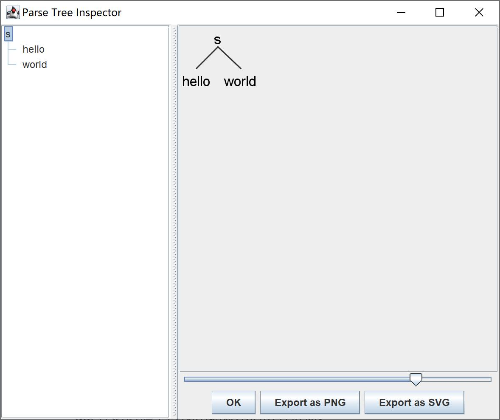
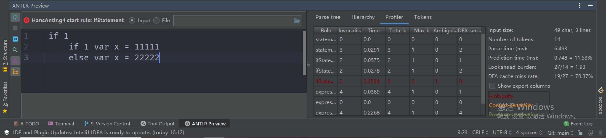

[toc]

# antlr4：实现一门编译到Java字节码的语言

## 引言

近几天我看到一个项目叫[Creating JVM language](https://juejin.cn/post/6844903671679942663)，目标是开发一门编译到JVM字节码的语言。在此我打算跟着这个项目做一遍，以学习：

1. 使用antlr4生成Lexer和Parser的代码。
2. 使用`ASM`，并熟悉大量JVM字节码指令。
3. 使用`JUnit + Mockito`保证项目质量。

为了更好地理解这个项目，我调换了各个功能的实现顺序，先实现过程式的特性，再实现函数和类。另外，我修复了原作者项目的一些问题，在此列举：

1. 原作者给出的规则`STRING: '"' .* '"';`是贪婪模式，会导致`"1"\n"2"`这个例子只匹配到一个字符串。我把它改成了非贪婪模式`STRING: '"' .*? '"';`。
2. 加法和减法、乘法和除法的运算优先级不相同，导致`3 - 1 + 2`算出0，而非4。见本文《Part8：1-支持算数运算》一节。
3. 原作者的`if`语句后跟的statement只有为块语句时才新建了作用域，我进行了修复。
4. 原作者项目存在变量shadow问题，我进行了修复，详见《原作者项目的子作用域变量预期外地修改祖先作用域变量的问题修复》一节。
5. 原作者项目括号表达式定义的优先级有问题，我进行了修复，详见《Part10：2-支持关系运算符+原作者项目括号优先级问题修复》一节。

这门语言叫做`hant`。[GitHub传送门](https://github.com/Hans774882968/hans-antlr-java)。

目前支持的语言特性：

- 定义变量：`var foo = 123`。
- 输出到控制台：`print expression`。
- 完整的表达式支持。相比于C语言仅三目运算符、逗号表达式不支持。

环境：
- Windows10
- VSCode快速创建的Maven项目

**作者：[hans774882968](https://blog.csdn.net/hans774882968)以及[hans774882968](https://juejin.cn/user/1464964842528888)以及[hans774882968](https://www.52pojie.cn/home.php?mod=space&uid=1906177)**

## 致敬原作者：如何运行[原项目](https://github.com/JakubDziworski/Enkel-JVM-language)

原项目的README已经足够清晰，我在此仅给出一些注意点。

1. mvn编译时需要跳过单测，因为单测有3个case会失败：`mvn.cmd clean package -DskipTests`。产物是`compiler\target\compiler-1.0-SNAPSHOT-jar-with-dependencies.jar`而不是`target\enkel-1.0-SNAPSHOT-jar-with-dependencies.jar`。
2. 编译`.enk`文件的命令：原作者给出的命令是`java -classpath compiler/target/compiler-1.0-SNAPSHOT-jar-with-dependencies.jar:. com.kubadziworski.compiler.Compiler EnkelExamples/DefaultParamTest.enk`，但也可以用一个更简单的命令：`java -jar <compiler-1.0-SNAPSHOT-jar-with-dependencies.jar的路径> <enk文件路径>`。编译产生的`.class`文件在根目录，在原作者项目的`.gitignore`中。

## antlr4 hello world（可以跳过）

> ANTLR（ANother Tool for Language Recognition）是用 Java 语言编写的功能强大的语法分析器自动生成工具，由旧金山大学的 Terence Parr 博士等人于 1989 年推出第一代，迭代到现在是第四代，因此一般称之为`antlr4`。该工具本身是 Java 语言的工具，但产出的语法分析器可以是包括 js 和 ts 语言在内的主流编程语言，因此基本上可以认为`antlr4`是当前使用最广泛的一款语法分析器自动生成工具。

> `antlr4`接收 g4 文法作为输入，输出为符合该文法约束的对应目标语言的解析器源代码。更准确地讲，是输出解析器的框架代码，该框架代码在运行时可以自动解析输入文本并生成我们在上一讲提到的AST，但业务项目仍然需要在该框架代码上补充完善业务需求的逻辑。

首先在[antlr官网](https://www.antlr.org/download/antlr-4.13.0-complete.jar)下载jar，并把jar所在路径加入环境变量Path。然后创建文件`src\main\java\com\example\antlr4_hello\Hello.g`：

```
grammar Hello; // 定义文法的名字

s: 'hello' ID; // 匹配关键字hello和标志符
ID: [a-z]+; // 标志符由小写字母组成
WS: [ \t\r\n]+ -> skip; // 跳过空格、制表符、回车符和换行符
```

注意，文件名必须大写，因为我们接下来要生成`.java`的lexer和parser。为了方便，编写一个叫`antlr.ps1`的power shell脚本：

```ps1
java -cp C:\java_project\softs\antlr-4.13.0-complete.jar org.antlr.v4.Tool $args
```

再把`C:\java_project\softs`加入环境变量，就能执行命令来生成`.java`的lexer和parser文件了。

```ps1
antlr src\main\java\com\example\antlr4_hello\Hello.g
```

生成了名称前缀为Hello的8个文件：`src\main\java\com\example\antlr4_hello\HelloBaseListener.java`、`src\main\java\com\example\antlr4_hello\HelloLexer.java`、`src\main\java\com\example\antlr4_hello\HelloListener.java`、`src\main\java\com\example\antlr4_hello\HelloParser.java`、`Hello.tokens`、`HelloLexer.interp`、`Hello.interp`、`HelloLexer.tokens`

现在开始准备编译由antlr4生成的Java代码。准备一个ps1脚本`antlr-compile.ps1`：

```ps1
javac -cp C:\java_project\softs\antlr-4.13.0-complete.jar $args
```

于是可以使用编译命令：

```ps1
antlr-compile src\main\java\com\example\antlr4_hello\Hello*.java
```

到此，我们已经有一个可以被执行的识别器，只缺一个主程序去触发语言识别。

antlr运行库有提供一个称之为TestRig的测试工具，可以让你不创建主程序就能测试文法。TestRig使用Java反射调用编译后的识别器，它能显示关于识别器如何匹配输入的大量信息。

输入命令：

```ps1
java -cp "C:\java_project\softs\antlr-4.13.0-complete.jar;C:\java_project\hans-antlr-java\src\main\java\com\example\antlr4_hello" org.antlr.v4.gui.TestRig Hello s -tokens
```

注意这条命令把`C:\java_project\hans-antlr-java\src\main\java\com\example\antlr4_hello`也加入了classpath，以兼容`antlr-4.13.0-complete.jar`和`Hello*.java`不同路径的情况。不出意外的话你就可以输入文本了。输入`hello world acmer`按回车，然后`Ctrl+Z`结束输入。于是你就能看到TestRig打印出的token列表了。

```
[@0,0:4='hello',<'hello'>,1:0]
[@1,6:10='world',<ID>,1:6]
[@2,12:16='acmer',<ID>,1:12]
[@3,19:18='<EOF>',<EOF>,2:0]
```

查看AST命令：

```ps1
java -cp "C:\java_project\softs\antlr-4.13.0-complete.jar;C:\java_project\hans-antlr-java\src\main\java\com\example\antlr4_hello" org.antlr.v4.gui.TestRig Hello s -gui
```

和上面一样输入`hello world`，可以看到效果：



## VSCode antlr 插件如何关闭自动生成`.antlr`文件夹的功能

antlr插件在点击`.g`文件后会自动生成lexer和parser，并生成`.antlr`文件夹。如何关闭这个功能？只需要设置：

```json
"antlr4.generation": {
    "mode": "none"
}
```

## antlr4 hello world：编程式

`pom.xml`添加依赖：

```xml
<dependency>
    <groupId>org.antlr</groupId>
    <artifactId>antlr4</artifactId>
    <version>4.13.0</version>
</dependency>
```

也可以添加本地依赖：

```xml
<dependency>
    <groupId>org.antlr</groupId>
    <artifactId>v4</artifactId>
    <version>1.0.0</version>
    <scope>system</scope>
    <systemPath>C:\java_project\softs\antlr-4.13.0-complete.jar</systemPath>
</dependency>
```

接着给上一节生成的`.java`文件添加`package com.example.antlr4_hello;`，然后就可以添加测试用例了。`src\test\java\com\example\hans_antlr4\HelloAntlr4Test.java`：

```java
package com.example.hans_antlr4;

import org.antlr.v4.runtime.CharStreams;
import org.antlr.v4.runtime.CommonTokenStream;
import org.antlr.v4.runtime.tree.ParseTree;
import org.junit.Assert;
import org.junit.Test;

import com.example.antlr4_hello.HelloLexer;
import com.example.antlr4_hello.HelloParser;

public class HelloAntlr4Test {
    @Test
    public void hello_antlr4_test() {
        HelloLexer lexer = new HelloLexer(CharStreams.fromString("hello world acmer"));
        CommonTokenStream tokens = new CommonTokenStream(lexer);
        HelloParser parser = new HelloParser(tokens);
        ParseTree tree = parser.s();
        String treeString = tree.toStringTree(parser);
        Assert.assertEquals("(s hello world)", treeString);
        System.out.println(treeString);
    }
}
```

`parser.s()`中的`s`是我们在`Hello.g`中定义的规则名。

TODO: 这样改造后就不能通过上一节的命令行来获取gui输出了。

## Part3：1-用 Listener 实现遍历 AST 过程中的自定义操作

这一节正式开始实现`hant`语言。这一节我们需要添加的特性：

- 声明`int`或者`string`类型的变量：`var str = "str"`
- 打印变量：`print str`
- 简单的类型推断
- 支持`java -jar xx.jar hello.hant`编译`hello.hant`，以及`java -jar xx.jar run hello.hant`直接运行`hello.hant`生成的字节码。
- 支持中文标识符和注释。

这一节的语法规则文件为`src\main\java\com\example\hans_antlr4\parsing\HansAntlr.g4`。

```g4
grammar HansAntlr;

@header {
package com.example.hans_antlr4.parsing;
}

// RULES
compilationUnit: (variable | print)* EOF;
// root rule - our code consist consist only of variables and prints (see definition below)
variable: VARIABLE ID EQUALS value;
// requires VAR token followed by ID token followed by EQUALS TOKEN ...
print:
	PRINT ID; // print statement must consist of 'print' keyword and ID
value:
	op = NUMBER
	| op = STRING; // must be NUMBER or STRING value (defined below)

// TOKENS
VARIABLE: 'var'; // VARIABLE TOKEN must match exactly 'var'
PRINT: 'print';
EQUALS: '='; // must be '='
NUMBER: [0-9]+; // must consist only of digits
// must be anything in quotes。注意，原作者给出的规则`STRING: '"' .* '"';`中的正则表达式是贪婪模式，我改成了非贪婪模式
STRING: '"' .*? '"';
ID: [a-zA-Z0-9]+; // must be any alphanumeric value
WS: [ \t\n\r]+ -> skip; // special TOKEN for skipping whitespaces
```

使用上一节编写的`antlr.ps1`来生成lexer、parser和listener：`antlr src\main\java\com\example\hans_antlr4\parsing\HansAntlr.g4`。

上一节提到，antlr4为我们生成了4个Java文件：

- `src\main\java\com\example\antlr4_hello\HelloBaseListener.java`
- `src\main\java\com\example\antlr4_hello\HelloLexer.java`
- `src\main\java\com\example\antlr4_hello\HelloListener.java`
- `src\main\java\com\example\antlr4_hello\HelloParser.java`

其中：
1. Lexer和Parser都不需要改动。
2. `HelloBaseListener`继承了`HelloListener`，它提供了一些函数，其中形如`enterXyz`，`exitXyz`的函数分别表示进入和离开名为`Xyz`的非终结符时的操作。因此我们只需要在`HelloBaseListener`的`exitXyz`编写自己的逻辑。

`src\main\java\com\example\hans_antlr4\parsing\HansAntlrBaseListener.java`：

```java
@Slf4j
@SuppressWarnings("CheckReturnValue")
public class HansAntlrBaseListener implements HansAntlrListener {
	private Map<String, Variable> variables = new HashMap<>();

	@Override
	public void exitVariable(HansAntlrParser.VariableContext ctx) {
		final TerminalNode varName = ctx.ID();
		final ValueContext varValue = ctx.value();
		if (varValue == null) {
			return;
		}
		final int varType = varValue.getStart().getType();
		final int varIndex = variables.size();
		final String varTextValue = varValue.getText();
		final Variable variable = new Variable(varIndex, varType, varName.getText(), varTextValue);
		variables.put(varName.getText(), variable);
		logVariableDeclarationStatementFound(varName, variable);
	}

    @Override
	public void exitPrint(HansAntlrParser.PrintContext ctx) {
		final TerminalNode varName = ctx.ID();
		if (varName == null) {
			return;
		}
		if (!variables.containsKey(varName.getText())) {
			log.error("ERROR: You are trying to print var '{}' which has not been declared!", varName.getText());
			return;
		}
		final Variable variable = variables.get(varName.getText());
		logPrintStatementFound(varName, variable);
	}

	private void logVariableDeclarationStatementFound(TerminalNode varName, Variable variable) {
		final int line = varName.getSymbol().getLine();
		log.info("OK: Define variable '{}' with type '{}' and value '{}' at line {}",
				variable.getName(), variable.getVarType(), variable.getVarTextValue(), line);
	}

	private void logPrintStatementFound(TerminalNode varName, Variable variable) {
		final int line = varName.getSymbol().getLine();
		final String format = "OK: You instructed to print variable '{}' which has type '{}' value of '{}' at line {}";
		log.info(format, variable.getVarIndex(), variable.getVarType(), variable.getVarTextValue(), line);
	}
}
```

为了方便后续的字节码生成流程，我们抽象出`Variable`表示变量信息。`src\main\java\com\example\hans_antlr4\parsing\Variable.java`：

```java
package com.example.hans_antlr4.parsing;

import lombok.AllArgsConstructor;
import lombok.Data;

@AllArgsConstructor
@Data
public class Variable {
    private int varIndex;
    private int varType;
    private String name;
    private String varTextValue;
}
```

除了BaseListener，我们还需要提供一个ErrorListener。`src\main\java\com\example\hans_antlr4\parsing\HansAntlrErrorListener.java`：

```java
package com.example.hans_antlr4.parsing;

import org.antlr.v4.runtime.BaseErrorListener;
import org.antlr.v4.runtime.RecognitionException;
import org.antlr.v4.runtime.Recognizer;

import lombok.extern.slf4j.Slf4j;

@Slf4j
public class HansAntlrErrorListener extends BaseErrorListener {
    @Override
    public void syntaxError(Recognizer<?, ?> recognizer, Object offendingSymbol, int line, int charPositionInLine,
            String msg, RecognitionException e) {
        final String errorFormat = "The program has error at line %d, char %d :(. Details:\n%s";
        final String errorMsg = String.format(errorFormat, line, charPositionInLine, msg);
        log.error(errorMsg);
    }
}
```

接下来我们需要在入口`src\main\java\com\example\hans_antlr4\App.java`显式地调用Lexer、Parser和Listener。

```java
package com.example.hans_antlr4;

import org.antlr.v4.runtime.CharStreams;
import org.antlr.v4.runtime.CommonTokenStream;
import org.antlr.v4.runtime.tree.ParseTree;

public class App {
    public static void main(String[] args) {
        HansAntlrLexer lexer = new HansAntlrLexer(CharStreams.fromString("var x1 = 114514\r\n" + //
                "print x1\r\n" +
                "var str = \"hello world\"\r\n" +
                "print str"));
        CommonTokenStream tokens = new CommonTokenStream(lexer);
        HansAntlrParser parser = new HansAntlrParser(tokens);

        HansAntlrBaseListener listener = new HansAntlrBaseListener();
        parser.addParseListener(listener);
        HansAntlrErrorListener errorListener = new HansAntlrErrorListener();
        parser.addErrorListener(errorListener);

        ParseTree tree = parser.compilationUnit();
        String treeString = tree.toStringTree(parser);
        System.out.println(treeString);
    }
}
```

运行可得输出：

```
OK: Define variable 'x1' with type '4' and value '114514' at line 1
OK: You instructed to print variable '0' which has type '4' value of '114514' at line 2
OK: Define variable 'str' with type '5' and value '"hello world"' at line 3
OK: You instructed to print variable '1' which has type '5' value of '"hello world"' at line 4
(compilationUnit (variable var x1 = (value 114514)) (print print x1) (variable var str = (value \"hello world\")) (print print str) <EOF>)
```

### VSCode快速运行本项目

点击VSCode界面左侧`Run and Debug`，即可快速生成`.vscode\launch.json`。给某个运行配置加上`args`属性（`string[]`）即可。我目前使用的配置如下：

```json
{
    "version": "0.2.0",
    "configurations": [
        {
            "type": "java",
            "name": "Current File",
            "request": "launch",
            "mainClass": "${file}"
        },
        {
            "type": "java",
            "name": "App",
            "request": "launch",
            "mainClass": "com.example.hans_antlr4.App",
            "projectName": "hans_antlr",
            "args": [
                "run",
                "<.hant文件路径>"
            ]
        }
    ]
}
```

## Part3：2-接受文件输入+打包

为了接受文件输入，我们需要改下入口`src\main\java\com\example\hans_antlr4\App.java`：

```java
@Slf4j
public class App {
    private static ARGUMENT_ERRORS getArgumentValidationError(String[] args) {
        if (args.length != 1) {
            return ARGUMENT_ERRORS.NO_FILE;
        }
        String filePath = args[0];
        if (!filePath.endsWith(".hant")) {
            return ARGUMENT_ERRORS.BAD_FILE_EXTENSION;
        }
        return ARGUMENT_ERRORS.NONE;
    }

    public static void parse(String fileAbsolutePath) throws IOException {
        // 显式调用Lexer、Parser和Listener，和上一节一样，在此省略了
    }

    public static void main(String[] args) {
        ARGUMENT_ERRORS argumentError = getArgumentValidationError(args);
        if (argumentError != ARGUMENT_ERRORS.NONE) {
            log.error(argumentError.getMessage());
            return;
        }
        File hantFile = new File(args[0]);
        String fileAbsolutePath = hantFile.getAbsolutePath();
        log.info("trying to parse hant file \"{}\" ...", fileAbsolutePath);
        try {
            parse(fileAbsolutePath);
        } catch (IOException e) {
            e.printStackTrace();
            return;
        }
    }
}
```

为了打包出一个“自带干粮”的jar，我们需要使用`maven-assembly-plugin`。`pom.xml`新增：

```xml
<plugins>
    <plugin>
    <artifactId>maven-assembly-plugin</artifactId>
    <configuration>
        <descriptorRefs>
        <descriptorRef>jar-with-dependencies</descriptorRef>
        </descriptorRefs>
        <archive>
        <manifest>
            <mainClass>com.example.hans_antlr4.App</mainClass>
        </manifest>
        </archive>
    </configuration>
    <executions>
        <execution>
        <id>make-assembly</id>
        <phase>package</phase>
        <goals>
            <goal>single</goal>
        </goals>
        </execution>
    </executions>
    </plugin>
</plugins>
```

打包完成后，运行命令

```ps1
java -jar C:\java_project\hans-antlr-java\target\hans_antlr-1.0-SNAPSHOT-jar-with-dependencies.jar C:\java_project\hans-antlr-java\hant_examples\hello.hant
```

即可看到输出。

## Part3：3-生成字节码+写入字节码到`.class`文件

为了支持字节码生成和写入，我们需要修改入口`src\main\java\com\example\hans_antlr4\App.java`：

```java
package com.example.hans_antlr4;
// 省略了一些不重要的 import
import java.io.File;
import java.io.FileOutputStream;
import java.io.IOException;
import java.io.OutputStream;
import java.util.Queue;

import org.apache.commons.lang3.StringUtils;

import com.example.hans_antlr4.bytecode_gen.BytecodeGenerator;
import com.example.hans_antlr4.bytecode_gen.instructions.Instruction;

import lombok.extern.slf4j.Slf4j;

@Slf4j
public class App {
    private static ARGUMENT_ERRORS getArgumentValidationError(String[] args) {
        if (args.length != 1) {
            return ARGUMENT_ERRORS.NO_FILE;
        }
        String filePath = args[0];
        if (!filePath.endsWith(".hant")) {
            return ARGUMENT_ERRORS.BAD_FILE_EXTENSION;
        }
        return ARGUMENT_ERRORS.NONE;
    }

    private static Queue<Instruction> parse(String fileAbsolutePath) throws IOException {
        CharStream charStream = CharStreams.fromFileName(fileAbsolutePath);
        HansAntlrLexer lexer = new HansAntlrLexer(charStream);
        // 其他语句省略了，只需要知道这里返回了 instructionsQueue
        return listener.getInstructionsQueue();
    }

    private static void saveBytecodeToClassFile(String fileAbsolutePath, byte[] byteCode) throws IOException {
        final String classFile = StringUtils.replace(fileAbsolutePath, ".hant", ".class");
        OutputStream os = new FileOutputStream(classFile);
        os.write(byteCode);
        os.close();
    }

    public static void main(String[] args) {
        // 前面的语句省略
        Queue<Instruction> instructionsQueue = null;
        try {
            instructionsQueue = parse(fileAbsolutePath);
        } catch (IOException e) {
            e.printStackTrace();
            return;
        }

        final byte[] byteCode = new BytecodeGenerator().generateBytecode(
                instructionsQueue, StringUtils.remove(fileName, ".hant"));
        try {
            saveBytecodeToClassFile(fileAbsolutePath, byteCode);
        } catch (IOException e) {
            e.printStackTrace();
        }
    }
}
```

和字节码生成相关的对象有`Instruction, instructionsQueue, BytecodeGenerator`。我们把字节码生成相关的类都放在`bytecode_gen`文件夹下：

```
SRC\MAIN\JAVA\COM\EXAMPLE\HANS_ANTLR4\BYTECODE_GEN
│  BytecodeGenerator.java
│
└─instructions
        Instruction.java
        PrintVariable.java
        VariableDeclaration.java
```

其中`interface Instruction`表示我们希望生成一条语句的字节码，`PrintVariable`和`VariableDeclaration`表示我们希望生成一条变量定义语句或print语句的字节码，所以后者都要`implements`前者。

遍历AST后，我们就能从 Listener 中拿到`Queue<Instruction> instructionsQueue`。`src\main\java\com\example\hans_antlr4\parsing\HansAntlrBaseListener.java`：

```java
@Slf4j
@SuppressWarnings("CheckReturnValue")
public class HansAntlrBaseListener implements HansAntlrListener {
	private Map<String, Variable> variables = new HashMap<>();
	private Queue<Instruction> instructionsQueue = new ArrayDeque<>();

	public Queue<Instruction> getInstructionsQueue() {
		return instructionsQueue;
	}

    @Override
	public void exitVariable(HansAntlrParser.VariableContext ctx) {
        final TerminalNode varName = ctx.ID();
		final ValueContext varValue = ctx.value();
		if (varValue == null) {
			return;
		}
		final int varType = varValue.getStart().getType();
		final int varIndex = variables.size();
		final String varTextValue = varValue.getText();
		final Variable variable = new Variable(varIndex, varType, varName.getText(), varTextValue);
		variables.put(varName.getText(), variable);
        instructionsQueue.add(new VariableDeclaration(variable));
    }

    @Override
	public void exitPrint(HansAntlrParser.PrintContext ctx) {
        final TerminalNode varName = ctx.ID();
		if (varName == null) {
			return;
		}
		if (!variables.containsKey(varName.getText())) {
			log.error("ERROR: You are trying to print var '{}' which has not been declared!", varName.getText());
			return;
		}
		final Variable variable = variables.get(varName.getText());
		instructionsQueue.add(new PrintVariable(variable));
	}
}
```

接下来我们关注`Instruction`的定义：

```java
package com.example.hans_antlr4.bytecode_gen.instructions;

import org.objectweb.asm.MethodVisitor;

public interface Instruction {
    void apply(MethodVisitor methodVisitor);
}
```

这里选用`ASM`来操作 Java 字节码。这样我们就不用关心非常底层的十六进制数字了。我们只需要知道指令的名字，`ASM`会自动帮我们处理剩下的事情。

`BytecodeGenerator.generateBytecode()`会依次遍历`instructionsQueue`里的`Instruction`，调用`apply`方法来生成字节码，输出`byte[]`。`apply`方法会调用`methodVisitor`的若干visit方法以实现输出字节码的“副作用”。`src\main\java\com\example\hans_antlr4\bytecode_gen\BytecodeGenerator.java`：

```java
package com.example.hans_antlr4.bytecode_gen;

import java.util.Queue;

import org.objectweb.asm.ClassWriter;
import org.objectweb.asm.MethodVisitor;
import org.objectweb.asm.Opcodes;

import com.example.hans_antlr4.bytecode_gen.instructions.Instruction;
import com.example.hans_antlr4.bytecode_gen.instructions.VariableDeclaration;

public class BytecodeGenerator implements Opcodes {
    public byte[] generateBytecode(Queue<Instruction> instructionsQueue, String name) {
        ClassWriter cw = new ClassWriter(0);
        MethodVisitor mv;
        // version, access, name, signature, base class, interfaces
        cw.visit(52, ACC_PUBLIC + ACC_SUPER, name, null, "java/lang/Object", null);
        {
            // declare static void main
            mv = cw.visitMethod(ACC_PUBLIC + ACC_STATIC, "main", "([Ljava/lang/String;)V", null, null);
            final long localVariablesCount = instructionsQueue.stream()
                    .filter(instruction -> instruction instanceof VariableDeclaration)
                    .count();
            final int maxStack = 100;

            // apply instructions generated from traversing parse tree!
            for (Instruction instruction : instructionsQueue) {
                instruction.apply(mv);
            }
            mv.visitInsn(RETURN); // add return instruction

            mv.visitMaxs(maxStack, (int) localVariablesCount); // set max stack and max local variables
            mv.visitEnd();
        }
        cw.visitEnd();

        return cw.toByteArray();
    }
}
```

为了简单，编译后的类直接继承自`Object`, 包含一个`main`函数。`MethodVisitor`需要提供局部变量以及栈的深度。

至此我们可以梳理出主流程：`App.java Listener 获取到 instructionsQueue -> BytecodeGenerator.generateBytecode 输入 instructionsQueue ，输出 byte[] -> PrintVariable 和 VariableDeclaration 生成字节码`。

接下来关注`PrintVariable`和`VariableDeclaration`的实现。

```java
@AllArgsConstructor
public class VariableDeclaration implements Instruction, Opcodes {
    Variable variable;

    @Override
    public void apply(MethodVisitor mv) {
        final int type = variable.getVarType();
        if (type == HansAntlrLexer.NUMBER) {
            int val = Integer.valueOf(variable.getVarTextValue());
            mv.visitIntInsn(SIPUSH, val);
            mv.visitVarInsn(ISTORE, variable.getVarIndex());
        }
        if (type == HansAntlrLexer.STRING) {
            mv.visitLdcInsn(variable.getVarTextValue());
            mv.visitVarInsn(ASTORE, variable.getVarIndex());
        }
    }
}

@AllArgsConstructor
public class PrintVariable implements Instruction, Opcodes {
    Variable variable;

    @Override
    public void apply(MethodVisitor mv) {
        int id = variable.getVarIndex();
        int type = variable.getVarType();
        mv.visitFieldInsn(GETSTATIC, "java/lang/System", "out", "Ljava/io/PrintStream;");
        if (type == HansAntlrLexer.NUMBER) {
            mv.visitVarInsn(ILOAD, id);
            mv.visitMethodInsn(INVOKEVIRTUAL, "java/io/PrintStream", "println", "(I)V", false);
        }
        if (type == HansAntlrLexer.STRING) {
            mv.visitVarInsn(ALOAD, id);
            mv.visitMethodInsn(INVOKEVIRTUAL, "java/io/PrintStream", "println", "(Ljava/lang/String;)V", false);
        }
    }
}
```

`VariableDeclaration`：

- `visitIntInsn` - 第一个参数是操作符，第二个是操作数，操作数类型为`int`。
- `BIPUSH` - 把一个`byte(integer)`入栈，同理`SIPUSH`把两个`byte(integer)`入栈。
- `ISTORE` - int 类型的值出栈，并存储到局部变量中，需要指定局部变量的索引。
- `ASTORE` - 和`ISTORE`功能类似，但是数据类型是索引。
- `visitLdcInsn` - 支持添加常量，从参数来看可以扔`Object`进去，所以`String`和`int`常量肯定都是支持的。

`PrintVariable`：

- `GETSTATIC` - 从`java.lang.System.out`获得静态属性，类型是`java.io.PrintStream`。
- `ILOAD` - 把局部变量入栈，id 是局部变量的索引。
- `visitMethodInsn` - 访问方法指令。
- `INVOKEVIRTUAL` - 触发实例方法（调用 out 的 print 方法，该方法接受一个参数为整数类型，返回为空）。
- `ALOAD` - 和`ILOAD`类似，但是数据类型是引用。

值得注意的是，`mv.visitIntInsn(SIPUSH, val);`只能处理`Short`范围的数据。为了解决这个问题，我们可以根据数值范围来决定所生成的指令。核心代码如下：

```java
public void generate(Value value) {
    Type type = value.getType();
    String stringValue = value.getValue();
    if (type == BuiltInType.INT) {
        int intValue = Integer.parseInt(stringValue);
        if (Byte.MIN_VALUE <= intValue && intValue <= Byte.MAX_VALUE) {
            mv.visitIntInsn(BIPUSH, intValue);
        } else if (Short.MIN_VALUE <= intValue && intValue <= Short.MAX_VALUE) {
            mv.visitIntInsn(SIPUSH, intValue);
        } else {
            mv.visitLdcInsn(intValue);
        }
    }
    if (type == BuiltInType.STRING) {
        stringValue = StringUtils.removeStart(stringValue, "\"");
        stringValue = StringUtils.removeEnd(stringValue, "\"");
        mv.visitLdcInsn(stringValue);
    }
}
```

### 效果

我们准备一个`.hant`文件`hant_examples\hello.hant`：

```js
var x1 = 114514
print x1
var str = "hello world"
print str
var str2 = "hello\n支持输出中文~"
print str2
```

运行代码后，即可看到在同一文件夹下生成了`hello.class`。我们可以使用 JDK 自带的`javap`工具来验证生成的字节码的正确性。`javap -v C:\java_project\hans-antlr-java\hant_examples\hello.class`输出：

```
Classfile /C:/java_project/hans-antlr-java/hant_examples/hello.class
  Last modified 2023年8月13日; size 355 bytes
  SHA-256 checksum bae32267cc9d8cd4cd8072df85c2afc3e5f440df014b84446290f58057d40d7d
public class hello
  minor version: 0
  major version: 52
  flags: (0x0021) ACC_PUBLIC, ACC_SUPER
  this_class: #2                          // hello
  super_class: #4                         // java/lang/Object
  interfaces: 0, fields: 0, methods: 1, attributes: 0
Constant pool:
   #1 = Utf8               hello
   #2 = Class              #1             // hello
   #3 = Utf8               java/lang/Object
   #4 = Class              #3             // java/lang/Object
   #5 = Utf8               main
   #6 = Utf8               ([Ljava/lang/String;)V
   #7 = Utf8               java/lang/System
   #8 = Class              #7             // java/lang/System
   #9 = Utf8               out
  #10 = Utf8               Ljava/io/PrintStream;
  #11 = NameAndType        #9:#10         // out:Ljava/io/PrintStream;
  #12 = Fieldref           #8.#11         // java/lang/System.out:Ljava/io/PrintStream;
  #13 = Utf8               java/io/PrintStream
  #14 = Class              #13            // java/io/PrintStream
  #15 = Utf8               println
  #16 = Utf8               (I)V
  #17 = NameAndType        #15:#16        // println:(I)V
  #18 = Methodref          #14.#17        // java/io/PrintStream.println:(I)V
  #19 = Utf8               \"hello world\"
  #20 = String             #19            // \"hello world\"
  #21 = Utf8               (Ljava/lang/String;)V
  #22 = NameAndType        #15:#21        // println:(Ljava/lang/String;)V
  #23 = Methodref          #14.#22        // java/io/PrintStream.println:(Ljava/lang/String;)V
  #24 = Utf8               \"hello\\n支持输出中文~\"
  #25 = String             #24            // \"hello\\n支持输出中文~\"
  #26 = Utf8               Code
{
  public static void main(java.lang.String[]);
    descriptor: ([Ljava/lang/String;)V
    flags: (0x0009) ACC_PUBLIC, ACC_STATIC
    Code:
      stack=100, locals=3, args_size=1
         0: sipush        -16558
         3: istore_0
         4: getstatic     #12                 // Field java/lang/System.out:Ljava/io/PrintStream;
         7: iload_0
         8: invokevirtual #18                 // Method java/io/PrintStream.println:(I)V
        11: ldc           #20                 // String \"hello world\"
        13: astore_1
        14: getstatic     #12                 // Field java/lang/System.out:Ljava/io/PrintStream;
        17: aload_1
        18: invokevirtual #23                 // Method java/io/PrintStream.println:(Ljava/lang/String;)V
        21: ldc           #25                 // String \"hello\\n支持输出中文~\"
        23: astore_2
        24: getstatic     #12                 // Field java/lang/System.out:Ljava/io/PrintStream;
        27: aload_2
        28: invokevirtual #23                 // Method java/io/PrintStream.println:(Ljava/lang/String;)V
        31: return
}
```

运行class文件的命令：

```ps1
java -cp C:\java_project\hans-antlr-java\hant_examples hello
# or 在 C:\java_project\hans-antlr-java\hant_examples 下运行
java hello
```

输出：

```
-16558
"hello world"
"hello\n支持输出中文~"
```

## Part3：4-在命令行直接运行`.hant`代码

在上一节我们已经得到了类的`byte[]`，因此可以直接使用`ClassLoader`加载并运行这个类。首先，我们修改入口，同时支持`java -jar xx.jar hello.hant`和`java -jar xx.jar run hello.hant`：

```java
@Slf4j
public class App {
    private static boolean runMode = false;

    private static ARGUMENT_ERRORS getArgumentValidationError(String[] args) {
        if ((runMode && args.length != 2) || (!runMode && args.length != 1)) {
            return ARGUMENT_ERRORS.NO_FILE;
        }
        String filePath = runMode ? args[1] : args[0];
        if (!filePath.endsWith(".hant")) {
            return ARGUMENT_ERRORS.BAD_FILE_EXTENSION;
        }
        return ARGUMENT_ERRORS.NONE;
    }

    private static void runClass(byte[] byteCode) {
        CodeRunner.run(byteCode);
    }

    public static void main(String[] args) {
        runMode = args[0].equals("run");
        ARGUMENT_ERRORS argumentError = getArgumentValidationError(args);
        if (argumentError != ARGUMENT_ERRORS.NONE) {
            log.error(argumentError.getMessage());
            return;
        }

        String inputFilePath = runMode ? args[1] : args[0];
        File hantFile = new File(inputFilePath);
        // 省略无关代码
        try {
            if (runMode) {
                runClass(byteCode);
            } else {
                saveBytecodeToClassFile(fileAbsolutePath, byteCode);
            }
        } catch (IOException e) {
            e.printStackTrace();
        }
    }
}
```

TODO: 这部分代码开始乱了，要整理下~考虑引入命令行参数解析框架

新增的`src\main\java\com\example\hans_antlr4\CodeRunner.java`从`byte[]`加载类并调用其`main`函数：

```java
package com.example.hans_antlr4;

import java.lang.reflect.InvocationTargetException;
import java.lang.reflect.Method;

class MyClassLoader extends ClassLoader {
    public Class<?> myDefineClass(byte[] arg1, int arg2, int arg3) {
        return super.defineClass(null, arg1, arg2, arg3);
    }
}

public class CodeRunner {
    public static void run(byte[] byteCode) {
        MyClassLoader cl = new MyClassLoader();
        Class<?> cls = cl.myDefineClass(byteCode, 0, byteCode.length);
        try {
            Method mainMethod = cls.getDeclaredMethod("main", String[].class);
            mainMethod.invoke(null, (Object) new String[] {});
        } catch (NoSuchMethodException | SecurityException | IllegalAccessException | IllegalArgumentException
                | InvocationTargetException e) {
            e.printStackTrace();
        }
    }
}
```

## Part3：5-支持中文标识符和注释

有一个很重要的观念是，要积极从现有编程语言的antlr规则文件中取经。

为了支持中文标识符，我选择了[TS的语法规则](https://github.com/antlr/grammars-v4/blob/master/javascript/typescript/TypeScriptLexer.g4)：

```g4
Identifier: IdentifierStart IdentifierPart*;
fragment IdentifierStart:
	[\p{L}]
	| [$_]
	| '\\' UnicodeEscapeSequence;
fragment UnicodeEscapeSequence:
	'u' HexDigit HexDigit HexDigit HexDigit;
fragment HexDigit: [0-9a-fA-F];
fragment IdentifierPart:
	IdentifierStart
	| [\p{Mn}]
	| [\p{Nd}]
	| [\p{Pc}]
	| '\u200C'
	| '\u200D';
```

为了支持注释，我选择了[Java的语法规则](https://github.com/antlr/grammars-v4/blob/master/java/java9/Java9Lexer.g4)

```g4
COMMENT: '/*' .*? '*/' -> channel(HIDDEN);
LINE_COMMENT: '//' ~[\r\n]* -> channel(HIDDEN);
```

### 效果

准备一个`.hant`文件：

```js
var x = "// 这不是单行注释" // 注释
print /* 注释 */ "/* 这不是块注释 */"
```

也可以查看`src\test\java\com\example\hans_antlr4\HansAntlr4Test.java` `unicodeVarNameAndComments()`这个单测用例。

```java
@Test
public void unicodeVarNameAndComments() {
    Statement statement = TestUtils.getFirstStatementFromCode("var 変数名2です /* 这是一个注释 */ = \"// 这不是注释\"");

    VariableDeclaration variableDeclaration = new VariableDeclaration("変数名2です",
            new Value(BuiltInType.STRING, "\"// 这不是注释\""));
    Assert.assertEquals(variableDeclaration, statement);

    MethodVisitor mv = mock(MethodVisitor.class);
    Scope scope = mock(Scope.class);
    StatementGenerator statementGenerator = new StatementGenerator(mv, scope);
    statementGenerator.generate(statement);
    verify(mv, times(1)).visitVarInsn(eq(Opcodes.ASTORE), eq(0));
}
```

## Part4~6：1-改用 Visitor 模式

antlr提供了Listener和Visitor两种模式使得我们能方便地遍历AST，以提取代码文本中的信息。为什么这里我们需要把代码改造成Visitor模式呢？

- 更少的代码。
- 更少的BUG。无需把解析的结果保存到变量里。

原作者给出的对比代码：

```java
// Listener
class ClassListener extends EnkelBaseListener<ClassDeclaration> {

    private Class parsedClass;

    @Override
    public void enterClassDeclaration(@NotNull EnkelParser.ClassDeclarationContext ctx) {
        String className = ctx.className().getText();
        // do some other stuff
        parsedClass = new Class(className, methods);
    }

    public Class getParsedClass() {
        return parsedClass;
    }
}

// Visitor
public class ClassVisitor extends EnkelBaseVisitor<ClassDeclaration> {

    @Override
    public ClassDeclaration visitClassDeclaration(@NotNull EnkelParser.ClassDeclarationContext ctx) {
        String name = ctx.className().getText();
        // do some other stuff
        return new ClassDeclaration(name, methods);
    }
}
```

listener和visitor都支持拆分，只不过我目前的实现规模较小，没有进行拆分。但listener只支持副作用，而visitor允许调用者直接拿到返回值，所以Visitor模式可以稍微少写点代码。

给`antlr.jar`显式传入`-visitor`即可获取`BaseVisitor.java`：

```ps1
antlr src\main\java\com\example\hans_antlr4\parsing\HansAntlr.g4 -visitor -no-listener
```

为了方便visitor的实现，需要改下文法：

```g4
compilationUnit: statements EOF;
statements: (variable | print)*;
```

我们自己的Visitor直接import刚刚生成的`src\main\java\com\example\hans_antlr4\parsing\HansAntlrBaseVisitor.java`即可。新增visitor：

```
biz_visitor
    CompilationUnitVisitor.java
    StatementVisitor.java
```

`src\main\java\com\example\hans_antlr4\parsing\biz_visitor\CompilationUnitVisitor.java`：

```java
@EqualsAndHashCode(callSuper = false)
@Data
public class CompilationUnitVisitor extends HansAntlrBaseVisitor<CompilationUnit> {
    @Override
    public CompilationUnit visitCompilationUnit(HansAntlrParser.CompilationUnitContext ctx) {
        StatementVisitor statementVisitor = new StatementVisitor();
        ctx.statements().accept(statementVisitor);
        return new CompilationUnit(statementVisitor.getInstructionsQueue());
    }
}
```

`src\main\java\com\example\hans_antlr4\parsing\biz_visitor\StatementVisitor.java`：

```java
@EqualsAndHashCode(callSuper = false)
@Data
@Slf4j
public class StatementVisitor extends HansAntlrBaseVisitor<Instruction> {
    private Map<String, Variable> variables = new HashMap<>();
    private Queue<Instruction> instructionsQueue = new ArrayDeque<>();

    @Override
    public VariableDeclaration visitVariable(HansAntlrParser.VariableContext ctx) {
        final TerminalNode varName = ctx.ID();
        final ValueContext varValue = ctx.value();
        if (varValue == null) {
            return null;
        }
        final int varType = varValue.getStart().getType();
        final int varIndex = variables.size();
        final String varTextValue = varValue.getText();
        final Variable variable = new Variable(varIndex, varType, varName.getText(), varTextValue);
        variables.put(varName.getText(), variable);
        VariableDeclaration variableDeclaration = new VariableDeclaration(variable);
        instructionsQueue.add(variableDeclaration);
        logVariableDeclarationStatementFound(varName, variable);
        return variableDeclaration;
    }

    @Override
    public PrintVariable visitPrint(HansAntlrParser.PrintContext ctx) {
        final TerminalNode varName = ctx.ID();
        if (varName == null) {
            return null;
        }
        if (!variables.containsKey(varName.getText())) {
            log.error("ERROR: You are trying to print var '{}' which has not been declared!", varName.getText());
            return null;
        }
        final Variable variable = variables.get(varName.getText());
        PrintVariable printVariable = new PrintVariable(variable);
        instructionsQueue.add(printVariable);
        logPrintStatementFound(varName, variable);
        return printVariable;
    }

    // logVariableDeclarationStatementFound 、 logPrintStatementFound 没有变化，省略了
}
```

这里用到了本次新增的`src\main\java\com\example\hans_antlr4\bytecode_gen\CompilationUnit.java`，它是由`com.example.hans_antlr4.bytecode_gen.BytecodeGenerator`稍作修改而来。

```java
@Data
@AllArgsConstructor
public class CompilationUnit implements Opcodes {
    private Queue<Instruction> instructionsQueue;

    public byte[] generateBytecode(String name) {
        ClassWriter cw = new ClassWriter(0);
        MethodVisitor mv;
        // version, access, name, signature, base class, interfaces
        cw.visit(52, ACC_PUBLIC + ACC_SUPER, name, null, "java/lang/Object", null);
        {
            // declare static void main
            mv = cw.visitMethod(ACC_PUBLIC + ACC_STATIC, "main", "([Ljava/lang/String;)V", null, null);
            final long localVariablesCount = instructionsQueue.stream()
                    .filter(instruction -> instruction instanceof VariableDeclaration)
                    .count();
            final int maxStack = 100;

            // apply instructions generated from traversing parse tree!
            for (Instruction instruction : instructionsQueue) {
                instruction.apply(mv);
            }
            mv.visitInsn(RETURN); // add return instruction

            mv.visitMaxs(maxStack, (int) localVariablesCount); // set max stack and max local variables
            mv.visitEnd();
        }
        cw.visitEnd();

        return cw.toByteArray();
    }
}
```

最后稍微改下入口调用`Parser`的代码，把`parser.addParseListener(listener);`改为`tree.accept(compilationUnitVisitor)`即可：

```java
@Slf4j
public class App {
    // 其他函数省略
    private static CompilationUnit parse(String fileAbsolutePath) throws IOException {
        CharStream charStream = CharStreams.fromFileName(fileAbsolutePath);
        HansAntlrLexer lexer = new HansAntlrLexer(charStream);
        CommonTokenStream tokens = new CommonTokenStream(lexer);
        HansAntlrParser parser = new HansAntlrParser(tokens);

        CompilationUnitVisitor compilationUnitVisitor = new CompilationUnitVisitor();
        HansAntlrErrorListener errorListener = new HansAntlrErrorListener();
        parser.addErrorListener(errorListener);

        ParseTree tree = parser.compilationUnit();
        CompilationUnit compilationUnit = tree.accept(compilationUnitVisitor);
        String treeString = tree.toStringTree(parser);
        System.out.println(treeString);
        return compilationUnit;
    }
}
```

## Part4~7：2-语法规则新增`expression`，为实现表达式功能做准备

本节改动对应原作者的[这个commit](https://github.com/JakubDziworski/Enkel-JVM-language/commit/433179bfbf67e65b7d9dc19d74b244df546ad333)。原作者博客的有效信息十分少，只有直接阅读上述commit的代码才能明白为什么需要做这些改造。

为什么要做这些改造？我的理解如下：整个项目原本只需要一部分：在`visitor`中写完所有代码。但这样做很快项目就会失控。于是我们会拆为两部分：`visitor + utils`。这依旧不能解决visitor各个函数代码较为松散、受束缚的痛点。所以我们决定拆为三部分：`visitor + bytecode_gen + utils`。visitor部分负责提取AST中的数据，比如作用域。如果某个数据结构组织成树的形式，比如解析表达式的表达式树，那么可以认为我们提取了更为精炼的AST，有助于字节码生成阶段。`bytecode_gen`部分则专注于字节码生成。本节改动引入的`domain`文件夹就是visitor和`bytecode_gen`部分沟通的语言。总而言之，“分层”是保证项目质量的一种有效手段。

本节主要工作：

1. 给语法规则新增了`expression`的产生式，为实现表达式功能做准备。
2. 新增作用域管理类`Scope`。

本节需要引入大量的类，用于沟通visitor部分和`bytecode_gen`部分，新增的类主要集中在`domain`文件夹。因为时间紧迫、改动过大，在此我仅给出[commit传送门](https://github.com/Hans774882968/hans-antlr-java/commit/425c4eddd27fa80b3a5fc870a0ac08a892687f7e)，并简单介绍一下文件夹的结构和相关文件的作用：

```
SRC\MAIN\JAVA\COM\EXAMPLE\HANS_ANTLR4
│  App.java：项目入口
│  CodeRunner.java：负责直接在内存运行刚刚生成的类
│
├─bytecode_gen
│      CompilationUnit.java：字节码生成的入口文件
│      ExpressionGenerator.java：含若干 generate(Expression expression) 方法，负责生成表达式的字节码
│      PrintStatementGenerator.java：负责生成 print 语句的字节码
│      StatementGenerator.java：分发到具体的语句类型，如 PrintStatementGenerator
│      VariableDeclarationStatementGenerator.java：负责生成变量定义语句的字节码
│
├─domain：domain文件夹下的类，主要是用于沟通 visitors 和 bytecodeGenerators
│  ├─expression
│  │      Addition.java：记录加法信息用于表达式生成。下一小节才会用到。
│  │      ArithmeticExpression.java：Addition等具体算数运算类的基类。下一小节才会用到。
│  │      Division.java：记录除法信息用于表达式生成。下一小节才会用到。
│  │      Expression.java：所有表达式类，如 Value 、VarReference 、 ArithmeticExpression 的基类。
│  │      Multiplication.java：记录乘法信息用于表达式生成。下一小节才会用到。
│  │      Pow.java：记录乘方信息用于表达式生成。下一小节才会用到。
│  │      Subtraction.java：记录减法信息用于表达式生成。下一小节才会用到。
│  │      Value.java：记录常量信息。
│  │      VarReference.java：记录变量引用信息。
│  │
│  ├─global
│  │      MetaData.java：目前仅用于作用域类 Scope 的初始化。
│  │
│  ├─scope
│  │      LocalVariable.java：记录局部变量信息。
│  │      Scope.java：记录作用域信息。可以理解为之前的 Queue<Instruction> instructionsQueue 的封装。数据结构变更为 List<LocalVariable> localVariables 。添加局部变量的操作移动到了 StatementVisitor ，被封装为 scope.addLocalVariable(new LocalVariable(varName, 类型))。
│  │
│  ├─statement：语句相关的类
│  │      PrintStatement.java：记录 print 语句的信息。目前只记录了待 print 的 expression 。
│  │      Statement.java：用于记录语句信息。是其他语句类的基类。
│  │      VariableDeclaration.java：记录变量定义语句的信息。目前只记录了变量名和变量初始值的表达式。
│  │
│  └─type
│          BuiltInType.java
│          ClassType.java
│          Type.java：用于记录类型信息。是其他类型类的基类。
│
├─exception：自定义异常类
│      LocalVariableNotFoundException.java
│      UnsupportedArithmeticOperationException.java
│
├─parsing
│  │  HansAntlr.g4：语法规则。下面其他的文件都是由 antlr.jar 工具生成，不需要改动。主要逻辑都在 biz_visitor 文件夹下。
│  │  HansAntlr.interp
│  │  HansAntlr.tokens
│  │  HansAntlrBaseVisitor.java
│  │  HansAntlrErrorListener.java
│  │  HansAntlrLexer.interp
│  │  HansAntlrLexer.java
│  │  HansAntlrLexer.tokens
│  │  HansAntlrParser.java
│  │  HansAntlrVisitor.java
│  │
│  └─biz_visitor
│          CompilationUnitVisitor.java：visitor的入口。
│          ExpressionVisitor.java：遍历至表达式子树时记录信息。
│          StatementVisitor.java：遍历至语句子树时记录信息。如变量定义语句、 print 语句。
│
├─utils
│      TypeResolver.java：目前只有一个方法 public static Type TypeResolver.getFromValue(String value) ，仅在 ExpressionVisitor.visitValue 用到，用于提取常量的类型信息。
│
└─validation
        ARGUMENT_ERRORS.java：用于入口，解析命令行参数。
```

另外，最好在本节就将`ExpressionGenerator`和`StatementGenerator`改造成若干不同签名的`generate`方法，并分别给对应的`Expression`和`Statement`添加`accept`抽象方法来调用`generate`方法——虽然我是在后续才做了这个改动。以`StatementGenerator`为例：

```java
public class StatementGenerator {
    private MethodVisitor mv;
    private Scope scope;

    public StatementGenerator(MethodVisitor mv, Scope scope) {
        this.mv = mv;
        this.scope = scope;
    }

    public void generate(PrintStatement printStatement) {
        new PrintStatementGenerator(mv, scope).generate(printStatement);
    }

    public void generate(VariableDeclaration variableDeclaration) {
        new VariableDeclarationStatementGenerator(mv, scope).generate(variableDeclaration);
    }
}
```

相应地，遍历`instructionsQueue`的代码也应变为：

```java
StatementGenerator statementGenerator = new StatementGenerator(mv, scope);
for (Statement instruction : instructionsQueue) {
    instruction.accept(statementGenerator);
}
```

## Part8：1-支持算数运算

原作者给出的文法如下：

```g4
expression:
	varReference						# VARREFERENCE
	| value								# VALUE
	| functionCall						# FUNCALL
	| '(' expression '*' expression ')'	# MULTIPLY
	| expression '*' expression			# MULTIPLY
	| '(' expression '/' expression ')'	# DIVIDE
	| expression '/' expression			# DIVIDE
	| '(' expression '+' expression ')'	# ADD
	| expression '+' expression			# ADD
	| '(' expression '-' expression ')'	# SUBSTRACT
	| expression '-' expression			# SUBSTRACT; // “SUBSTRACT”是typo
```

tips：

1. 产生式的顺序就是优先级。比如，在这个文法里，加法的优先级大于减法。
2. 这条规则有直接左递归，不过antlr4是允许直接左递归的，所以没问题。但编写规则的时候要注意，antlr4目前不支持间接左递归。

这个文法至少存在3个问题：

1. 不支持`(x0)`，只支持`(x0 + 0)`；不支持`-x0`，只支持`0 - x0`。
2. 加法和减法、乘法和除法的运算优先级不相同，导致`3 - 1 + 2`算出0，而非4。
3. 确定的括号优先级不正确，导致`3 * 10 + 70`算出100，但`(3 * 10 + 70)`算出240。

问题1和3将在《Part10：2-支持关系运算符+原作者项目括号优先级问题修复》一节解决。

为了解决问题2，需要让`'+'`和`'-'`出现在同一条产生式。改造后的文法如下：

```g4
expression:
	variableReference								# VarReference
	| value											# ValueExpr
	| '(' expression POW expression ')'				# POW
	| expression POW expression						# POW
	| '(' expression MULTIPLICATIVE expression ')'	# MULTIPLICATIVE
	| expression MULTIPLICATIVE expression			# MULTIPLICATIVE
	| '(' expression ADDITIVE expression ')'		# ADDITIVE
	| expression ADDITIVE expression				# ADDITIVE
	| '(' expression SHIFT expression ')'			# SHIFT
	| expression SHIFT expression					# SHIFT
	| '(' expression AND expression ')'				# AND
	| expression AND expression						# AND
	| '(' expression XOR expression ')'				# XOR
	| expression XOR expression						# XOR
	| '(' expression OR expression ')'				# OR
	| expression OR expression						# OR;

POW: '**';
MULTIPLICATIVE: '*' | '/' | '%';
ADDITIVE: '+' | '-';
SHIFT: '<<' | '>>' | '>>>';
AND: '&';
XOR: '^';
OR: '|';
```

接下来在visitor判断好当前优先级实际的运算符是`'+'`还是`'-'`，返回对应类型的类用于构建表达式树。`src\main\java\com\example\hans_antlr4\parsing\biz_visitor\ExpressionVisitor.java`：

```java
@AllArgsConstructor
public class ExpressionVisitor extends HansAntlrBaseVisitor<Expression> {
    private Scope scope;

    @Override
    public Additive visitADDITIVE(HansAntlrParser.ADDITIVEContext ctx) {
        ExpressionContext leftExpressionContext = ctx.expression(0);
        ExpressionContext rightExpressionContext = ctx.expression(1);
        Expression leftExpression = leftExpressionContext.accept(this);
        Expression rightExpression = rightExpressionContext.accept(this);
        String op = ctx.ADDITIVE().getText();
        if (op.equals("+")) {
            return new Addition(leftExpression, rightExpression);
        }
        return new Subtraction(leftExpression, rightExpression);
    }
}
```

为了支持返回多种类型，需要引入一个中间父类：`src\main\java\com\example\hans_antlr4\domain\expression\Additive.java`。

```java
package com.example.hans_antlr4.domain.expression;

import com.example.hans_antlr4.domain.type.Type;

public abstract class Additive extends ArithmeticExpression {
    Additive(Type type, Expression leftExpression, Expression rightExpression) {
        super(type, leftExpression, rightExpression);
    }
}
```

如果当前运算优先级只有一个运算符，则不需要引入中间父类，比如：`&`、`^`、`|`。

在原作者的设计里，`Addition`和`Subtraction`直接继承了`ArithmeticExpression`。我改造成了`Addition -> Additive -> ArithmeticExpression`。同理，乘除法、移位分别产生了中间父类`src\main\java\com\example\hans_antlr4\domain\expression\Multiplicative.java`、`src\main\java\com\example\hans_antlr4\domain\expression\Shift.java`。

这样`src\main\java\com\example\hans_antlr4\bytecode_gen\ExpressionGenerator.java`就不必考虑当前优先级实际的运算符了，直接根据类型生成指令即可。

其他改造：

1. 给`Expression`添加`accept`抽象方法来调用`ExpressionGenerator`下的某个`generate`方法，于是`public void generate(Expression expression, Scope scope)`可以删除。
2. `ExpressionGenerator`、`PrintStatementGenerator`、`StatementGenerator`、`VariableDeclarationStatementGenerator`添加成员`private Scope scope;`，在调用构造函数时就获得`scope`，这样它们各个方法就不需要额外传入`scope`了。

### 支持乘方（`**`）运算

我们知道，Python支持乘方运算符，所以在此我也尝试支持。首先确定一下其特性：

1. 乘方运算符优先级大于乘法、除法、取模。
2. 乘方运算符也是左结合的。

接着据此修改规则：

```g4
expression:
	variableReference								# VarReference
	| value											# ValueExpr
	| '(' expression POW expression ')'				# POW
	| expression POW expression						# POW
	| '(' expression MULTIPLICATIVE expression ')'	# MULTIPLICATIVE
	| expression MULTIPLICATIVE expression			# MULTIPLICATIVE
	| '(' expression ADDITIVE expression ')'		# ADDITIVE
	| expression ADDITIVE expression				# ADDITIVE;

variableReference: Identifier;

POW: '**';
MULTIPLICATIVE: '*' | '/' | '%';
ADDITIVE: '+' | '-';
```

对`ExpressionVisitor`的改动和加减乘除一样：

```java
    @Override
    public Pow visitPOW(HansAntlrParser.POWContext ctx) {
        ExpressionContext leftExpressionContext = ctx.expression(0);
        ExpressionContext rightExpressionContext = ctx.expression(1);
        Expression leftExpression = leftExpressionContext.accept(this);
        Expression rightExpression = rightExpressionContext.accept(this);
        return new Pow(leftExpression, rightExpression);
    }
```

新增的`Pow`类也和加减乘除的一样：

```java
public class Pow extends ArithmeticExpression {
    public Pow(Expression leftExpression, Expression rightExpression) {
        super(leftExpression.getType(), leftExpression, rightExpression);
    }

    @Override
    public void accept(ExpressionGenerator generator) {
        generator.generate(this);
    }
}
```

字节码生成是支持乘方运算符的难点，我们打算先研究相关字节码再写代码。我们快速写一段Java代码：

```java
public class TestLookAtBytecode {
    public static void main(String[] args) {
        int x = 114514;
        int v = (int) Math.pow(x - 114514 + 1 * 2, x - 114514 + 1 * 3) + (x - 114512);
        System.out.println(v);
    }
}
```

并执行`javap -v xx.class`查看相关的字节码：

```
20: iload_1
21: ldc           #16                 // int 114514
23: isub
24: iconst_2
25: iadd
// 生成好 expression 的字节码后，需要生成 i2d 语句强转为 double
26: i2d
27: iload_1
28: ldc           #16                 // int 114514
30: isub
31: iconst_3
32: iadd
33: i2d
// 两个参数都准备好后即可生成 Math.pow 的调用语句
34: invokestatic  #34                 // Method java/lang/Math.pow:(DD)D       
// 因为目前 hant 语言只支持整型，所以需要强转回 int
37: d2i
38: iload_1
39: ldc           #40                 // int 114512
41: isub
42: iadd
43: istore_3
44: getstatic     #17                 // Field java/lang/System.out:Ljava/io/PrintStream;
47: iload_3
48: invokevirtual #23                 // Method java/io/PrintStream.println:(I)V
51: return
```

要点：
1. 生成好`expression`的字节码后，需要生成`i2d`语句强转为`double`。
2. 两个参数都准备好后即可生成`Math.pow`的调用语句`invokestatic`。
3. 因为目前 hant 语言只支持整型，所以需要生成`d2i`语句强转回`int`。

于是可以写出其`generate(Pow expression)`方法：

```java
    public void generate(Pow expression) {
        Expression leftExpression = expression.getLeftExpression();
        Expression rightExpression = expression.getRightExpression();
        leftExpression.accept(this);
        mv.visitInsn(I2D);
        rightExpression.accept(this);
        mv.visitInsn(I2D);
        ClassType owner = new ClassType("java.lang.Math");
        String fieldDescriptor = owner.getInternalName(); // "java/lang/Math"
        String descriptor = "(DD)D";
        mv.visitMethodInsn(INVOKESTATIC, fieldDescriptor, "pow", descriptor, false);
        mv.visitInsn(D2I);
    }
```

### 效果

`hant_examples\expression`下的`.hant`文件：

- `https://github.com/Hans774882968/hans-antlr-java/blob/main/hant_examples/expression/bitwise.hant`
- `https://github.com/Hans774882968/hans-antlr-java/blob/main/hant_examples/expression/expression_base.hant`
- `https://github.com/Hans774882968/hans-antlr-java/blob/main/hant_examples/expression/mod.hant`
- `https://github.com/Hans774882968/hans-antlr-java/blob/main/hant_examples/expression/shift.hant`

## Part8：2-编写`bytecode_gen`下代码单测的解决方案：`Mockito`

`bytecode_gen`文件夹下代码的测试用例需要通过确认函数的调用次数符合预期，来间接保证生成的字节码正确。因此我们需要一个Mock框架，经过简单搜索我选择了`Mockito`。添加`Mockito`依赖：

```xml
<dependency>
    <groupId>org.mockito</groupId>
    <artifactId>mockito-all</artifactId>
    <version>2.0.2-beta</version>
</dependency>
```

顺便把`junit`升级到最新，以解决GitHub指出的安全漏洞：

```xml
<dependency>
    <groupId>junit</groupId>
    <artifactId>junit</artifactId>
    <version>4.13.2</version>
    <scope>test</scope>
</dependency>
```

用法（[参考链接3](https://blog.csdn.net/shangboerds/article/details/99611079)）：

1. `MethodVisitor mv = mock(MethodVisitor.class);`：规避对象初始化过程所依赖的环境，快速获得对象。
2. `verify(mv, times(0)).visitLdcInsn(anyString());`：格式为：`verify(对象, times(方法的期望调用次数)).对象的方法(参数规则，如 anyString() 或 eq("foo"))`。值得注意的是，`verify`返回的对象不可以保存到变量里再进行多次调用，否则测试结果不符合预期。

测试用例`src\test\java\com\example\hans_antlr4\HansAntlr4Test.java`示例：

```java
public class HansAntlr4Test {
    // ...
    @Test
    public void variableDeclarationStatementGeneratorTest1() {
        MethodVisitor mv = mock(MethodVisitor.class);
        Scope scope = mock(Scope.class);
        StatementGenerator statementGenerator = new StatementGenerator(mv, scope);
        statementGenerator.generate(new VariableDeclaration("v0", new Value(BuiltInType.INT, "114514")));
        verify(mv, times(1)).visitVarInsn(eq(Opcodes.ISTORE), anyInt());
        verify(mv, times(0)).visitVarInsn(eq(Opcodes.ASTORE), anyInt());
        verify(mv, times(1)).visitIntInsn(eq(Opcodes.SIPUSH), anyInt());
        verify(mv, times(0)).visitLdcInsn(anyString());
    }
}
```

值得注意的是，`Mockito`依赖`cglib`实现hook，导致Java17报非法反射的错。对于VSCode的`Test Runner for Java`插件，可以通过在`.vscode\settings.json`设置`--add-opens`解决：

```json
{
    "java.test.config": {
        "vmArgs": [
            "--add-opens=java.base/java.lang=ALL-UNNAMED"
        ]
    }
}
```

但这个虚拟机参数似乎没办法传入`mvn.cmd`，设置`MAVEN_OPTS`环境变量也未生效，导致打包时无法通过单测。所以只好先在`.vscode\settings.json`设置跳过测试的虚拟机参数了：

```json
{
    "maven.executable.options": "-DskipTests"
}
```

TODO: 想办法把`--add-opens=java.base/java.lang=ALL-UNNAMED`传入`mvn.cmd`，从而可以恢复打包命令的单测。

另外，为了支持使用junit的`Assert.assertEquals()`方便地验证表达式树符合预期，我们需要补充`domain`下所有用到的类——在本项目中是所有没有子类的类的`equals`和`hashCode`方法。比如，`Unary, Additive`有子类，没被直接用到，不需要补充；`Addition`没有子类，会被直接用到，需要补充。补充过程为：先使用VSCode插件`Java Code Generators`生成`equals`和`hashCode`方法，再进行修改，把这个类具有的所有属性包含进`Objects.equals / Objects.hash`。下面举几个例子：

1. `Scope`。

```java
@Override
public boolean equals(Object o) {
    if (o == this)
        return true;
    if (!(o instanceof Scope)) {
        return false;
    }
    Scope scope = (Scope) o;
    return Objects.equals(localVariables, scope.localVariables) && Objects.equals(metaData, scope.metaData);
}

@Override
public int hashCode() {
    return Objects.hash(localVariables, metaData);
}
```

2、`Addition`。

```java
@Override
public boolean equals(Object o) {
    if (o == this)
        return true;
    if (!(o instanceof Addition)) {
        return false;
    }
    Addition addition = (Addition) o;
    return Objects.equals(getType(), addition.getType())
            && Objects.equals(getLeftExpression(), addition.getLeftExpression())
            && Objects.equals(getRightExpression(), addition.getRightExpression());
}

@Override
public int hashCode() {
    return Objects.hash(getType(), getLeftExpression(), getRightExpression());
}
```

## Part10：1-支持block语句和if语句

首先修改文法规则：

```g4
compilationUnit: statements EOF;
statements: statement*;
block: '{' statements '}';
statement: block | variable | ifStatement | print;
variable: VARIABLE Identifier EQUALS expression;
ifStatement:
	'if' ('(')? expression (')')? trueStatement = statement (
		'else' falseStatement = statement
	)?;

expression:
	// ... 
	| '(' expression RELATIONAL expression ')'		# RELATIONAL
	| expression RELATIONAL expression				# RELATIONAL
	| '(' expression EQUALITY expression ')'		# EQUALITY
	| expression EQUALITY expression				# EQUALITY
```

- `ifStatement`的`expression`是一个真值表达式。
- 真值表达式放到括号里是非必要的，问号意味着是可选的。
- 为 true 时`trueStatement`会被执行。
- if 后面可以跟随者 else。
- 当 false 时`falseStatement`会被执行。

我们不需要专门处理`if ... else if`，因为`else if`就是`falseStatement`为if语句的情况。

值得注意的是，IDEA antlr插件告诉我们，这个文法有二义性。



我尝试了[antlr4解决else悬空问题的GitHub issue](https://github.com/antlr/antlr4/issues/42)给出的写法，都不能消除IDEA antlr插件报告的二义性问题。实际上antlr4处理这个二义性问题已有默认策略，就是匹配最近的`if`，所以这个问题可以不解决。TODO: 但后续可以参考《编译原理》第2版例4.16解决，也可以参考[参考链接4](https://www.jianshu.com/p/2d55d50f8bc4)解决，两者描述的是同一个文法。

### 支持block语句

支持block的改造比较常规，保证传入`newScope`即可。

`Block`定义（`src\main\java\com\example\hans_antlr4\domain\statement\Block.java`）：

```java
@AllArgsConstructor
@Getter
public class Block implements Statement {
    private final List<Statement> statements;
    private final Scope scope;

    @Override
    public void accept(StatementGenerator generator) {
        generator.generate(this);
    }

    public List<Statement> getStatements() {
        return Collections.unmodifiableList(statements);
    }
}
```

`src\main\java\com\example\hans_antlr4\parsing\biz_visitor\StatementVisitor.java`的改造：

```java
@Override
public Block visitBlock(HansAntlrParser.BlockContext ctx) {
    Scope newScope = new Scope(scope);
    StatementsVisitor statementsVisitor = new StatementsVisitor(newScope);
    List<Statement> statements = ctx.statements().accept(statementsVisitor);
    Block block = new Block(statements, newScope);
    instructionsQueue.add(block);
    return block;
}
```

为了接收`List<Statement>`，我们不得不引入`StatementsGenerator`。`src\main\java\com\example\hans_antlr4\parsing\biz_visitor\StatementsVisitor.java`如下：

```java
public class StatementsVisitor extends HansAntlrBaseVisitor<List<Statement>> {
    private Scope scope;

    public StatementsVisitor(Scope scope) {
        super();
        this.scope = scope;
    }

    @Override
    public List<Statement> visitStatements(HansAntlrParser.StatementsContext ctx) {
        StatementVisitor statementVisitor = new StatementVisitor(scope);
        List<Statement> statements = ctx.statement().stream()
                .map(stmt -> stmt.accept(statementVisitor))
                .collect(Collectors.toList());
        return statements;
    }
}
```

`src\main\java\com\example\hans_antlr4\bytecode_gen\StatementGenerator.java`的改造：

```java
public void generate(Block block) {
    new BlockStatementGenerator(mv).generate(block);
}
```

新增的`BlockStatementGenerator`也比较常规，`src\main\java\com\example\hans_antlr4\bytecode_gen\BlockStatementGenerator.java`如下：

```java
@AllArgsConstructor
@Getter
public class BlockStatementGenerator implements Opcodes {
    private MethodVisitor mv;

    public void generate(Block blockStatement) {
        Scope newScope = blockStatement.getScope();
        StatementGenerator statementGenerator = new StatementGenerator(mv, newScope);
        blockStatement.getStatements().forEach(stmt -> stmt.accept(statementGenerator));
    }
}
```

相关测试代码：`https://github.com/Hans774882968/hans-antlr-java/blob/main/hant_examples/block.hant`。

### 支持if语句

在介绍if语句visitor的改造之前，需要先讨论作用域问题。我发现原作者项目并没有专门为`if`语句处理作用域，而是使用了`block`语句自带的作用域处理能力。我们编写以下`.enk`文件：

```enk
IfTest {
    start {
        if true var x = "x"
        else var y = "y"
        var z = "z"
        print z+"z"
    }
}
```

编译方式见上文《致敬原作者：如何运行原项目》。生成的`.class`文件如下：

```
  public void start();
    descriptor: ()V
    flags: (0x0001) ACC_PUBLIC
    Code:
      stack=3, locals=4, args_size=1
         0: ldc           #7                  // int 1
         2: ifne          11
         5: ldc           #9                  // String y
         7: astore_2
         8: goto          14
        11: ldc           #11                 // String x
        13: astore_1
        14: ldc           #13                 // String z
        16: astore_3
        17: getstatic     #19                 // Field java/lang/System.out:Ljava/io/PrintStream;
        20: new           #21                 // class java/lang/StringBuilder
        23: dup
        24: invokespecial #24                 // Method java/lang/StringBuilder."<init>":()V
        27: aload_3
        28: invokevirtual #28                 // Method java/lang/StringBuilder.append:(Ljava/lang/String;)Ljava/lang/StringBuilder;
        31: ldc           #13                 // String z
        33: invokevirtual #28                 // Method java/lang/StringBuilder.append:(Ljava/lang/String;)Ljava/lang/StringBuilder;
        36: invokevirtual #32                 // Method java/lang/StringBuilder.toString:()Ljava/lang/String;
        39: invokevirtual #38                 // Method java/io/PrintStream.println:(Ljava/lang/String;)V  
        42: return
      StackMapTable: number_of_entries = 2
        frame_type = 11 /* same */
        frame_type = 2 /* same */
```

可见变量`z`索引为3，但我们期望的索引为1。

另外，如果尝试访问if块内定义的变量，则会报运行时错误。比如对于以下`.enk`代码：

```enk
IfTest {
    start {
        if true var x = "x"
        else var y = "y"
        print x
    }
}
```

报错：

```
java.lang.VerifyError: Bad local variable type
Exception Details:
  Location:
    IfTest.start()V @17: aload_1
  Reason:
    Type top (current frame, locals[1]) is not assignable to reference type
```

为了满足期望，应该保证出block后能够销毁`if`的语句块所产生的变量。幸好`StatementGenerator`要求传入`Scope`，我们只需要保证`StatementGenerator`获取的是`newScope`即可。为此，我们引入了`StatementAfterIf`对象，如下（`src\main\java\com\example\hans_antlr4\domain\statement\StatementAfterIf.java`）：

```java
package com.example.hans_antlr4.domain.statement;

import com.example.hans_antlr4.bytecode_gen.StatementGenerator;
import com.example.hans_antlr4.domain.scope.Scope;

import lombok.AllArgsConstructor;
import lombok.Getter;

@AllArgsConstructor
@Getter
public class StatementAfterIf implements Statement {
    private final Scope newScope;
    private final Statement statement;

    @Override
    public void accept(StatementGenerator generator) {
        generator.generate(this);
    }
}
```

对应地，要给`StatementGenerator`添加一个`StatementAfterIf`的`generate`方法：

```java
public void generate(StatementAfterIf statementAfterIf) {
    StatementGenerator statementGenerator = new StatementGenerator(mv, scope);
    statementAfterIf.getStatement().accept(statementGenerator);
}
```

于是`IfStatement`可以改成持有`StatementAfterIf`对象了：

```java
@Getter
public class IfStatement implements Statement {
    private final Expression condition;
    private final StatementAfterIf trueStatement;
    private final Optional<StatementAfterIf> falseStatement;

    public IfStatement(Expression condition, StatementAfterIf trueStatement, StatementAfterIf falseStatement) {
        this.condition = condition;
        this.trueStatement = trueStatement;
        this.falseStatement = Optional.ofNullable(falseStatement);
    }

    public IfStatement(Expression condition, StatementAfterIf trueStatement) {
        this.condition = condition;
        this.trueStatement = trueStatement;
        this.falseStatement = Optional.empty();
    }

    @Override
    public void accept(StatementGenerator generator) {
        generator.generate(this);
    }

    public Optional<StatementAfterIf> getFalseStatement() {
        return falseStatement;
    }
}
```

看不惯Java啰嗦的你可能会问：直接把`newTrueScope`和`newFalseScope`挂到`IfStatement`下不就行？的确引入`StatementAfterIf`不是必要的，这里引入`StatementAfterIf`是为了可读性。

接下来改造`src\main\java\com\example\hans_antlr4\parsing\biz_visitor\StatementVisitor.java`：

```java
    @Override
public IfStatement visitIfStatement(HansAntlrParser.IfStatementContext ctx) {
    final ExpressionContext conditionalExpressionContext = ctx.expression();
    final ExpressionVisitor expressionVisitor = new ExpressionVisitor(scope);
    final Expression condition = conditionalExpressionContext.accept(expressionVisitor);
    // if 的两个语句应该各自新开作用域
    Scope newTrueScope = new Scope(scope);
    final StatementVisitor trueStatementVisitor = new StatementVisitor(newTrueScope);
    final Statement trueStatement = ctx.trueStatement.accept(trueStatementVisitor);
    final StatementAfterIf trueStatementAfterIf = new StatementAfterIf(newTrueScope, trueStatement);
    if (ctx.falseStatement == null) {
        IfStatement ifStatementResult = new IfStatement(condition, trueStatementAfterIf);
        instructionsQueue.add(ifStatementResult);
        return ifStatementResult;
    }
    Scope newFalseScope = new Scope(scope);
    final StatementVisitor falseStatementVisitor = new StatementVisitor(newFalseScope);
    final Statement falseStatement = ctx.falseStatement.accept(falseStatementVisitor);
    final StatementAfterIf falseStatementAfterIf = new StatementAfterIf(newFalseScope, falseStatement);
    IfStatement ifStatementResult = new IfStatement(condition, trueStatementAfterIf, falseStatementAfterIf);
    instructionsQueue.add(ifStatementResult);
    return ifStatementResult;
}
```

只需要注意，`if`的两个语句应该各自新开作用域。

接下来看`generator`部分。`StatementGenerator`的改造：

```java
public void generate(IfStatement ifStatement) {
    new IfStatementGenerator(mv, scope).generate(ifStatement);
}
```

新增的`src\main\java\com\example\hans_antlr4\bytecode_gen\IfStatementGenerator.java`：

```java
@AllArgsConstructor
@Getter
public class IfStatementGenerator implements Opcodes {
    private MethodVisitor mv;
    private Scope scope;

    public void generate(IfStatement ifStatement) {
        Expression condition = ifStatement.getCondition();
        condition.accept(new ExpressionGenerator(mv, scope));
        Label trueLabel = new Label();
        Label endLabel = new Label();
        mv.visitJumpInsn(IFNE, trueLabel);

        Optional<StatementAfterIf> falseStatement = ifStatement.getFalseStatement();
        if (falseStatement.isPresent()) {
            StatementGenerator statementGenerator = new StatementGenerator(mv, falseStatement.get().getNewScope());
            falseStatement.get().accept(statementGenerator);
        }

        mv.visitJumpInsn(GOTO, endLabel);
        mv.visitLabel(trueLabel);
        StatementAfterIf trueStatement = ifStatement.getTrueStatement();
        StatementGenerator statementGenerator = new StatementGenerator(mv, trueStatement.getNewScope());
        trueStatement.accept(statementGenerator);
        mv.visitLabel(endLabel);
    }
}
```

JVM 中有一些指令来做分支判断：

`if<eq,ne,lt,le,gt,ge>` - 操作数栈出栈，和 0 比较。
`if_icmp_<eq,ne,lt,le,gt,ge>` - 从栈上出栈两个值，比较是否相等。
`if[non]null` - 检查空值。

为了简单，本节我们只使用`IFNE`指令。如果学过汇编，上面的代码还是比较容易理解的。

```assembly
IFNE trueLabel ; 如果栈顶值不等于0，就跳到true分支代码对应的标签
; 生成false分支的代码，不跳转时就继续往下一句执行，也就是走false分支了
GOTO endLabel ; false分支走完，不能再走true分支
trueLabel:
; 生成true分支的代码
endLabel:
; 后续代码
```

同理，我们也可以写下面的代码：

```assembly
IFEQ falseLabel
; true分支代码
GOTO endLabel
falseLabel:
; false分支代码
endLabel:
; 后续代码
```

[相关单测代码](https://github.com/Hans774882968/hans-antlr-java/blob/main/src/test/java/com/example/hans_antlr4/HantIfTest.java)

相关测试代码：`hant_examples\if`下的`.hant`文件：

- `hant_examples\if\ambiguity.hant`：测试二义性。
- `hant_examples\if\if_scope_test.hant`：测试确实新建了作用域，尤其是`if`后跟单个语句的情况。
- `hant_examples\if\if.hant`：一些杂乱的测试。

这次需要加`-noverify`才能运行，否则报错：

```
java.lang.VerifyError: Expecting a stackmap frame at branch target 24
Exception Details:
  Location:
    ambiguity.main([Ljava/lang/String;)V @10: ifne
  Reason:
    Expected stackmap frame at this location.
```

TODO: 原因未知。

### 原作者项目的子作用域变量预期外地修改祖先作用域变量的问题修复

在我以为`if`语句已经支持完毕时，我又发现了一个和作用域有关的问题：

```hant
var x = 10
print x
{
    var x = 20
    print x
}
{
    // 一开始发现 y 输出40，不符合预期。有几个选项：
    // 1、Scope 改造成跳 parent 的逻辑。2、检测变量 shadow 并报错。3、getLocalVariable 改成 findLast。
    // 最后选择了3。
    var y = x + 20
    print y // 30
}
```

子作用域的变量预期外地修改了祖先作用域的变量。实际上原作者的项目也有这个问题。测试`.enk`代码如下（`https://github.com/JakubDziworski/Enkel-JVM-language/blob/master/EnkelExamples/ifTest3.enk`）：

```enk
IfTest3 {
    start {
        var x = 10
        print x
        if 1 {
            var x = 20
            print x
        }
        if 1 {
            var y = x + 20
            print y
        }
        print (3 * 10 + 70)
    }
}
```

我们关注`https://github.com/JakubDziworski/Enkel-JVM-language/blob/master/compiler/src/main/java/com/kubadziworski/domain/scope/Scope.java`的相关代码：

```java
public LocalVariable getLocalVariable(String varName) {
    return Optional.ofNullable(localVariables.get(varName))
            .orElseThrow(() -> new LocalVariableNotFoundException(this, varName));
}

public int getLocalVariableIndex(String varName) {
    return localVariables.indexOf(varName);
}
```

因为`indexOf`比较相等调用的是`.equals`方法，但这里应该比较的是对象地址，即使用`==`。如何解决？如上述`hant`代码注释所说，因为祖先作用域的变量都是有序添加到列表的最后的，所以我们可以把查找时的`findFirst`改造为`findLast`，并将`indexOf`修改为自己实现的查找算法。修改后的`Scope`类相关方法：

```java
public LocalVariable getLocalVariable(String varName) {
    // 越靠后的元素作用域层级越大，所以可以通过返回最后一个元素来实现变量 shadow
    return localVariables.stream()
            .filter(variable -> variable.getVarName().equals(varName))
            .reduce((result, item) -> item)
            .orElseThrow(() -> new LocalVariableNotFoundException(this, varName));
}

public int getLocalVariableIndex(String varName) {
    LocalVariable localVariable = getLocalVariable(varName);
    // 这里必须使用 == 比较对象地址，所以不能使用 indexOf
    for (int i = 0; i < localVariables.size(); i++) {
        if (localVariables.get(i) == localVariable) {
            return i;
        }
    }
    return -1;
}
```

验证问题已修复的`hant`代码（`hant_examples\if\if_scope_test.hant`）：

```hant
print "scope test about variable x"
if 1 {
    var x = 20
    print x ** 2
    if 1 {
        var x = 30
        {
            var x = 40
            print x ** 2
        }
        print x ** 2
    }
} else {
    var x = 1234
    print x ** 2
}
if 1 var x = 50
else if 1 var x = 60
print x ** 2
```

## Part10：2-支持关系运算符、一元运算符+原作者项目括号优先级问题修复

原作者项目Part10实际上包含了支持关系运算符和支持if语句两部分，为了将边界清晰地展示给大家，我把这两者拆分开来实现了。在不支持关系运算符的时候，你也已经可以直接在`if`语句上写表达式，只不过需要加`-noverify`参数才能运行。那么为什么需要支持关系运算符？我理解是为后续支持boolean类型做准备。

另外，我们已经发现原作者项目的文法规则确定的括号优先级不正确，导致`3 * 10 + 70`算出100，但`(3 * 10 + 70)`算出240。既然这一节要支持关系运算符和一元运算符，那么我们顺便把这个问题也解决了。

首先参考[参考链接5](https://blog.csdn.net/weixin_41960890/article/details/105263228)重新设计表达式的语法规则：

```g4
expression:
	variableReference								# VarReference
	| value											# ValueExpr
	| '(' expression ')'							# BRACKET
	| UNARY = ('+' | '-' | '~') expression			# UNARY
	| expression POW expression						# POW
	| expression MULTIPLICATIVE expression			# MULTIPLICATIVE
	| expression ADDITIVE = ('+' | '-') expression	# ADDITIVE
	| expression SHIFT expression					# SHIFT
	| expression RELATIONAL expression				# RELATIONAL
	| expression EQUALITY expression				# EQUALITY
	| expression AND expression						# AND
	| expression XOR expression						# XOR
	| expression OR expression						# OR;

// hant TOKENS
POW: '**';
MULTIPLICATIVE: '*' | '/' | '%';
SHIFT: '<<' | '>>' | '>>>';
RELATIONAL: '<' | '<=' | '>' | '>=';
EQUALITY: '==' | '!=';
AND: '&';
XOR: '^';
OR: '|';
```

1. 括号表达式应该处于最高优先级。`variableReference`、`value`和`'(' expression ')'`的优先级关系随意。
2. `UNARY`表达式的优先级目前仅次于括号表达式。
2. `UNARY`和之前的词法规则`ADDITIVE`在一起会产生歧义，因此我们把词法规则`ADDITIVE`删除，并改成Token，这样获取运算符的方式就由`String op = ctx.ADDITIVE().getText();`变为`String op = ctx.ADDITIVE.getText();`。

### 支持一元运算符

新增`unary`文件夹和一元运算符相关的类。继承关系：`UnaryNegative, UnaryPositive, UnaryTilde -> Unary`。

```java
@Getter
public abstract class Unary extends Expression {
    private Expression expression;

    public Unary(Type type, Expression expression) {
        super(type);
        this.expression = expression;
    }
}

public class UnaryNegative extends Unary {
    public UnaryNegative(Expression expression) {
        super(expression.getType(), expression);
    }

    @Override
    public void accept(ExpressionGenerator generator) {
        generator.generate(this);
    }
}
```

`ExpressionVisitor`新增：

```java
@Override
public Unary visitUNARY(HansAntlrParser.UNARYContext ctx) {
    Expression expression = ctx.expression().accept(this);
    String op = ctx.UNARY.getText();
    if (op.equals("+")) {
        return new UnaryPositive(expression);
    }
    if (op.equals("-")) {
        return new UnaryNegative(expression);
    }
    return new UnaryTilde(expression);
}
```

随便写段Java代码：

```java
public class TestLookAtBytecode {
    public static void main(String[] args) {
        int x = 10;
        System.out.println(~-~~-+~-+x);
    }
}
```

很快就能确定一元运算符所使用的指令：`+`无额外指令，`-`生成`INEG`指令，`~`生成`ICONST_M1`和`IXOR`指令（异或-1）。

`ExpressionGenerator`新增：

```java
public void generate(UnaryPositive expression) {
    expression.getExpression().accept(this);
}

public void generate(UnaryNegative expression) {
    expression.getExpression().accept(this);
    mv.visitInsn(INEG);
}

public void generate(UnaryTilde expression) {
    expression.getExpression().accept(this);
    mv.visitInsn(ICONST_M1);
    mv.visitInsn(IXOR);
}
```

[相关`.hant`测试代码](https://github.com/Hans774882968/hans-antlr-java/blob/main/hant_examples/expression/expression_base.hant)

### 原作者项目括号优先级问题修复

相比于其他运算符比较特殊的一点是，我们不需要引入括号类，因此目前我没有引入括号类。但不引入括号类有一个缺点：拿到一棵表达式树，要生成它对应的**括号最少的**表达式字符串变得困难了（给每棵子树都添加括号是一个可行的字符串）。

因为表达式树已经包含了运算优先级信息，所以我们不需要修改字节码生成部分，只需要修改visitor部分。

```java
@Override
public Expression visitBRACKET(HansAntlrParser.BRACKETContext ctx) {
    Expression expression = ctx.expression().accept(this);
    return expression;
}
```

[表达式优先级相关单测用例](https://github.com/Hans774882968/hans-antlr-java/blob/main/src/test/java/com/example/hans_antlr4/HantOperatorPriorityTest.java)。

[表达式优先级相关`.hant`测试代码](https://github.com/Hans774882968/hans-antlr-java/blob/495ecef88aaa3b2289210290a0fbb72e23a57bef/hant_examples/expression/expression_base.hant)。

### 支持关系运算符

首先引入`ConditionalExpression`类。`src\main\java\com\example\hans_antlr4\domain\expression\ConditionalExpression.java`：

```java
@Getter
public class ConditionalExpression extends Expression {
    private final CompareSign compareSign;
    private final Expression leftExpression;
    private final Expression rightExpression;
    private final boolean isPrimitiveComparison;

    public ConditionalExpression(Expression leftExpression, Expression rightExpression, CompareSign compareSign) {
        super(BuiltInType.BOOLEAN);
        this.compareSign = compareSign;
        this.leftExpression = leftExpression;
        this.rightExpression = rightExpression;
        boolean leftExpressionIsPrimitive = leftExpression.getType().getTypeClass().isPrimitive();
        boolean rightExpressionIsPrimitive = rightExpression.getType().getTypeClass().isPrimitive();
        isPrimitiveComparison = leftExpressionIsPrimitive && rightExpressionIsPrimitive;
        boolean isObjectsComparison = !leftExpressionIsPrimitive && !rightExpressionIsPrimitive;
        boolean isMixedComparison = !isPrimitiveComparison && !isObjectsComparison;
        if (isMixedComparison) {
            throw new MixedComparisonNotAllowedException(leftExpression.getType(), rightExpression.getType()); // src\main\java\com\example\hans_antlr4\exception\MixedComparisonNotAllowedException.java
        }
    }

    @Override
    public void accept(ExpressionGenerator generator) {
        generator.generate(this);
    }
}
```

1. 引入`CompareSign`枚举不是必须的，是一种Clean Code技巧。
2. `isPrimitiveComparison`字段目前没有用到，在后续支持对象的比较时才会用到。

`ExpressionVisitor`新增：

```java
public ConditionalExpression getConditionalExpression(
        ExpressionContext leftExpressionContext,
        ExpressionContext rightExpressionContext,
        TerminalNode terminalNode) {
    Expression leftExpression = leftExpressionContext.accept(this);
    Expression rightExpression = rightExpressionContext != null
            ? rightExpressionContext.accept(this)
            : new Value(BuiltInType.INT, "0");
    CompareSign cmpSign = terminalNode != null
            ? CompareSign.fromString(terminalNode.getText())
            : CompareSign.NOT_EQUAL;
    return new ConditionalExpression(leftExpression, rightExpression, cmpSign);
}

@Override
public ConditionalExpression visitRELATIONAL(HansAntlrParser.RELATIONALContext ctx) {
    ExpressionContext leftExpressionContext = ctx.expression(0);
    ExpressionContext rightExpressionContext = ctx.expression(1);
    return getConditionalExpression(leftExpressionContext, rightExpressionContext, ctx.RELATIONAL());
}

@Override
public ConditionalExpression visitEQUALITY(HansAntlrParser.EQUALITYContext ctx) {
    ExpressionContext leftExpressionContext = ctx.expression(0);
    ExpressionContext rightExpressionContext = ctx.expression(1);
    return getConditionalExpression(leftExpressionContext, rightExpressionContext, ctx.EQUALITY());
}
```

为了不让`ExpressionGenerator`代码量膨胀得太快，这次我拆分出了`src\main\java\com\example\hans_antlr4\bytecode_gen\expression\ConditionalExpressionGenerator.java`。

```java
@AllArgsConstructor
public class ConditionalExpressionGenerator implements Opcodes {
    private ExpressionGenerator parent;
    private MethodVisitor mv;

    public void generate(ConditionalExpression conditionalExpression) {
        Expression leftExpression = conditionalExpression.getLeftExpression();
        Expression rightExpression = conditionalExpression.getRightExpression();
        CompareSign compareSign = conditionalExpression.getCompareSign();
        if (conditionalExpression.isPrimitiveComparison()) {
            generatePrimitivesComparison(leftExpression, rightExpression, compareSign);
        } else {
            throw new SupportGenerateObjectsComparisonLaterException(leftExpression, rightExpression, compareSign);
        }
        Label endLabel = new Label();
        Label trueLabel = new Label();
        mv.visitJumpInsn(compareSign.getOpcode(), trueLabel);
        mv.visitInsn(ICONST_0);
        mv.visitJumpInsn(GOTO, endLabel);
        mv.visitLabel(trueLabel);
        mv.visitInsn(ICONST_1);
        mv.visitLabel(endLabel);
    }

    private void generatePrimitivesComparison(Expression leftExpression, Expression rightExpression,
            CompareSign compareSign) {
        leftExpression.accept(parent);
        rightExpression.accept(parent);
        mv.visitInsn(ISUB);
    }
}
```

这一节的核心代码，算是对上一节学到的`IFNE`等指令的复习。如果学过汇编，这段代码就很容易理解。以

```hant
var const1 = 55
if const1 >= 44 {
    print "55 >= 44"
}
```

为例。这里`compareSign.getOpcode() = IFGE`。

```assembly
; 左侧的被减数入栈
; 右侧的减数入栈
ISUB ; 把减法结果保存到栈顶
IFGE trueLabel ; 如果栈顶的减法结果大于等于0，则跳到true分支
; 立即数0加入栈顶
GOTO endLabel
trueLabel:
; 立即数1加入栈顶
endLabel:
; 后续代码
```

[相关单测代码](https://github.com/Hans774882968/hans-antlr-java/blob/main/src/test/java/com/example/hans_antlr4/HantIfTest.java)

相关`.hant`测试代码：

1. [relational_exp.hant](https://github.com/Hans774882968/hans-antlr-java/blob/main/hant_examples/if/relational_exp.hant)
2. [equality_exp.hant](https://github.com/Hans774882968/hans-antlr-java/blob/main/hant_examples/if/equality_exp.hant)

## Part13-1-支持ranged for循环

本节我们仿照[Creating JVM language [PART 13] - For Loops](https://jakubdziworski.github.io/enkel/2016/04/24/enkel_13_for_loops.html)实现ranged for循环：`for i: L to R body`。但由我的方案所生成的字节码会和原项目有一些差异。比如：原项目生成了两份方法体的字节码，但我的方案只会生成一份方法体的字节码。

文法规则修改：

```g4
statement:
	variable
	| print
	| block
	| ifStatement
	| forStatement;

forStatement: 'for' ('(')? rangedForConditions (')')? statement;
rangedForConditions:
	iterator = variableReference ':' startExpr = expression range = 'to' endExpr = expression;
```

新增数据结构：`src\main\java\com\example\hans_antlr4\domain\statement\RangedForStatement.java`。

```java
@Getter
public class RangedForStatement implements Statement {
    private String iteratorVarName;
    private Expression startExpression;
    private Expression endExpression;
    private Statement bodyStatement;
    private Scope scope;
    private Statement iteratorVariableStatement;

    public RangedForStatement(
            Statement iteratorVariableStatement,
            String iteratorVarName,
            Expression startExpression,
            Expression endExpression,
            Statement bodyStatement,
            Scope scope) {
        this.iteratorVarName = iteratorVarName;
        this.startExpression = startExpression;
        this.endExpression = endExpression;
        this.bodyStatement = bodyStatement;
        this.scope = scope;
        this.iteratorVariableStatement = iteratorVariableStatement;
    }

    @Override
    public void accept(StatementGenerator generator) {
        generator.generate(this);
    }

    public Type getEndExpressionType() {
        return endExpression.getType();
    }
}
```

`iteratorVariableStatement`是什么？我们生成for循环的字节码时，需要先判断迭代变量是否已经定义。如果未定义，则生成变量定义语句，否则生成赋值语句。因为本节还未实现赋值，所以我们先抛出了一个异常：`src\main\java\com\example\hans_antlr4\exception\SupportAssignmentLaterException.java`。

```java
package com.example.hans_antlr4.exception;

public class SupportAssignmentLaterException extends RuntimeException {
    public SupportAssignmentLaterException() {
        super("We will support assignment expression later");
    }
}
```

`StatementVisitor`新增：

```java
    @Override
public RangedForStatement visitForStatement(HansAntlrParser.ForStatementContext ctx) {
    Scope newScope = new Scope(scope);
    final RangedForConditionsContext rangedForConditionsContext = ctx.rangedForConditions();
    final ExpressionVisitor expressionVisitor = new ExpressionVisitor(newScope);
    final String iteratorVarName = rangedForConditionsContext.variableReference().getText();
    final Expression startExpr = rangedForConditionsContext.startExpr.accept(expressionVisitor);
    final Expression endExpr = rangedForConditionsContext.endExpr.accept(expressionVisitor);
    final StatementVisitor statementVisitor = new StatementVisitor(newScope);
    // 实现赋值表达式后再修改这里
    if (newScope.localVariableExists(iteratorVarName)) {
        throw new SupportAssignmentLaterException();
    }
    newScope.addLocalVariable(new LocalVariable(iteratorVarName, startExpr.getType()));
    Statement iteratorVariableStatement = new VariableDeclaration(iteratorVarName, startExpr);
    Statement statement = ctx.statement().accept(statementVisitor);

    RangedForStatement rangedForStatement = new RangedForStatement(
            iteratorVariableStatement, iteratorVarName, startExpr, endExpr, statement, newScope);
    instructionsQueue.add(rangedForStatement);
    return rangedForStatement;
}
```

要注意，获取方法体的语句`ctx.statement().accept(statementVisitor)`要在`newScope.addLocalVariable`之后执行，否则拿不到变量定义。

`Scope`新增的`localVariableExists`方法：

```java
public boolean localVariableExists(String varName) {
    return localVariables.stream()
            .anyMatch(variable -> variable.getVarName().equals(varName));
}
```

JVM没有为 for 循环设计特殊的指令。一种实现方式就是使用控制流指令，也就是上一节接触到的`IFNE, IFGE`等指令。这就是考验你编写汇编代码能力的时候了！原作者项目的方案和我的方案理解难度没有差别，但原作者项目的方案生成了两份方法体的字节码，性能不太好，所以下面分享一下我设计的方案。

首先，我们最好先找一个可靠的参照。简单写一段代码：

```java
public class TestLookAtBytecode {
    public static void main(String[] args) {
        int up = 10;
        for (int i = 1; i <= up; i += 3) {
            if (i % 2 == 0)
                break;
            System.out.println(i);
            if (i % 2 == 0)
                continue;
        }
    }
}
```

并使用`javap`命令生成字节码：

```
0: getstatic     #16                 // Field java/lang/System.out:Ljava/io/PrintStream;
3: ldc           #102                // String forStatement
5: invokevirtual #35                 // Method java/io/PrintStream.println:(Ljava/lang/String;)V
8: bipush        10
10: istore_0
11: iconst_1
12: istore_1
13: goto          26
16: getstatic     #16                 // Field java/lang/System.out:Ljava/io/PrintStream;
19: iload_1
20: invokevirtual #22                 // Method java/io/PrintStream.println:(I)V
23: iinc          1, 3
26: iload_1
27: iload_0
28: if_icmple     16
31: return
LineNumberTable:
line 69: 0
line 70: 8
line 71: 11
line 74: 16
line 71: 23
line 78: 31
```

简单总结一下组成部分：

- 变量定义语句
- `GOTO`语句，跳到条件判断区
- 方法体
- 循环后操作区
- 条件判断区

我们按这个框架来写代码即可。

循环后操作区和条件判断区的代码是本功能的难点，接下来讨论这一块的实现。我设计的文法允许`startExpr, endExpr`都是任意表达式，因此是加1还是减1必须在运行时决定，所以我决定生成这样的字节码：

```assembly
; 判断 startExpr < endExpr 的表达式，若满足则栈顶为1
IFEQ decOneLabel
; IINC指令，变量加1
GOTO conditionLabel

decOneLabel:
; IINC指令，变量减1

conditionLabel:
; 条件判断相关指令
```

同理，结束条件判断也需要运行时决定。如果`startExpr < endExpr`，则继续运行的条件为`itVar <= endExpr`，否则为`itVar >= endExpr`。这里就不写出汇编伪代码了，给新手读者留作练习。

`src\main\java\com\example\hans_antlr4\bytecode_gen\statement\RangedForStatementGenerator.java`完整代码：

```java
@AllArgsConstructor
@Getter
public class RangedForStatementGenerator implements Opcodes {
    private MethodVisitor mv;

    public void generate(RangedForStatement rangedForStatement) {
        final Scope newScope = rangedForStatement.getScope();
        final String iteratorVarName = rangedForStatement.getIteratorVarName();
        final int iteratorVarIndex = newScope.getLocalVariableIndex(iteratorVarName);
        final Expression startExpression = rangedForStatement.getStartExpression();
        final Expression endExpression = rangedForStatement.getEndExpression();
        final Type endExprType = rangedForStatement.getEndExpressionType();
        ExpressionGenerator expressionGenerator = new ExpressionGenerator(mv, newScope);
        StatementGenerator statementGenerator = new StatementGenerator(mv, newScope);

        // 1. 生成变量定义语句
        rangedForStatement.getIteratorVariableStatement().accept(statementGenerator);

        // 2. 生成 GOTO 结束条件判断区的 label
        Label conditionLabel = new Label();
        mv.visitJumpInsn(GOTO, conditionLabel);

        // 3. 方法体
        Label bodyLabel = new Label();
        mv.visitLabel(bodyLabel);
        rangedForStatement.getBodyStatement().accept(statementGenerator);

        // 4. 生成加1或减1的操作
        ConditionalExpression startLessThenEndExpression = new ConditionalExpression(
                startExpression, endExpression, CompareSign.LESS);
        startLessThenEndExpression.accept(expressionGenerator);
        Label decOneLabel = new Label();
        mv.visitJumpInsn(IFEQ, decOneLabel);
        mv.visitIincInsn(iteratorVarIndex, 1);
        mv.visitJumpInsn(GOTO, conditionLabel);

        mv.visitLabel(decOneLabel);
        mv.visitIincInsn(iteratorVarIndex, -1);

        // 5. 生成条件判断
        mv.visitLabel(conditionLabel);
        startLessThenEndExpression.accept(expressionGenerator);
        // start < end 固定走加1， var 大于 end 则退出；
        // 否则固定走减1， var 小于 end 则退出
        Label iteratorLessThanEndLabel = new Label();
        mv.visitJumpInsn(IFEQ, iteratorLessThanEndLabel);
        ConditionalExpression iteratorGreaterThanEndCondition = new ConditionalExpression(
                new VarReference(iteratorVarName, endExprType), endExpression, CompareSign.GREATER);
        iteratorGreaterThanEndCondition.accept(expressionGenerator);
        // 满足 var 大于 end 就退出，否则跳 body
        Label endLoopLabel = new Label();
        mv.visitJumpInsn(IFNE, endLoopLabel);
        mv.visitJumpInsn(GOTO, bodyLabel);

        // 同理
        mv.visitLabel(iteratorLessThanEndLabel);
        ConditionalExpression iteratorLessThanEndCondition = new ConditionalExpression(
                new VarReference(iteratorVarName, endExprType), endExpression, CompareSign.LESS);
        iteratorLessThanEndCondition.accept(expressionGenerator);
        mv.visitJumpInsn(IFNE, endLoopLabel);
        mv.visitJumpInsn(GOTO, bodyLabel);

        mv.visitLabel(endLoopLabel);
    }
}
```

### 效果

[相关`.hant`代码：`hant_examples/for/ranged_for.hant`](https://github.com/Hans774882968/hans-antlr-java/blob/main/hant_examples/for/ranged_for.hant)

以下代码：

```hant
var L = 12
var R = L + 7
for i: L to R {
    if i % 2 != 0 {
        print i * 2
    } else {
        print i * 3
    }
}
```

VSCode反编译效果如下：

```java
byte var65536 = 12;
int var1 = var65536 + 7;
int var2 = var65536;

while(true) {
    if (var65536 - var1 < 0) {
        if (var2 - var1 > 0) {
            break;
        }
    } else if (var2 - var1 < 0) {
        break;
    }

    if (var2 % 2 - 0 == 0) {
        System.out.println(var2 * 3);
    } else {
        System.out.println(var2 * 2);
    }

    if (var65536 - var1 < 0) {
        ++var2;
    } else {
        --var2;
    }
}
```

## Part19-支持赋值运算符

修改文法：

```g4
statement:
	variable
	| print
	| expressionStatement
	| block
	| ifStatement
	| forStatement;
expressionStatement: expression;
expression:
	variableReference								# VarReference
	| value											# ValueExpr
	| '(' expression ')'							# BRACKET
	| UNARY = ('+' | '-' | '~') expression			# UNARY
	| expression POW expression						# POW
	| expression MULTIPLICATIVE expression			# MULTIPLICATIVE
	| expression ADDITIVE = ('+' | '-') expression	# ADDITIVE
	| expression SHIFT expression					# SHIFT
	| expression RELATIONAL expression				# RELATIONAL
	| expression EQUALITY expression				# EQUALITY
	| expression AND expression						# AND
	| expression XOR expression						# XOR
	| expression OR expression						# OR
	| <assoc = right> variableReference AssignmentOperator = (
		'='
		| '**='
		| '*='
		| '/='
		| '%='
		| '+='
		| '-='
		| '<<='
		| '>>='
		| '>>>='
		| '&='
		| '^='
		| '|='
	) expression # ASSIGNMENT;
```

1. 新增`expressionStatement`。
2. `expression`新增赋值的生成式。

为了支持`expressionStatement`，需要修改`StatementVisitor`。

```java
@Override
public ExpressionStatement visitExpressionStatement(HansAntlrParser.ExpressionStatementContext ctx) {
    final ExpressionContext expressionContext = ctx.expression();
    final ExpressionVisitor expressionVisitor = new ExpressionVisitor(scope);
    Expression expression = expressionContext.accept(expressionVisitor);
    ExpressionStatement expressionStatement = new ExpressionStatement(expression);
    instructionsQueue.add(expressionStatement);
    return expressionStatement;
}
```

为了支持赋值运算符，需要修改`ExpressionVisitor`。

```java
@Override
public AssignmentExpression visitASSIGNMENT(HansAntlrParser.ASSIGNMENTContext ctx) {
    final String varName = ctx.variableReference().getText();
    final String op = ctx.AssignmentOperator.getText();
    AssignmentSign assignmentSign = AssignmentSign.fromString(op);
    Expression expression = ctx.expression().accept(this);
    return new AssignmentExpression(varName, assignmentSign, expression);
}
```

这里[`AssignmentExpression`](https://github.com/Hans774882968/hans-antlr-java/blob/main/src/main/java/com/example/hans_antlr4/domain/expression/AssignmentExpression.java)和[`AssignmentSign`](https://github.com/Hans774882968/hans-antlr-java/blob/main/src/main/java/com/example/hans_antlr4/domain/global/AssignmentSign.java)的设计仿照了`ConditionalExpression`和`CompareSign`。

`ExpressionStatementGenerator`的支持比较简单，在此省略。接下来看本节的难点：`AssignmentExpressionGenerator`。

首先我们需要观察赋值运算符对应的字节码，再考虑模仿。约定`x, y, z, w`分别占据局部变量表0到3。

（1）只有简单赋值运算符的情况：`z = x = y = 3 * (x + y + z);`。

```assembly
15: iload_0
16: iload_1
17: iadd
18: iload_2
19: iadd
20: imul
21: dup
22: istore_1
23: dup
24: istore_0
25: istore_2
```

（2）只有非简单赋值运算符：`x += y -= z *= w /= x %= 5;`。

```assembly
108: iload_0
109: iload_1
110: iload_2
111: iload_3
112: iload_0
113: iconst_5
114: irem
115: dup
116: istore_0
117: idiv
118: dup
119: istore_3
120: imul
121: dup
122: istore_2
123: isub
124: dup
125: istore_1
126: iadd
127: istore_0
```

（3）简单赋值运算符和其他赋值运算符混合：`x = y -= z += x = y += z = w;`。

```assembly
169: iload_1
170: iload_2
171: iload_1
172: iload_3
173: dup
174: istore_2
175: iadd
176: dup
177: istore_1
178: dup
179: istore_0
180: iadd
181: dup
182: istore_2
183: isub
184: dup
185: istore_1
186: istore_0
```

我们总结出以下规律：

1. 只有简单赋值运算符时开头没有额外的`iload`，直接开始从右边修改到左边。其他赋值运算符因为都是二元运算符，所以开头需要有额外的`iload`，预先把操作数放到栈里。比如（2）中额外的`iload`是`iload_0, iload_1, iload_2, iload_3, iload_0`，对应`x, y, z, w, x`。（3）中额外的`iload`是`iload_1, iload_2, iload_1`，对应`y, z, y`。
2. 最左侧的赋值运算符在`istore`之前没有`dup`，其他的都有。这是因为`istore`会弹出栈顶，后续的指令又需要用一次栈顶的值。因此最左侧的赋值运算符一定没有`dup`吗？不一定。我们需要判断的是最左侧的赋值运算符的后续指令是否需要本次的操作数。

综上：

1. 我们需要**将连续赋值语句作为一个整体考虑**，即需要向子树走若干层，直到遇到的节点不是`AssignmentExpression`。
2. 实验表明，总是为最左侧的赋值运算符在`istore`之前生成`dup`指令是可以正常运行的。因此规律2转变为以下问题：如何尽量减少不必要的`dup`指令？这个问题在下一节《引入中间层data processor》处理。

最后说一下特殊的赋值运算符：`**=`如何实现。参照其他非简单赋值运算符，如`+=`的字节码可知，我们只需要关注：

1. 修改局部变量表的哪个位置。
2. 栈顶。

因此我们基本上只需要把之前实现`**`运算符的核心代码搬过来。如下所示：

```java
if (sign == AssignmentSign.POW) {
    mv.visitInsn(I2D);
    ClassType owner = new ClassType("java.lang.Math");
    String fieldDescriptor = owner.getInternalName(); // "java/lang/Math"
    String descriptor = "(DD)D";
    mv.visitMethodInsn(INVOKESTATIC, fieldDescriptor, "pow", descriptor, false);
    mv.visitInsn(D2I);
}
```

`AssignmentExpressionGenerator`完整代码：

```java
@AllArgsConstructor
public class AssignmentExpressionGenerator implements Opcodes {
    private ExpressionGenerator parent;
    private MethodVisitor mv;

    public void generate(AssignmentExpression assignmentExpression) {
        Expression currentExpression = assignmentExpression;
        List<Integer> variableIndexes = new ArrayList<>();
        List<AssignmentSign> signs = new ArrayList<>();
        while (currentExpression instanceof AssignmentExpression) {
            AssignmentExpression currentAssignmentExpression = (AssignmentExpression) currentExpression;
            int index = parent.getScope().getLocalVariableIndex(currentAssignmentExpression.getVarName());
            variableIndexes.add(index);
            signs.add(currentAssignmentExpression.getSign());
            currentExpression = currentAssignmentExpression.getExpression();
        }

        for (int i = 0; i < variableIndexes.size(); i++) {
            AssignmentSign sign = signs.get(i);
            int variableIndex = variableIndexes.get(i);
            if (sign != AssignmentSign.ASSIGN) {
                mv.visitVarInsn(ILOAD, variableIndex);
                if (sign == AssignmentSign.POW) {
                    mv.visitInsn(I2D);
                }
            }
        }
        currentExpression.accept(parent);

        for (int i = variableIndexes.size() - 1; i >= 0; i--) {
            int variableIndex = variableIndexes.get(i);
            AssignmentSign sign = signs.get(i);

            if (sign == AssignmentSign.POW) {
                mv.visitInsn(I2D);
                ClassType owner = new ClassType("java.lang.Math");
                String fieldDescriptor = owner.getInternalName(); // "java/lang/Math"
                String descriptor = "(DD)D";
                mv.visitMethodInsn(INVOKESTATIC, fieldDescriptor, "pow", descriptor, false);
                mv.visitInsn(D2I);
            }
            if (sign == AssignmentSign.MUL) {
                mv.visitInsn(IMUL);
            }
            if (sign == AssignmentSign.DIV) {
                mv.visitInsn(IDIV);
            }
            if (sign == AssignmentSign.MOD) {
                mv.visitInsn(IREM);
            }
            if (sign == AssignmentSign.ADD) {
                mv.visitInsn(IADD);
            }
            if (sign == AssignmentSign.MINUS) {
                mv.visitInsn(ISUB);
            }
            if (sign == AssignmentSign.SHL) {
                mv.visitInsn(ISHL);
            }
            if (sign == AssignmentSign.SHR) {
                mv.visitInsn(ISHR);
            }
            if (sign == AssignmentSign.UNSIGNED_SHR) {
                mv.visitInsn(IUSHR);
            }
            if (sign == AssignmentSign.AND) {
                mv.visitInsn(IAND);
            }
            if (sign == AssignmentSign.XOR) {
                mv.visitInsn(IXOR);
            }
            if (sign == AssignmentSign.OR) {
                mv.visitInsn(IOR);
            }

            mv.visitInsn(DUP);
            mv.visitVarInsn(ISTORE, variableIndex);
        }
    }
}
```

[相关`.hant`测试代码](https://github.com/Hans774882968/hans-antlr-java/blob/main/hant_examples/expression/assignment.hant)。

`hant`语句`x = y -= z += x = y += z = w`生成的字节码：

```
132: iload_1
133: iload_2
134: iload_1
135: iload_3
136: dup
137: istore_2
138: iadd
139: dup
140: istore_1
141: dup
142: istore_0
143: iadd
144: dup
145: istore_2
146: isub
147: dup
148: istore_1
149: istore_0
```

## 引入中间层data processor

`bytecode_gen`文件夹下的各个类需要依据`Statement`树和`Expression`树的信息生成字节码，这些类会发现需要在这两种树上读取越来越多的附加信息。如果直接在visitor处附加信息，就会提高耦合度，代码质量很快就会失控。所以这一节我们需要引入data processor。具体来说，data processor的作用有：

1. 为赋值运算符尽量减少不必要的`dup`指令。
2. 为支持break和continue语句做准备。

新增的`data_processor`文件夹：

```
SRC\MAIN\JAVA\COM\EXAMPLE\HANS_ANTLR4\DATA_PROCESSOR
    ExpressionTreeProcessor.java
    ProcessorEntry.java
    StatementTreeProcessor.java
```

先为Statement树和Expression树的每个节点添加指向父节点的指针。将`Statement`从接口改造为抽象类：

```java
@Getter
@Setter
public abstract class Statement {
    private Statement parent;

    public abstract void accept(StatementGenerator generator);

    public abstract void processSubStatementTree(StatementTreeProcessor processor, Statement parent);
}
```

改造`Expression`类：

```java
@AllArgsConstructor
@Data
public abstract class Expression {
    private Type type;
    private Expression parent;

    public boolean isRootExpression() {
        return parent == null;
    }

    public abstract void accept(ExpressionGenerator generator);

    public abstract void processSubExpressionTree(ExpressionTreeProcessor processor, Expression parent);
}
```

这里新增的`processSubStatementTree`和`processSubExpressionTree`方法是模仿了它们上面的`accept`方法的设计，允许`Statement`和`Expression`对象调用方法，根据入参`this`去选择恰当的方法来触发副作用，避免直接在某个方法里写大量的`instanceof`。

做以上修改后，`domain`文件夹大多数类都需要更改了，以`domain/expression/Addition.java`为例：

```java
@Override
public void processSubExpressionTree(ExpressionTreeProcessor processor, Expression parent) {
    processor.processExpressionTree(this, parent);
}
```

我们需要考虑语句树和表达式树的遍历如何启动。为了启动语句树的遍历，我们可以新增一个专门的入口`src\main\java\com\example\hans_antlr4\data_processor\ProcessorEntry.java`：

```java
public class ProcessorEntry {
    public static void process(CompilationUnit compilationUnit) {
        StatementTreeProcessor processor = new StatementTreeProcessor();
        for (Statement statement : compilationUnit.getInstructionsQueue()) {
            statement.processSubStatementTree(processor, null);
        }
    }
}
```

并在`ParseEntry`中调用`ProcessorEntry`：

```java
public class ParseEntry {
    private static CompilationUnit parse(CharStream charStream) {
        // ...
        onParseEnd(compilationUnit);
        // ...
    }

    private static void onParseEnd(CompilationUnit compilationUnit) {
        ProcessorEntry.process(compilationUnit);
    }
}
```

为了启动表达式树的遍历，我考虑在遍历语句树的过程中启动。以表达式语句为例：

```java
public void processStatementTree(ExpressionStatement expressionStatement, Statement parent) {
    if (expressionStatement == null) {
        return;
    }
    expressionStatement.setParent(parent);
    Expression expression = expressionStatement.getExpression();
    expression.processSubExpressionTree(expressionTreeProcessor, null);
}
```

因为目前只需要实现对`Statement`树和`Expression`树的副作用，所以我们仅添加了两个分别用于dfs`Statement`树和`Expression`树的类：[`data_processor/ExpressionTreeProcessor.java`](https://github.com/Hans774882968/hans-antlr-java/blob/main/src/main/java/com/example/hans_antlr4/data_processor/ExpressionTreeProcessor.java)和[data_processor/ExpressionTreeProcessor.java](https://github.com/Hans774882968/hans-antlr-java/blob/main/src/main/java/com/example/hans_antlr4/data_processor/ExpressionTreeProcessor.java)。

比如`ExpressionTreeProcessor`需要实现若干`processExpressionTree`方法，其第一个参数是`Expression`的某个子类。语句树和表达式树各举一个例子：

```java
public void processStatementTree(IfStatement ifStatement, Statement parent) {
    if (ifStatement == null) {
        return;
    }
    ifStatement.setParent(parent);
    ifStatement.getCondition().processSubExpressionTree(expressionTreeProcessor, null);
    ifStatement.getTrueStatement().processSubStatementTree(this, ifStatement);
    Optional<StatementAfterIf> falseStatement = ifStatement.getFalseStatement();
    if (falseStatement.isPresent()) {
        falseStatement.get().processSubStatementTree(this, ifStatement);
    }
}

public void processExpressionTree(ArithmeticExpression arithmeticExpression, Expression parent) {
    if (arithmeticExpression == null) {
        return;
    }
    arithmeticExpression.setParent(parent);
    // 递归
    arithmeticExpression.getLeftExpression().processSubExpressionTree(this, arithmeticExpression);
    arithmeticExpression.getRightExpression().processSubExpressionTree(this, arithmeticExpression);
}
```

### 为赋值运算符尽量减少不必要的`dup`指令

我们需要给`Expression`附加一个信息：它所属的语句。因此我们需要改造`Expression`类：

```java
@AllArgsConstructor
@Data
public abstract class Expression {
    private Type type;
    private Expression parent;
    private Statement belongStatement;

    public boolean isRootExpression() {
        return parent == null;
    }

    public abstract void accept(ExpressionGenerator generator);

    public abstract void processSubExpressionTree(
            ExpressionTreeProcessor processor,
            Expression parent,
            Statement belongStatement);
}
```

接下来修改`src\main\java\com\example\hans_antlr4\domain\expression`下的类，以及修改`src\main\java\com\example\hans_antlr4\data_processor`下遍历语句树和表达式树的逻辑的难度都不大。语句树和表达式树各举一个例子：

```java
public void processStatementTree(IfStatement ifStatement, Statement parent) {
    if (ifStatement == null) {
        return;
    }
    ifStatement.setParent(parent);
    ifStatement.getCondition().processSubExpressionTree(expressionTreeProcessor, null, ifStatement);
    ifStatement.getTrueStatement().processSubStatementTree(this, ifStatement);
    Optional<StatementAfterIf> falseStatement = ifStatement.getFalseStatement();
    if (falseStatement.isPresent()) {
        falseStatement.get().processSubStatementTree(this, ifStatement);
    }
}

public void processExpressionTree(
        ArithmeticExpression arithmeticExpression,
        Expression parent,
        Statement belongStatement) {
    if (arithmeticExpression == null) {
        return;
    }
    arithmeticExpression.setParent(parent);
    arithmeticExpression.setBelongStatement(belongStatement);
    arithmeticExpression.getLeftExpression().processSubExpressionTree(this, arithmeticExpression, belongStatement);
    arithmeticExpression.getRightExpression().processSubExpressionTree(this, arithmeticExpression, belongStatement);
}
```

最后为`AssignmentExpressionGenerator`生成`dup`指令的语句添加一个if语句：

```java
// 这里的变量`i`表示子孙 AssignmentExpression ， i = 0 表示回到了 assignmentExpression
if (i > 0 || (i == 0 && !assignmentExpression.notNecessaryToGenerateDupInstruction())) {
    mv.visitInsn(DUP);
}
```

我们把所有能够断定不需要`dup`指令的情况封装在`AssignmentExpression.notNecessaryToGenerateDupInstruction`中，其他情况都生成`dup`指令。上述方法的实现：

```java
public boolean notNecessaryToGenerateDupInstruction() {
    if (!isRootExpression()) {
        return false;
    }
    Statement statement = getBelongStatement();
    return statement instanceof ExpressionStatement;
}
```

## 支持break和continue语句

TODO

为了支持break和continue语句，需要知道它们所处的for循环。因此需要给现有的Statement树和Expression树附加信息。于是我们需要继续给data processor增加逻辑。

## Part13-2-支持标准for循环

TODO

## 参考资料

1. antlr4简明教程：https://wizardforcel.gitbooks.io/antlr4-short-course/content/getting-started.html
2. Creating JVM language中文翻译：https://juejin.cn/post/6844903671679942663
3. `Mockito`：https://blog.csdn.net/shangboerds/article/details/99611079
4. 编译原理笔记9：语法分析树、语法树、二义性的消除：https://www.jianshu.com/p/2d55d50f8bc4
5. 【小白打造编译器系列7】Anltr 重构脚本语言：https://blog.csdn.net/weixin_41960890/article/details/105263228